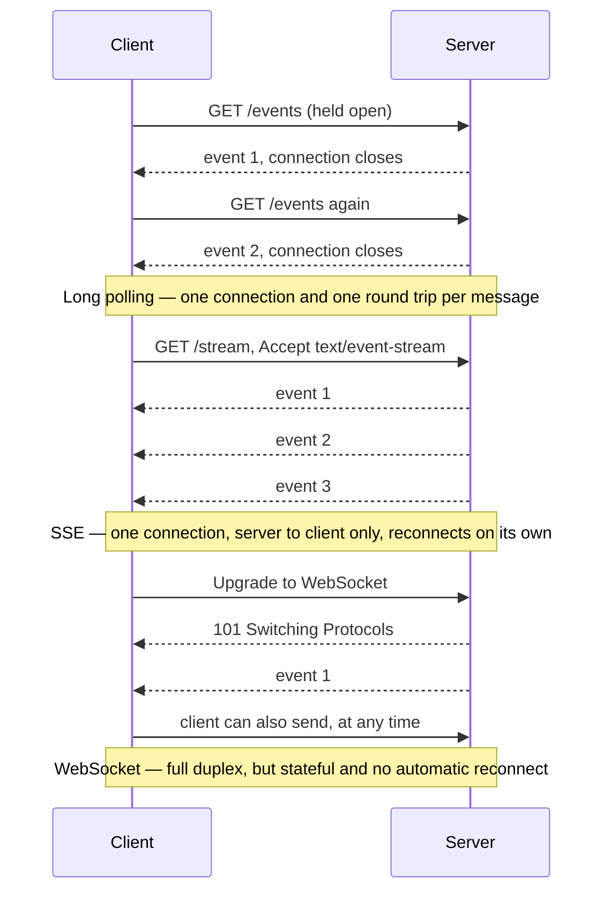

# 101. Real-Time Systems — WebSocket, SSE, Long Polling

## What It Is
Real-time systems push data from server to client (or both directions) without the client repeatedly asking for it. There are three mainstream transport mechanisms: Long Polling, Server-Sent Events (SSE), and WebSockets. Each sits at a different point on the complexity/capability spectrum, and picking the wrong one adds either unnecessary overhead or missing features.

Long Polling is the oldest trick: the client fires an HTTP request, the server holds it open until new data arrives (or a timeout), responds, and the client immediately re-requests. It works everywhere, needs no special infrastructure, but burns connections and adds latency equal to one round-trip per message. SSE is a unidirectional HTTP/1.1 stream — server pushes text events, client listens. It re-uses your existing HTTP stack, supports automatic reconnection, and is the right fit for 90% of notification use-cases. WebSocket is a full-duplex TCP-level protocol — both sides can send at any time. That power comes at a cost: stateful connections, tricky horizontal scaling, and no automatic reconnection.

For your multi-tenant SaaS, SSE is the correct choice for `notification_inapp`. Users need to receive push notifications; they do not need to send arbitrary frames back. WebSockets make sense if you add collaborative editing, a live chat module, or a real-time dashboard where the client sends filter/subscription changes. Long Polling is a fallback for environments that block SSE (some corporate proxies strip chunked responses).

## Key Concepts
- **SSE (EventSource)**: Browser API that opens a persistent HTTP connection and receives `data: …\n\n` formatted text events; supports `id`, `retry`, and custom `event` fields.
- **WebSocket handshake**: Starts as HTTP Upgrade request (`101 Switching Protocols`), then becomes raw TCP frame exchange — no HTTP overhead per message.
- **Long Polling**: Client blocks on an HTTP GET; server responds only when there is data or a timeout fires; client immediately reconnects.
- **Rooms / channels**: Logical groupings of WebSocket connections so you can broadcast to a subset (e.g., all connections belonging to `tenantId`).
- **Sticky sessions**: WebSocket connections are stateful — without them, a load balancer may route the same client to a different server on reconnect, losing room membership. Solve with Redis Pub/Sub as a shared message bus.
- **Backpressure**: A slow client cannot consume as fast as the server produces; you need to detect and drop or buffer, especially in WebSocket servers.
- **Reconnection logic**: SSE reconnects automatically using the `Last-Event-ID` header; WebSocket clients must implement exponential backoff themselves.
- **Authentication at connection time**: JWT must be validated on the initial HTTP upgrade or SSE request, not on each message — pass it as a query param or cookie.

The three transports are easiest to tell apart by counting connections and round trips for the same three server-side events:



## Example Code

```typescript
// --- SSE route handler for notification_inapp ---
// app/api/notifications/stream/route.ts

import { NextRequest } from "next/server";
import { verifyJwt } from "@/modules/auth/auth.token.service";
import { getRedisClient } from "@/lib/redis";

export const runtime = "nodejs"; // SSE requires Node.js runtime, not edge

export async function GET(req: NextRequest) {
  const token = req.headers.get("authorization")?.split(" ")[1];
  const payload = token ? verifyJwt(token) : null;

  if (!payload) {
    return new Response("Unauthorized", { status: 401 });
  }

  const { userId, tenantId } = payload;

  // ReadableStream gives us the SSE body
  const stream = new ReadableStream({
    async start(controller) {
      const encoder = new TextEncoder();
      const redis = getRedisClient();

      // Subscribe to a per-user Redis channel so any server instance
      // can push to this connection via Pub/Sub
      const subscriber = redis.duplicate();
      await subscriber.subscribe(`notify:${tenantId}:${userId}`);

      subscriber.on("message", (_channel: string, raw: string) => {
        // SSE format: "data: <json>\n\n"
        controller.enqueue(encoder.encode(`data: ${raw}\n\n`));
      });

      // Keep-alive ping every 25s to prevent proxy timeout
      const heartbeat = setInterval(() => {
        controller.enqueue(encoder.encode(": ping\n\n"));
      }, 25_000);

      // Clean up when client disconnects
      req.signal.addEventListener("abort", async () => {
        clearInterval(heartbeat);
        await subscriber.unsubscribe();
        await subscriber.quit();
        controller.close();
      });
    },
  });

  return new Response(stream, {
    headers: {
      "Content-Type": "text/event-stream",
      "Cache-Control": "no-cache, no-transform",
      Connection: "keep-alive",
      "X-Accel-Buffering": "no", // Disable nginx buffering
    },
  });
}

// --- Publishing a notification from any service ---
// modules/notification_inapp/notification_inapp.service.ts

export async function pushNotification(
  tenantId: string,
  userId: string,
  payload: { title: string; body: string; url?: string }
): Promise<void> {
  const redis = getRedisClient();
  const channel = `notify:${tenantId}:${userId}`;
  await redis.publish(channel, JSON.stringify({ ...payload, ts: Date.now() }));
}
```

## When to Use
- **SSE**: Server-to-client push — notifications, live feed updates, progress tracking for long BullMQ jobs, order status updates. Default choice for your stack.
- **WebSocket**: Bi-directional real-time — chat, collaborative document editing, live cursors, multiplayer game state.
- **Long Polling**: When you need real-time in environments that block persistent connections (certain CDNs, corporate proxies), or when polling interval latency (~1–2 s) is acceptable.
- **Neither**: If "real-time" means updating every 30 seconds, a plain `setInterval` fetch is simpler and costs less infrastructure.
- **Hybrid**: Use SSE for most push, fall back to long polling for clients that can't maintain SSE (detectable via `EventSource` support check).

## Common Mistakes
- **Prisma/TypeORM in SSE handlers**: These create a DB connection per stream — with 1000 concurrent users you'll saturate your pool. Use Redis Pub/Sub as the message bus and only hit the DB when writing the notification record, not when streaming it.
- **No cleanup on disconnect**: Forgetting to unsubscribe from Redis on `abort` leaks memory and subscriber counts. Always hook into `req.signal`.
- **WebSocket without sticky sessions or Pub/Sub**: Works on a single server, silently breaks under a load balancer. If you add WebSockets, wire up Redis adapter (e.g., `socket.io-redis`) before deploying multi-instance.
- **SSE on edge runtime**: Next.js Edge runtime does not support the full Node.js streams API needed for long-lived SSE. Set `export const runtime = "nodejs"` explicitly.

## Further Reading
- [MDN: Using Server-Sent Events](https://developer.mozilla.org/en-US/docs/Web/API/Server-sent_events/Using_server-sent_events)
- [WebSocket RFC 6455](https://datatracker.ietf.org/doc/html/rfc6455) — read §1–5 to understand the handshake and framing model
- [Ably: SSE vs WebSockets vs Long Polling](https://ably.com/blog/websockets-vs-sse) — balanced comparison with latency benchmarks
