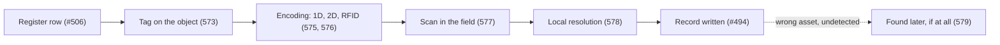

# 572. The Wrong Asset Problem: A Register Row Is Not the Object in Front of You

## What It Is
An asset register is a set of rows, each with an identity that Lesson 506 spent a whole lesson getting right. A building is a set of objects, most of which look like several other objects in the same plant room. **The link between the two is not part of either system**, and this course is about that link: how it is made, how it fails, and how to notice when it has failed.

The failure has a specific shape and it is worth stating before any technology. A technician arrives, opens the app, picks an asset from a list, and records a reading. If they picked the row above the one they meant, the reading is now attached to a different machine — and nothing downstream can tell. The value is plausible, the timestamp is right, the inspector is real, the asset exists. **A record written against the wrong asset is worse than a missing record**, because a gap is visible and a wrong value is not: it will be read as truth by the condition score (Lesson 507), by the maintenance history (Lesson 508) and by anything built on either.

That is why the identifier has to leave the register and appear **on the object**. A tag turns "which of these four fans is B2-01?" from a judgement into a reading. It also introduces four new places for the link to break, and each of the remaining lessons is about one of them: what the tag carries (573, 574), what physically encodes it (575, 576), what happens at the moment of reading (577, 578), and what happens over the asset's life as tags are replaced (580).

One clarification about scope, because two neighbouring lessons already own parts of this. **Lesson 506 owns the identity** — what an asset's identifier means, how a functional location is structured, why it outlives a serial number. This course does not redesign that; it puts the identifier somewhere a person can read it. And **Lesson 503 owns validating a submission once it reaches the server**; Lesson 577 is about the checks available at the moment of the scan, in a device that may have no network at all (Lesson 494).



```quiz
- q: "Why is a reading recorded against the wrong asset worse than no reading at all?"
  anchor: "A record written against the wrong asset is worse than a missing record"
  options:
    - text: "Because it takes up storage that the correct record would have used"
      correct: false
      why: "Storage is irrelevant here; the problem is that the value is believed."
    - text: "Because a gap is visible and a wrong value is not — it will be read as truth by everything downstream"
      correct: true
      why: "Condition scores, maintenance history and anything built on them all inherit it."
    - text: "Because it cannot be deleted once written"
      correct: false
      why: "It usually can. The problem is that nobody knows it should be."

- q: "What does putting an identifier on the object actually change?"
  anchor: "from a judgement into a reading"
  options:
    - text: "It makes the register unnecessary"
      correct: false
      why: "The tag carries the identifier; the register still holds everything else about the asset."
    - text: "It turns 'which of these four fans is B2-01?' from a judgement into a reading"
      correct: true
      why: "And introduces four new failure points, which is what the rest of the course is about."
    - text: "It guarantees the right asset is selected"
      correct: false
      why: "A scan can still succeed against the wrong tag — Lesson 577's subject."

- q: "What does this course leave to Lesson 506?"
  anchor: "Lesson 506 owns the identity"
  options:
    - text: "Nothing — identity is redefined here for field use"
      correct: false
      why: "Redefining it would produce two identities for one asset, which is the problem 506 exists to prevent."
    - text: "What an identifier means and how a functional location is structured; this course only puts it where a person can read it"
      correct: true
      why: "The tag is a carrier, not a second identity scheme."
    - text: "Only the serial number, which stays in the register"
      correct: false
      why: "Serials and functional locations are both 506's subject, and the distinction between them is its point."
```

## Key Concepts
- **The link between a register row and a physical object is in neither system** — it has to be built deliberately
- **The failure is silent**: a plausible value on the wrong asset, with a real timestamp and a real inspector
- **A wrong record is worse than a missing one** — a gap is visible, a wrong value is believed
- **A tag turns a judgement into a reading**, and adds four new failure points
- **Four places the link breaks**: what the tag carries, how it is encoded, the moment of reading, and the tag's own life
- **Lesson 506 keeps the identity**; this course carries it onto the object
- **Lesson 503 keeps server-side validation**; Lesson 577 is what the device can check with no network

## Example Code
What the register knows, what the technician sees, and where the two stop lining up:

```typescript run
/** Four assets in one plant room, as the register holds them and as they
 *  appear to somebody standing in front of them. */
type Asset = { tag: string; name: string; serial: string | null; parent: string };

const register: Asset[] = [
  { tag: 'FAN-B2-01', name: 'Supply Fan B2-01', serial: 'SN-FAN-7741', parent: 'AHU-B2-01' },
  { tag: 'FAN-B2-02', name: 'Supply Fan B2-02', serial: 'SN-FAN-7742', parent: 'AHU-B2-02' },
  { tag: 'COIL-B2-01', name: 'Cooling Coil B2-01', serial: 'SN-CL-2210', parent: 'AHU-B2-01' },
  { tag: 'COIL-B2-02', name: 'Cooling Coil B2-02', serial: 'SN-CL-2214', parent: 'AHU-B2-02' },
];

// How distinguishable are these from a metre away, in a plant room?
const commonPrefix = (a: string, b: string): number => {
  let i = 0;
  while (i < a.length && i < b.length && a[i] === b[i]) i++;
  return i;
};

console.log('pairs of assets and how much of their identifier is identical:');
for (let i = 0; i < register.length; i++) {
  for (let j = i + 1; j < register.length; j++) {
    const a = register[i];
    const b = register[j];
    const shared = commonPrefix(a.tag, b.tag);
    if (shared < 3) continue;
    console.log(`  ${a.tag} / ${b.tag}   first ${shared} of ${a.tag.length} characters identical`);
  }
}

console.log('');
console.log('The pairs above differ in one character, at the end, in a room where both are');
console.log('mounted side by side. Picking from a list is a judgement made under exactly the');
console.log('conditions that make judgements unreliable: similar names, poor light, and a');
console.log('technician who has been in four identical rooms today.');
console.log('');
console.log('Note the serials differ too -- SN-FAN-7741 and SN-FAN-7742 -- and are no better:');
console.log('one character, at the end, on a plate that may be behind the unit.');
```

## When to Use
- Before any field data collection scheme goes live, where asset selection is the step nobody designs
- When a register contains many near-identical identifiers, which is most plant rooms
- When a reading looks wrong for an asset and right for its neighbour — the classic mis-scan signature (Lesson 579)
- When deciding what to put on a tag, which is the next lesson and the decision hardest to reverse
- When auditing a condition or maintenance history, where a wrong attribution has been believed for years

## Common Mistakes
- **Selecting the asset from a list** — under field conditions this is a judgement between near-identical strings
- **Assuming the serial number solves it** — serials are as similar as the tags and are often unreadable in place
- **Treating a wrong attribution as a data-quality issue** — it is a data-*truth* issue and nothing downstream can see it
- **Designing the capture form before the identification method** — the form is the easy half
- **Believing the register's identifier is visible on the object** — it usually is not, unless somebody put it there
- **Skipping straight to the technology** — the tag is a carrier for an identity that Lesson 506 has to have settled first

## Further Reading
- [Lesson 506](/courses/asset-management-systems/asset-identity) — what an asset's identifier means, and why a functional location outlives a serial
- [Lesson 494](/courses/field-data-collection/offline-first-capture) — the capture path this identification step sits at the front of
- [Lesson 507](/courses/asset-management-systems/condition-and-criticality) — one of the things that silently inherits a wrong attribution
- [Lesson 579](/courses/asset-identification/finding-the-mis-scan-after-the-fact) — what a wrong attribution looks like in the data, weeks later

```recall
- q: "Why is the link between a register row and a physical object a problem in its own right?"
  must:
    - "it exists in neither the register nor the building -- it has to be built deliberately"
    - "a technician picking from a list is making a judgement between near-identical identifiers"
    - "and the failure is silent: a plausible value, a real timestamp, and the wrong asset"

- q: "Why is a wrong attribution worse than a missing record?"
  must:
    - "a gap is visible and can be chased"
    - "a wrong value is believed by the condition score, the maintenance history and everything built on them"
    - "nothing downstream can tell that the attribution was wrong"

- q: "What do Lessons 506 and 503 keep, and what does this course add?"
  must:
    - "Lesson 506 keeps the identity itself -- what the identifier means and how it is structured"
    - "Lesson 503 keeps validation of a submission once it reaches the server"
    - "this course carries the identifier onto the object and covers the moment of reading"
```
