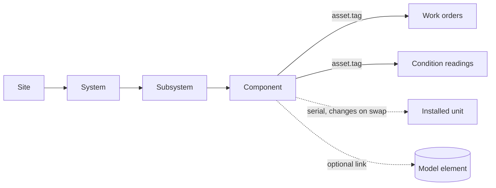

# 504. The Asset Register: What One Asset Row Must Carry

## What It Is
An asset register is the list of things an organisation is responsible for keeping working: pumps, air handlers, breakers, valves, tanks. A model hands over geometry and a bill of materials; the register is what that list becomes once somebody has to maintain it, and the difference is entirely in which columns each row carries.

The register is **a data model, not a spreadsheet**, and the developer's problems with it are data-model problems: recursive hierarchy queries (Lesson 505), an identity that survives a component being swapped (Lesson 506), merging two registers that were built separately (Lesson 510), and the anti-join that finds the assets nobody has touched (Lesson 508). Every one of those is decided by what a single row holds.

The smallest useful row is four fields. A **tag** — the functional-location identifier stencilled on the equipment, the thing a work order names. A **parent** — the tag of the asset this one sits inside, which is what makes the register a tree. An **asset class** — pump, valve, AHU — because almost every question asked of the register is asked of a class, not of one asset. And a **criticality** — how much it matters when this asset fails, recorded by the organisation from its own consequences (Lesson 507), never copied from a vendor sheet.

Everything else is optional and context-dependent: a serial number for the unit currently installed, an install date, a status, a location reference into the model. What is **not** optional is that the tag is stable. The register's whole value is that a reading taken in 2014 and a work order raised in 2024 are about the same asset, and that only holds if the tag never moved.

```quiz
- q: "Why is the asset register described as a data model rather than a spreadsheet?"
  anchor: "the developer's problems with it are data-model problems"
  options:
    - text: "Because spreadsheets cannot hold enough rows for a real site"
      correct: false
      why: "Row count is rarely the problem. A mid-size site is a few thousand assets, which any tool holds."
    - text: "Because the questions asked of it — hierarchy walks, identity across replacement, merging, anti-joins — are all data-model questions"
      correct: true
      why: "Each of those is a query or a constraint, and the row design is what makes it answerable or not."
    - text: "Because a register must always live in a relational database"
      correct: false
      why: "It often does, but the point is the shape of the questions, not the storage engine."

- q: "What breaks if an asset's tag changes over its life?"
  anchor: "a reading taken in 2014 and a work order raised in 2024 are about the same asset, and that only holds if the tag never moved"
  options:
    - text: "Nothing, as long as the old tag is kept as an alias"
      correct: false
      why: "An alias helps, but only if it was recorded. An unrecorded rename silently splits one asset's history in two."
    - text: "The asset's history splits — readings and work orders under the old tag no longer join to the asset"
      correct: true
      why: "The register's value is a continuous history per asset, and the tag is the key that history joins on."
    - text: "The parent relationship is lost"
      correct: false
      why: "The parent is a separate field. A rename that also breaks the tree is worse, but the history break happens even on its own."
```

## Key Concepts
- **A register is a maintained list** — what a model's asset list becomes once someone is responsible for keeping it working
- **The four-field minimum**: tag, parent, asset class, criticality
- **The tag is a functional location** — stencilled on the equipment, named by work orders, stable for the asset's whole life
- **The parent field makes it a tree** — Site, System, Subsystem, Component (Lesson 505)
- **Almost every question is asked of a class**, not of one asset, so the class field is not optional
- **Criticality is the organisation's own judgement** (Lesson 507), never a vendor number
- **The serial belongs to the installed unit**, not to the location — it changes on replacement, the tag does not (Lesson 506)
- **A register's value is a continuous per-asset history** — readings and work orders joining to the same key over years
- **Optional columns are context-dependent**: install date, status, a link into the model, warranty end

## Example Code
The register in this course is one site — a campus block — with four levels: the site, its systems (HVAC, water, electrical, fire), the subsystems within each, and the components that carry a serial number. The schema is deliberately small:

```sql run seed=asset_register
-- One row per asset. `parent_id` is the tag of the asset above it, which is
-- what makes the table a tree rather than a flat list.
SELECT tag, name, parent_id, asset_class, criticality
FROM asset
ORDER BY tag
LIMIT 8;
```

```sql run seed=asset_register
-- The register answers class questions first. "How many of each class, and
-- how critical are they on average" is the shape of most reporting.
SELECT asset_class,
       count(*)                     AS assets,
       round(avg(criticality), 1)   AS avg_criticality,
       max(criticality)             AS worst_case
FROM asset
GROUP BY asset_class
ORDER BY avg_criticality DESC;
```

```sql run seed=asset_register
-- The tag is the join key for every other table. One asset's whole history,
-- assembled from three tables that only agree on `asset.tag`.
SELECT a.tag,
       a.criticality,
       count(DISTINCT w.wo_id)      AS work_orders,
       count(DISTINCT c.reading_id) AS condition_readings
FROM asset a
LEFT JOIN work_order w       ON w.asset_tag = a.tag
LEFT JOIN condition_reading c ON c.asset_tag = a.tag
WHERE a.tag = 'FAN-B2-01'
GROUP BY a.tag, a.criticality;
```

The relationships, as a diagram — the register in the centre, and the two histories that hang off it by tag:



## When to Use
- At handover, when the model's asset list first has to become something a maintenance team can work from (Lesson 511)
- When choosing or configuring an EAM/CMMS, since the tool's data model is the decision (Lesson 512)
- Before writing any report against asset data — the four-field minimum is what makes a report a `GROUP BY` rather than a manual count
- When a second register appears — an acquisition, a merged portfolio — and the two have to become one (Lesson 510)

## Common Mistakes
- **Keying the register on the serial number** — the serial belongs to the unit, so every replacement creates a new key and the asset's history restarts (Lesson 506)
- **No parent field** — the register is then a flat list, and every "everything under this system" question becomes a manual exercise (Lesson 505)
- **Free-text asset class** — `Pump`, `pump`, `Booster Pump` and `PUMP` are four classes to the database, and every class report is wrong by exactly that spread
- **Criticality copied from a datasheet** — the vendor does not know what this asset's failure costs this site; only the organisation does (Lesson 507)
- **Renaming a tag without recording the old one** — the asset's readings and work orders stay under the old tag and silently detach
- **Storing the model's element id as the tag** — element ids change on re-export (Lesson 490 in the twin course), and the register's key must not

## Further Reading
- [ISO 55000 catalogue page](https://www.iso.org/standard/83053.html) — the asset-management vocabulary standard; the number and scope only, since the clause text is paid and this course teaches the data model rather than compliance
- [buildingSMART COBie documentation](https://www.thenbs.com/knowledge/what-is-cobie) — the handover spreadsheet a register is often first populated from, and its component/type split
- [IfcAsset](https://ifc43-docs.standards.buildingsmart.org/IFC/RELEASE/IFC4x3/HTML/lexical/IfcAsset.htm) — how IFC itself groups elements into an accountable asset, for comparison with a register row

```recall
- q: "Name the four fields in the minimum useful asset row and why each is there."
  must:
    - "tag — the stable functional location, the key every other table joins on"
    - "parent — the tag above it, which makes the register a tree"
    - "asset class — because most questions are asked of a class, not one asset"
    - "criticality — the organisation's own judgement of failure consequence"

- q: "Why must the tag be stable for the asset's whole life?"
  must:
    - "the register's value is a continuous per-asset history"
    - "readings and work orders join to the asset on its tag"
    - "a rename without recording the old tag splits that history in two"

- q: "What is the difference between the tag and the serial number?"
  must:
    - "the tag is the functional location — it stays with the position"
    - "the serial belongs to the physical unit currently installed"
    - "a replacement changes the serial and leaves the tag untouched"
```
