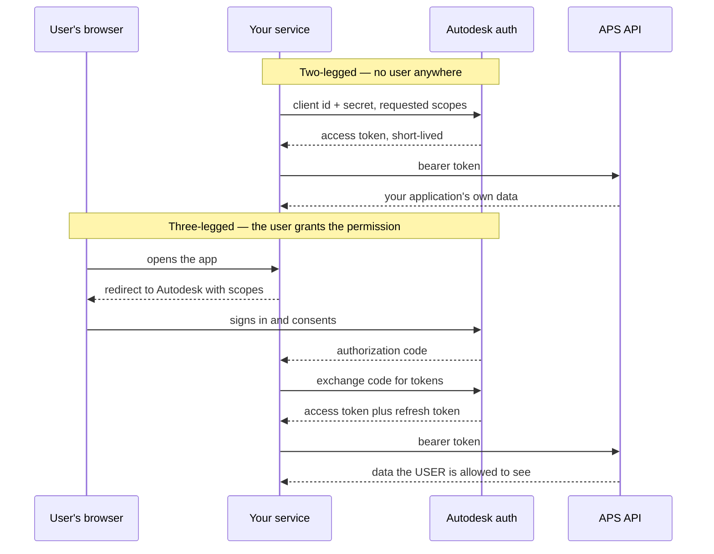

# 461. APS OAuth: Two-Legged vs Three-Legged, Scopes, Token Lifetime

## What It Is
**Mode: cloud.** From here to the end of the course, no Revit is running anywhere and nothing needs a Revit licence.

Every APS call carries a bearer token, and there are two ways to get one. **Two-legged** is the client credentials grant from OAuth 2.0: your application authenticates as itself, gets a token, and acts as itself. There is no user. It is the right choice for a service that owns its own storage and does its own translations, and it is the wrong choice for anything that touches data belonging to a person.

**Three-legged** is the authorization code grant: the user is redirected to Autodesk, signs in, consents, and your application receives a code it exchanges for a token that acts **as that user**. Anything reaching into a person's own cloud storage needs this, because the permission being exercised is theirs, not yours. A two-legged token cannot borrow it, and the failure is an authorization error rather than a missing feature.

**Scopes** are what a token is allowed to do, requested at the moment it is issued and fixed for its life. The discipline is the same as any capability system: ask for what this token will actually do and no more. A token minted with everything, cached, and reused for every call is one leak away from being the whole account.

**Lifetime** is the part that decides your architecture. Access tokens are short-lived; three-legged flows also give you a refresh token, which is long-lived and is the thing that must actually be protected. So the shape is: keep the refresh token in a secret store (the argument in Lesson 37), mint access tokens on demand, cache them until shortly before they expire, and never send a token to a browser that could have been minted narrower.

*(Volatile by nature: exact scope names, token lifetimes and endpoint paths change. This lesson teaches the mechanism; the current values are in the service documentation, and Lesson 468 is about designing so they can change.)*

```quiz
- q: "Your service needs to read a file from a user's own cloud storage. Which flow?"
  anchor: "the permission being exercised is theirs, not yours"
  options:
    - text: "Two-legged, with a scope that grants data access"
      correct: false
      why: "No scope on a two-legged token grants access to someone else's data. The token acts as your application, which was never given that permission."
    - text: "Three-legged, because the permission belongs to the user and the token has to act as them"
      correct: true
      why: "The user signs in and consents; the token carries their authority."
    - text: "Either — three-legged is a convenience for interactive apps"
      correct: false
      why: "It is not a convenience. It is the only flow that can exercise a user's permission."

- q: "When are a token's scopes decided?"
  anchor: "requested at the moment it is issued and fixed for its life"
  options:
    - text: "Per request, in a header alongside the token"
      correct: false
      why: "The token carries its own scopes. A request cannot widen or narrow them."
    - text: "When the token is issued, and they cannot change afterwards"
      correct: true
      why: "Which is the argument for minting narrow tokens rather than one broad cached one."
    - text: "When the application is registered, once and for all"
      correct: false
      why: "Registration bounds what may be requested; each token then requests some of it."
```

## Key Concepts
- **Two-legged (client credentials)**: the application authenticates as itself; no user is involved
- **Three-legged (authorization code)**: the user signs in and consents; the token acts as them
- **A two-legged token cannot reach user data** — not a configuration gap, a different authority
- **Scopes**: fixed at issue, for the life of the token; request what this token will do and no more
- **Short-lived access token**: minted on demand, cached briefly, cheap to replace
- **Long-lived refresh token**: the thing actually worth stealing, and therefore the thing to protect (see #37)
- **Never hand a browser a token you could have minted narrower** — a viewer needs read access to one thing, not an account
- **Values change, mechanism does not**: scope names and lifetimes are documentation lookups, not facts to memorise

## Example Code
The two flows, side by side. The difference is entirely in who is being asked:



```typescript
// The caching shape that follows from short-lived tokens. Types declared here
// rather than imported: an SDK's shape is a moving target and the mechanism
// is not.
type Token = { accessToken: string; scopes: readonly string[]; expiresAt: number };

/** Refreshed slightly early, because a token that expires in flight is an
 *  error the caller cannot distinguish from a permissions problem. */
const SAFETY_MARGIN_MS = 60_000;

export function isUsable(token: Token | null, needed: readonly string[], now: number): boolean {
  if (!token) return false;
  if (token.expiresAt - SAFETY_MARGIN_MS <= now) return false;
  // A cached token is only reusable if it already carries what this call
  // needs — scopes are fixed at issue and cannot be widened per request.
  return needed.every((scope) => token.scopes.includes(scope));
}
```

## When to Use
- Two-legged: server-to-server work on your own buckets and your own translations, where no person's permission is being exercised
- Three-legged: anything reaching a user's own storage or projects, and anything where an audit trail should name a person
- When designing token storage, where the refresh token is the secret and the access token is a cache entry
- When a viewer or any browser code needs a token, where the answer is a narrow, short-lived one minted for that purpose

## Common Mistakes
- **Reaching for two-legged because three-legged is more work** — no scope grants an application access to a user's data, so the shortcut ends in an authorization error
- **Minting one broad token and caching it everywhere** — scopes are fixed at issue, so a broad cached token makes every call as privileged as the widest one
- **Sending a server token to the browser** — the browser needs read access to one resource, and anything wider is now in the client
- **Storing the refresh token beside the code** — it is the long-lived credential, and #37's argument applies to it exactly
- **Not refreshing early** — a token that expires mid-request produces an error indistinguishable from a permissions failure
- **Hard-coding scope names and lifetimes as facts** — they change, which is why this lesson names the mechanism and points at the documentation for values

## Further Reading
- [APS authentication overview](https://aps.autodesk.com/en/docs/oauth/v2/developers_guide/overview/) — the index for both flows and the current scope list
- [RFC 6749 — The OAuth 2.0 Authorization Framework](https://datatracker.ietf.org/doc/html/rfc6749) — the client credentials and authorization code grants these two flows are
- [RFC 6750 — Bearer Token Usage](https://datatracker.ietf.org/doc/html/rfc6750) — how the token travels, and the error responses that distinguish expiry from insufficient scope
- [Autodesk Platform Services documentation](https://aps.autodesk.com/developer/documentation) — the service index the rest of this course uses

```recall
- q: "Distinguish the two flows and say when each is the only option."
  must:
    - "two-legged is client credentials — the application acts as itself, no user"
    - "three-legged is the authorization code grant — the user signs in and the token acts as them"
    - "anything touching a user's own data needs three-legged; no two-legged scope substitutes"

- q: "When are scopes fixed, and what follows?"
  must:
    - "at the moment the token is issued, for its whole life"
    - "a request cannot widen or narrow them"
    - "so mint narrow tokens per purpose rather than caching one broad one"

- q: "Describe the token storage shape."
  must:
    - "the refresh token is long-lived and belongs in a secret store"
    - "access tokens are short-lived, minted on demand and cached briefly"
    - "refresh slightly early, because expiry in flight looks like a permissions error"
```
