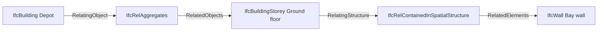

# 434. The Spatial Hierarchy: Project → Site → Building → Storey → Space

## What It Is
Every element in an IFC model has to be somewhere, and "somewhere" is a position in a tree that IFC calls the spatial structure. The canonical chain is `IfcProject` → `IfcSite` → `IfcBuilding` → `IfcBuildingStorey` → `IfcSpace`, and a physical element such as a wall or a door hangs off one of those — normally the storey.

`IfcProject` is the root, and there is exactly one per file. It is not a building and not a place; it is the context that carries the units and the geometric representation contexts every coordinate in the file is expressed against. Nothing contains it. Everything below it is attached by decomposition, one level at a time.

The distinction that matters for anyone reading the file is that **two different relationships build this tree**: spatial levels decompose into each other; physical elements are placed into a level. A building is made of its storeys, which is decomposition; a wall sits on the ground floor by spatial containment, which is a different relationship entity with different rules. Lesson 435 is about that difference. What matters here is the shape: a viewer's model tree, a per-storey quantity take-off, and a room schedule are all reading this one structure, so an element attached at the wrong level disappears from all three at once.

The schema is looser than practice. Levels may be skipped — a project may aggregate a building directly, with no site — and it will parse. But every consumer of the model has an opinion about the chain, and skipping a level is legal in the schema and wrong in practice: the storey filter in a viewer, the floor grouping in a cost tool and the room list in a facility system all assume the full chain and quietly return nothing when it is not there.

```quiz
- q: "How many IfcProject instances does a well-formed IFC file contain, and what does it carry?"
  anchor: "there is exactly one per file"
  options:
    - text: "One per building, each carrying that building's units"
      correct: false
      why: "Units are declared once, on the single project. Several buildings sit under one project via their sites."
    - text: "Exactly one, carrying the units and the geometric representation contexts"
      correct: true
      why: "It is the context everything else is expressed against — not a place, and not contained in anything."
    - text: "One per discipline, merged when models are federated"
      correct: false
      why: "Federation combines several files, each with its own single project. Within one file there is one."

- q: "A room schedule comes back empty, but the spaces are visibly in the model. What is the first thing to check?"
  anchor: "an element attached at the wrong level disappears from all three at once"
  options:
    - text: "Whether the spaces have names — an unnamed space is skipped"
      correct: false
      why: "A missing name makes a row look wrong; it does not remove the row."
    - text: "Where the spaces sit in the spatial structure, since every consumer reads that one tree"
      correct: true
      why: "The viewer tree, the take-off and the room schedule all read the spatial structure, so a wrong attachment removes an element from all of them together."
    - text: "Whether the file is IFC2X3 rather than IFC4"
      correct: false
      why: "The spatial chain is the same in both. A version difference would not empty the schedule on its own."
```

## Key Concepts
- **`IfcProject`**: the single root of the file; carries units and geometric representation contexts, and is contained in nothing
- **`IfcSite`**: the piece of land; also where a model's real-world reference position is usually declared
- **`IfcBuilding`**: one structure on the site; several may sit under one site
- **`IfcBuildingStorey`**: a level, with an `Elevation` relative to the building — the unit almost every downstream report groups by
- **`IfcSpace`**: a bounded volume inside a storey — a room, a shaft, a zone
- **Spatial structure**: the whole chain above, and the one tree a viewer, a take-off and a room schedule all read
- **Decomposition vs placement**: spatial levels decompose into each other; physical elements are placed into a level — different relationships, covered in lesson 435
- **A skipped level parses**: the schema permits it, but every consumer assumes the full chain

## Example Code
The tree as a consumer sees it. Answer before opening it:

```spatial
title: "Where an element may legally hang"
ask: "The bay wall is attached to the storey and the meeting room to the storey as well. Which of the two used a different relationship to get there, and why?"
reveal: "spatial levels decompose into each other; physical elements are placed into a level"
root:
  id: "1xS3BCk291UvhgP2a6eflL"
  type: IfcProject
  name: "Riverside Depot"
  children:
    - id: "0Nq7bTx4T9YR5Fn2WmKcJp"
      type: IfcSite
      name: "Depot site"
      rel: aggregates
      children:
        - id: "2wLpH8dGz3nQBcVsRt1eMf"
          type: IfcBuilding
          name: "Depot"
          rel: aggregates
          children:
            - id: "2rSuRi_lD5$O4Op8DVOCkd"
              type: IfcBuildingStorey
              name: "Ground floor"
              rel: aggregates
              children:
                - id: "1Kd4mYpQb7vTAeZrLs9wXc"
                  type: IfcSpace
                  name: "Meeting room"
                  rel: aggregates
                  flag: focus
                - id: "3Xt7zPfNb2vgqR1YkEwNsq"
                  type: IfcWall
                  name: "Bay wall, north"
                  rel: contained
```

And the same fragment as the file actually stores it — the relationship is an instance of its own, with both ends pointing at it rather than at each other:



## When to Use
- You are grouping anything by floor — quantities, costs, issues, sensor readings — and need the level an element belongs to
- You are building a model tree in a viewer, or reproducing one a viewer already shows
- You are validating a delivered model, where "every element reaches the project through a complete chain" is the cheapest useful check
- You are federating models from several disciplines and need to know which spatial structure the merged view is keyed on

## Common Mistakes
- **Assuming an element's storey is an attribute of the element** — it is held by a separate relationship instance, so the lookup is a reverse index rather than a field read
- **Accepting a model with skipped levels because it parses** — the schema permits `IfcProject` straight to `IfcBuilding`, and every consumer that groups by storey returns nothing for it
- **Treating `IfcSpace` as optional detail** — the room schedule, the area take-off and most facility handovers are built from spaces, so a model without them is a geometry file rather than a data model
- **Reading `IfcBuildingStorey.Elevation` as an absolute height** — it is relative to the building, which is itself placed relative to the site, so the absolute value comes from the placement chain in lesson 437
- **Expecting one project per building** — there is one project per file, and several buildings can sit beneath it through their sites

## Further Reading
- [IfcProject](https://ifc43-docs.standards.buildingsmart.org/IFC/RELEASE/IFC4x3/HTML/lexical/IfcProject.htm) — the root, its units attribute and its representation contexts
- [IfcSite](https://ifc43-docs.standards.buildingsmart.org/IFC/RELEASE/IFC4x3/HTML/lexical/IfcSite.htm) — including the reference latitude, longitude and elevation attributes
- [IfcBuildingStorey](https://ifc43-docs.standards.buildingsmart.org/IFC/RELEASE/IFC4x3/HTML/lexical/IfcBuildingStorey.htm) — the `Elevation` attribute and what it is relative to
- [IfcSpace](https://ifc43-docs.standards.buildingsmart.org/IFC/RELEASE/IFC4x3/HTML/lexical/IfcSpace.htm) — bounded volumes and how they relate to their storey
- [IfcRelAggregates](https://ifc43-docs.standards.buildingsmart.org/IFC/RELEASE/IFC4x3/HTML/lexical/IfcRelAggregates.htm) — the decomposition relationship that builds the chain

```recall
- q: "Recite the canonical spatial chain and say what sits at the top."
  must:
    - "IfcProject, IfcSite, IfcBuilding, IfcBuildingStorey, IfcSpace"
    - "exactly one IfcProject per file, contained in nothing"
    - "it carries the units and the geometric representation contexts"

- q: "Why does one misattached element break three different reports at once?"
  must:
    - "the viewer tree, the per-storey take-off and the room schedule all read the same spatial structure"
    - "an element attached at the wrong level disappears from all of them together"

- q: "The schema allows a project to aggregate a building with no site between. Why is that still a defect?"
  must:
    - "it parses, so no validator complains"
    - "downstream consumers assume the full chain"
    - "storey filters, floor groupings and room lists return nothing rather than erroring"
```
