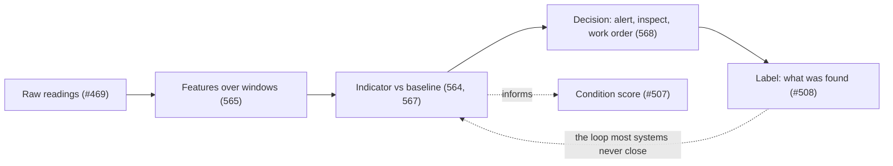

# 563. From a Score to a Signal: What Telemetry Can and Cannot Say About Condition

## What It Is
Two numbers describe the same asset and they come from different worlds. Lesson 507's **condition score** is a person's judgement on a visit — 1 for as-new, 5 for failed — recorded two or three times a year. The telemetry from Lesson 469's path arrives every few minutes, is validated, timestamped and stored, and says nothing about condition at all. It says what the machine is *doing*. Turning the second into something that can inform the first is a layer of work that this corpus has not covered, and it is the subject of this course.

The layer has four steps and they are worth separating, because tools blur them. **Raw readings** become **features** — an aggregate over a window, a rate of change, a residual against what was expected. Features become an **indicator**, a number whose movement is supposed to mean something about the machine. The indicator triggers a **decision**: an alert, an inspection, a work order. And the decision, once acted on, is supposed to produce a **label** — what was actually found — which is the only thing that can tell you whether the indicator was any good.

That last arrow is where most of these systems are broken, and this course says so early. **The loop from decision back to label runs through the maintenance history**, which is Lesson 508's subject, and in most organisations it is either absent or unusable for this purpose. Lesson 569 is about what that costs.

Two boundaries, stated now so the course does not drift across them. **Lesson 507 keeps the inspector's score**; nothing here redefines it, and the goal is not to replace a person with a number but to tell them where to go first. **Lesson 482 keeps thresholds, hysteresis and dead bands** — the mechanics of not crying wolf. This course supplies what those mechanics should be applied to, which is a considerably harder question than what the threshold value should be.

And the whole course sits inside one constraint that is worth naming before anything else: this is **not a machine-learning course**. No model is trained, no library is chosen, no hyperparameter is discussed. Every claim here is arithmetic over data you already have, and the reason is Lesson 569 — a model needs labels, and the labels are usually not there. Building the data layer honestly is both the prerequisite and, more often than anyone expects, the whole job.



```quiz
- q: "What does telemetry directly tell you about an asset's condition?"
  anchor: "It says what the machine is *doing*"
  options:
    - text: "Its condition, on the same 1-to-5 scale an inspector uses"
      correct: false
      why: "That scale is a judgement (Lesson 507); telemetry is a measurement of behaviour."
    - text: "Nothing directly — it says what the machine is doing, and condition has to be inferred from that"
      correct: true
      why: "The inference is the four-step layer this course is about."
    - text: "Its remaining useful life, once enough history exists"
      correct: false
      why: "That claim needs labels, and Lesson 570 is about how little can honestly be said."

- q: "Which arrow in the loop is missing in most real systems?"
  anchor: "The loop from decision back to label"
  options:
    - text: "Raw readings to features — most systems never aggregate"
      correct: false
      why: "Aggregation is the easy part and is usually present."
    - text: "Decision back to label — what was actually found, recorded against the asset"
      correct: true
      why: "It runs through the maintenance history (Lesson 508), which is usually absent or unusable for this."
    - text: "Indicator to decision — nobody acts on indicators"
      correct: false
      why: "Acting is common; recording what was found afterwards is not."

- q: "Why is this not a machine-learning course?"
  anchor: "a model needs labels, and the labels are usually not there"
  options:
    - text: "Because the mathematics is too advanced for the audience"
      correct: false
      why: "The obstacle is data, not difficulty."
    - text: "Because a model needs labels the organisation usually does not have, so the data layer is the prerequisite and often the whole job"
      correct: true
      why: "Lesson 569 measures that absence rather than asserting it."
    - text: "Because models cannot be run in a browser"
      correct: false
      why: "Runtime is not the constraint; the missing ground truth is."
```

## Key Concepts
- **Two numbers, two worlds**: an inspector's condition score (Lesson 507) and a stream of measurements (Lesson 469)
- **Four steps**: raw readings → features over a window → an indicator → a decision
- **A fifth step closes the loop**: the label — what was actually found when someone acted
- **The label arrow runs through maintenance history** (Lesson 508) and is usually missing (Lesson 569)
- **Lesson 507 keeps the inspector's score**; this course tells that person where to look first
- **Lesson 482 keeps threshold mechanics**; this course decides what to apply them to
- **Not a machine-learning course** — no models, no libraries; the data layer is the prerequisite and often the job

## Example Code
The four steps, made concrete on one asset, so the vocabulary is fixed before the rest of the course uses it:

```typescript run
/** One hour of readings from one machine, and the same data at each of the
 *  four stages. Nothing here is modelled -- it is arithmetic, which is the
 *  point. */
const raw = [2.21, 2.24, 2.19, 2.60, 2.23, 2.25, 2.22, 2.26]; // mm/s, 8 samples

// A feature: an aggregate over a window. Several are usually computed.
const mean = raw.reduce((a, b) => a + b, 0) / raw.length;
const peak = Math.max(...raw);
const spread = Math.max(...raw) - Math.min(...raw);

// An indicator: a feature compared against what this machine normally does.
// The baseline is per asset, which is Lesson 564's whole argument.
const BASELINE_MEAN = 2.10;
const indicator = mean - BASELINE_MEAN;

// A decision: a policy applied to the indicator. The number is a choice.
const ALERT_ABOVE = 0.20;
const decision = indicator > ALERT_ABOVE ? 'raise an inspection' : 'no action';

console.log('raw       :', raw.join(', '));
console.log(`features  : mean ${mean.toFixed(3)}, peak ${peak.toFixed(2)}, spread ${spread.toFixed(2)}`);
console.log(`indicator : ${indicator.toFixed(3)} mm/s above this machine's baseline of ${BASELINE_MEAN}`);
console.log(`decision  : ${decision} (policy: alert above ${ALERT_ABOVE})`);
console.log('');
console.log('label     : unknown -- nobody has been yet');
console.log('');
console.log('The last line is not a gap in the example. Until someone acts and records what');
console.log('they found, there is no way to know whether that indicator meant anything, and');
console.log('no amount of further computation supplies it (Lesson 569).');
```

## When to Use
- Before building anything on telemetry, to fix which of the four steps a proposed feature actually belongs to
- When a stakeholder asks for "predictive maintenance", where the productive first question is what the label would be
- When an asset register's condition scores are stale and telemetry exists, which is the case this course was written for
- When deciding what to store and for how long, since features can often be kept when raw data cannot (Lesson 477)
- When reviewing a vendor's monitoring product, where the four steps are a checklist of what it does and does not do

## Common Mistakes
- **Reading a condition score off a sensor** — the sensor reports behaviour, and condition is inferred with assumptions
- **Skipping the feature step** — comparing raw samples to a threshold is Lesson 482's problem and produces Lesson 482's noise
- **Treating the indicator as the product** — an indicator nobody acts on has no value, and one nobody records the outcome of cannot improve
- **Assuming the label will exist later** — if the work order does not capture what was found, the loop never closes (Lesson 508)
- **Starting with a model** — the data layer decides whether a model is possible at all
- **Replacing the inspector** — the realistic goal is telling them where to go first, not removing the visit

## Further Reading
- [ISO 17359 — condition monitoring and diagnostics of machines, general guidelines](https://www.iso.org/standard/71194.html) — the standard's framing of measurement, baselines and alarm criteria; catalogue reference, the clause text is paid
- [Lesson 507](/courses/asset-management-systems/condition-and-criticality) — the inspector's condition score this course sits beside rather than replaces
- [Lesson 508](/courses/asset-management-systems/work-orders-and-maintenance-history) — the maintenance history the label arrow runs through
- [Lesson 482](/courses/iot-telemetry-edge/alerting-without-crying-wolf) — thresholds, hysteresis and dead bands: the mechanics this course supplies inputs to

```recall
- q: "Name the four steps between a reading and a maintenance decision, plus the fifth that closes the loop."
  must:
    - "raw readings become features over a window; features become an indicator; the indicator triggers a decision"
    - "the fifth is the label -- what was actually found when someone acted"
    - "the label runs through the maintenance history and is what tells you whether the indicator was any good"

- q: "What is the boundary between this course and Lessons 507 and 482?"
  must:
    - "Lesson 507 keeps the inspector's condition score; this course does not redefine it"
    - "Lesson 482 keeps threshold, hysteresis and dead-band mechanics"
    - "this course decides what those mechanics should be applied to, which is the harder question"

- q: "Why does this course refuse to be a machine-learning course?"
  must:
    - "a model needs labels, and the maintenance history usually does not contain usable ones"
    - "every claim here is arithmetic over data the organisation already has"
    - "building the data layer honestly is the prerequisite, and often the whole job"
```
