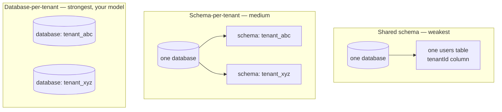

# 50. Multi-Tenant Data Isolation Models

## What It Is
Multi-tenancy is the property of a single deployment serving multiple independent customers (tenants) with data isolation between them. There are three common models, each with a different isolation boundary.

The first and weakest model is shared schema: all tenants' data lives in the same tables, distinguished by a `tenantId` column. Simple to implement, cheap to operate, but data leakage through a missing `WHERE tenant_id = $1` filter affects all tenants, and a performance problem in one tenant's queries affects all others. This model is appropriate for very early-stage products with low-sensitivity data.

The second model is separate schemas within a single database: each tenant gets their own schema (`tenant_abc.users`, `tenant_xyz.users`). Better isolation than shared schema, but still within the same database process and storage. A database-level breach exposes all tenants.

The third model — which you use — is separate databases. Each tenant has their own PostgreSQL database, provisioned dynamically when the tenant is created. This is the gold standard: a compromise of one tenant's database does not expose any other tenant's data, per-tenant backup and deletion are trivial, tenant-specific schema migrations can be run independently, and you can move a tenant's database to a different server for performance or compliance reasons. The cost is operational complexity: you manage N databases instead of one, migrations must run across all of them, and monitoring must cover all databases.

## Key Concepts
- **Database-per-tenant** — Strongest isolation; each tenant's data in a separate database; your current model
- **Schema-per-tenant** — Medium isolation; separate schemas in one database; simpler to operate, weaker isolation
- **Shared-schema** — Weakest isolation; all tenants in shared tables with `tenantId` discriminator; simplest to build, highest risk of data leakage
- **Dynamic DataSource** — Your TypeORM setup provisions a new DataSource connection pool per tenant at request time; this is the core mechanism of your isolation
- **Connection pool management** — N tenant databases × connections per pool = total DB connections; must be bounded to avoid exhausting PostgreSQL's `max_connections`
- **Tenant provisioning** — Creating a new database, running migrations, seeding initial data — should be automated and idempotent
- **Cross-tenant query** — Aggregate queries across all tenants (total users, revenue by tenant) require either federated queries or a separate analytics pipeline
- **Tenant offboarding** — Deleting a tenant means dropping a database; complete data erasure is trivially auditable

The isolation boundary is a nesting relationship a bullet list states but a diagram actually shows — where does one tenant's blast radius stop:



## Example Code
```typescript
// ─── What you have (the core pattern) ─────────────────────────────────────
// libs/typeorm/tenant.ts
// Your getTenantDataSource(tenantId) function — the foundation of isolation

// The key insight: every service method that touches tenant data
// must receive a tenantId and resolve the correct DataSource.
// There is no "default" tenant DataSource.

// ─── Connection pool management across N tenants ───────────────────────────

// libs/typeorm/tenant-pool.ts
// Problem: at 100 tenants × 20 connections each = 2000 connections.
// PostgreSQL's default max_connections is 100-200.
// Solution: limit pool size per tenant and use connection pooling (PgBouncer).

import crypto from 'crypto';
import { DataSource } from 'typeorm';
import { LRUCache } from 'lru-cache'; // npm install lru-cache

const TENANT_POOL_SIZE = 3; // connections per tenant pool (small, multiplied by tenant count)
const MAX_CACHED_DATASOURCES = 50; // evict least-recently-used tenants

// LRU cache: keeps the N most recently used tenant DataSources in memory
// Evicted DataSources are closed (connection pool released)
const datasourceCache = new LRUCache<string, DataSource>({
  max: MAX_CACHED_DATASOURCES,
  dispose: async (dataSource) => {
    if (dataSource.isInitialized) {
      await dataSource.destroy();
    }
  },
});

export async function getTenantDataSource(tenantId: string): Promise<DataSource> {
  const cached = datasourceCache.get(tenantId);
  if (cached?.isInitialized) return cached;

  // Resolve tenant's database URL from the system database
  const tenantDbUrl = await resolveTenantDatabaseUrl(tenantId);

  const dataSource = new DataSource({
    type: 'postgres',
    url: tenantDbUrl,
    entities: [...tenantEntities],
    synchronize: false,
    poolSize: TENANT_POOL_SIZE,  // small pool per tenant
    connectTimeoutMS: 5000,
  });

  await dataSource.initialize();
  datasourceCache.set(tenantId, dataSource);
  return dataSource;
}

// ─── Tenant provisioning ──────────────────────────────────────────────────

export class TenantProvisioningService {
  /**
   * Provision a new tenant database.
   * Called when a new tenant signs up.
   * Must be idempotent (safe to call multiple times for the same tenant).
   */
  static async provision(tenantId: string, tenantName: string): Promise<string> {
    const dbName = `tenant_${tenantId.replace(/-/g, '_')}`;
    const adminDs = getAdminDataSource(); // DataSource with CREATE DATABASE privilege

    // 1. Create the database (idempotent)
    await adminDs.query(`
      DO $$ BEGIN
        IF NOT EXISTS (SELECT 1 FROM pg_database WHERE datname = '${dbName}') THEN
          CREATE DATABASE "${dbName}";
        END IF;
      END $$;
    `);

    // 2. Create a dedicated DB user for this tenant (principle of least privilege)
    const dbUser = `tenant_${tenantId.replace(/-/g, '_')}_user`;
    const dbPassword = crypto.randomBytes(32).toString('hex');
    await adminDs.query(`
      DO $$ BEGIN
        IF NOT EXISTS (SELECT 1 FROM pg_roles WHERE rolname = '${dbUser}') THEN
          CREATE USER "${dbUser}" WITH PASSWORD '${dbPassword}';
        END IF;
      END $$;
    `);
    await adminDs.query(`GRANT CONNECT ON DATABASE "${dbName}" TO "${dbUser}"`);

    const tenantDbUrl = `postgresql://${dbUser}:${dbPassword}@${DB_HOST}:5432/${dbName}`;

    // 3. Run schema migrations on the new database
    const tenantDs = new DataSource({
      type: 'postgres',
      url: tenantDbUrl,
      entities: [...tenantEntities],
      migrations: ['./migrations/tenant/**/*.ts'],
      synchronize: false,
    });
    await tenantDs.initialize();
    await tenantDs.runMigrations({ transaction: 'each' });
    await tenantDs.destroy();

    // 4. Store the connection URL in the system database
    await systemRepo.update(tenantId, { databaseUrl: tenantDbUrl });

    console.log(`[Provision] Tenant ${tenantName} (${tenantId}) provisioned: ${dbName}`);
    return tenantDbUrl;
  }

  /**
   * Deprovision a tenant: drops the database entirely.
   * Complete data erasure — no soft delete.
   */
  static async deprovision(tenantId: string): Promise<void> {
    const dbName = `tenant_${tenantId.replace(/-/g, '_')}`;

    // Remove from DataSource cache
    datasourceCache.delete(tenantId);

    const adminDs = getAdminDataSource();
    // Terminate active connections before dropping
    await adminDs.query(`
      SELECT pg_terminate_backend(pid)
      FROM pg_stat_activity
      WHERE datname = '${dbName}' AND pid <> pg_backend_pid()
    `);
    await adminDs.query(`DROP DATABASE IF EXISTS "${dbName}"`);

    await systemRepo.update(tenantId, { databaseUrl: null, status: 'DEPROVISIONED' });
    console.log(`[Deprovision] Tenant ${tenantId} database dropped`);
  }
}

// ─── Cross-tenant analytics query ────────────────────────────────────────

// Cross-tenant queries (admin dashboard: "total active users across all tenants")
// cannot use individual tenant DataSources efficiently.
// Options:
// A) Query the system DB for aggregated stats (if you maintain denormalized counters)
// B) A separate analytics database (ETL pipeline syncing from all tenant DBs)
// C) Accept the N-query approach for low-frequency admin queries

export async function getTotalActiveUsersAllTenants(): Promise<number> {
  const tenants = await getAllActiveTenants();
  let total = 0;

  // Option C: N queries — acceptable for infrequent admin use
  for (const tenant of tenants) {
    const ds = await getTenantDataSource(tenant.tenantId);
    const count = await ds.getRepository(TenantMember)
      .count({ where: { status: 'ACTIVE' } });
    total += count;
  }

  return total;
}
// For production analytics dashboards, prefer Option A or B over N queries.
```

## When to Use
- **Database-per-tenant** (your current model) — Enterprise customers, healthcare data, financial data, any scenario where a tenant demands contractual guarantees of data isolation
- **Schema-per-tenant** — B2B SaaS with moderate isolation requirements, where operational simplicity matters more than maximum isolation; good middle ground for 10-500 tenants
- **Shared-schema** — Early-stage products, consumer SaaS, low-sensitivity data, or when operational complexity must be minimized; add `tenantId` to every table and enforce it at the ORM query scope level
- **Hybrid** — Free-tier tenants share a database; paid/enterprise tenants get dedicated databases; common pattern as you grow

## Common Mistakes
- **Missing `tenantId` checks in service methods** — In database-per-tenant, the database boundary enforces isolation; if you ever add shared-schema features, you must add explicit `WHERE tenantId = $1` guards or the ORM-level scope
- **Connection pool explosion** — Naive implementation: every request creates a new DataSource; correct: LRU cache with bounded pool sizes; you likely have this, but verify the eviction policy
- **Running tenant migrations without verification** — A migration that fails on tenant 50 of 200 leaves the remaining 150 on the old schema; implement the migration runner from item 43 with retry and idempotency
- **No tenant offboarding process** — Every provisioned database costs money; implement deprovisioning for churned tenants and test that it correctly drops the database and revokes credentials

## Further Reading
- [The Database-Per-Tenant Multi-Tenancy Pattern (Microsoft Azure docs)](https://docs.microsoft.com/en-us/azure/architecture/patterns/sharding)
- [TypeORM multiple data sources](https://typeorm.io/multiple-data-sources)
- [Building multi-tenant SaaS on PostgreSQL (Citus / Azure)](https://www.citusdata.com/blog/2016/10/03/designing-your-saas-database-for-high-scalability/)
