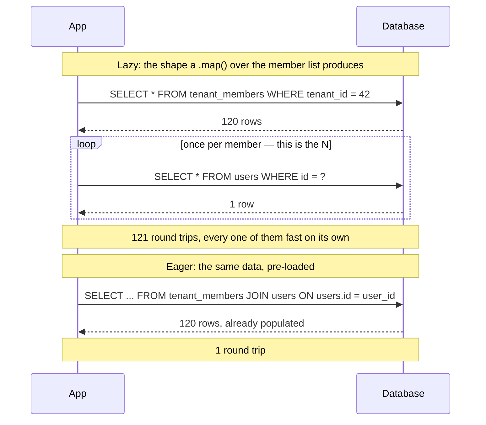

# 16. N+1 Query Problem

## What It Is
The N+1 query problem occurs when code fetches a list of N items (1 query), then for each item individually fetches related data (N additional queries) — producing N+1 total database round trips. The result is functionally correct but catastrophically inefficient: fetching 50 tenants with their owners fires 51 queries instead of 1. At small scale, this is invisible. At moderate scale (a page that returns 100 records), it adds hundreds of milliseconds of unnecessary DB round trips.

The insidious thing about N+1 is that it looks correct in code reviews and tests. A `for` loop that calls `db.user.findUnique()` for each item in a list will work perfectly in your development environment with 5 users, but will hammer your database in production with 500. ORMs like Prisma make it easy to accidentally introduce N+1: accessing a relation on a model without pre-loading it triggers a lazy query per item in many ORM patterns.

The fix is almost always **eager loading** — telling the ORM to fetch related data in the initial query using JOINs or a second bulk query. In Prisma, this means using `include` or `select` with nested relations. In some cases, the correct fix is a **DataLoader** (batch loader): collect individual IDs from a request cycle, issue one batched query, and fan results back. DataLoader is the standard solution for GraphQL resolvers but is equally applicable to REST endpoints with complex relational data.


```quiz
- q: "Why does an N+1 query problem usually survive code review?"
  anchor: "it looks correct in code reviews and tests"
  options:
    - text: "Reviewers rarely read data-access code"
      correct: false
      why: "The code gets read. The problem is that reading it does not reveal anything wrong \u2014 each line is correct in isolation."
    - text: "Every individual query is correct and fast; only the loop firing it N times is the defect"
      correct: true
      why: "Nothing on any single line is wrong, and with five records in dev the total cost is invisible. The defect lives in the repetition, not the query."
    - text: "The ORM hides the SQL, so it cannot be reviewed at all"
      correct: false
      why: "You can log or inspect the SQL. The issue is that the emitted query is fine \u2014 it is the count of them that is not."

- q: "What is the usual fix once you have found an N+1?"
  anchor: "telling the ORM to fetch related data in the initial query"
  options:
    - text: "Add a cache in front of the per-item query"
      correct: false
      why: "Caching hides the round trips rather than removing them, and it adds an invalidation problem on top of the original defect."
    - text: "Eager loading \u2014 tell the ORM to fetch the related data in the initial query"
      correct: true
      why: "That is the standard fix: Prisma's include/select with nested relations, collapsing N+1 round trips into one or two."
    - text: "Raise the database connection pool size"
      correct: false
      why: "A bigger pool lets you fire the same N queries more concurrently. It raises database load instead of reducing the work."
```

## Key Concepts
- **N+1 query**: 1 query to fetch a list, N queries to fetch related data per item — total N+1 round trips
- **Eager loading**: Pre-fetching related data in the initial query (via JOIN or a second bulk query) — Prisma's `include`
- **Lazy loading**: Fetching related data only when accessed — triggers per-item queries; often the root cause of N+1
- **DataLoader**: A batching and caching utility that collects individual load requests, batches them into one query, and fans results back
- **Query count assertion**: A test assertion that checks a code path issues no more than N queries — catches N+1 regressions before they reach production
- **`EXPLAIN ANALYZE`**: PostgreSQL command that shows the actual execution plan and query count; run this on your slow endpoints
- **Select only what you need**: Fetching all columns (`SELECT *`) when you need 3 columns wastes bandwidth and cache memory
- **JOIN vs two queries**: For large datasets, a single JOIN can be slower than two targeted queries; profile before assuming a JOIN is always better



## Example Code

Same seeded table as the query-plan-analysis and index-strategy lessons. This is the shape a naive per-item loop actually fires — one query, run once per member of tenant 42 (~120 of them):

```sql run seed=tenant_members
-- One of the N: db.user.findUnique({ where: { id: member.userId } }) inside
-- a .map() over the member list. Fast and harmless on its own — the problem
-- is only visible at the round-trip count, not in this single query's plan.
SELECT id, email, display_name FROM users WHERE id = 7;
```

And this is the fix — the same total data, in one round trip instead of N:

```sql run seed=tenant_members
-- Eager loading: fetch every member's user row in ONE query. This is what
-- Prisma's include actually issues (a second bulk query, not a JOIN) — a
-- plain JOIN is used here because that's the SQL-native equivalent.
SELECT tm.id AS member_id, tm.role, u.email, u.display_name
FROM tenant_members tm
JOIN users u ON u.id = tm.user_id
WHERE tm.tenant_id = 42;
```

Both queries run in a few milliseconds here — and that's exactly the honesty band's point. This is one browser tab, one process, no network. Running the first query 120 times (once per member of tenant 42) costs nothing extra in this environment, so N+1's actual damage doesn't show up in either the timing or the plan. In production, each of those N queries pays a real network round trip — typically 1-5ms same-region, 20-50ms+ cross-region — and that cost is what the second query collapses to one instance of, not a difference in query complexity.

```typescript
// ─── FIX 2: DataLoader for batching across concurrent requests ───
// Useful when the same user might appear in multiple concurrent queries
// (common in GraphQL resolvers, also useful in complex REST handlers)

import { NextResponse } from 'next/server';
import type { NextRequest } from 'next/server';
import { PrismaClient } from '@prisma/client';
import DataLoader from 'dataloader';

// Create one DataLoader per request (not per-app — must not cache across requests)
function createUserLoader(db: PrismaClient) {
    // Only what the loader hands back to callers.
  type User = { id: string; email: string; displayName: string };

  return new DataLoader<string, User | null>(async (userIds) => {
    const users = await db.user.findMany({
      where: { id: { in: [...userIds] } },
    });
    // DataLoader requires results in the same order as keys
    const userMap = new Map(users.map((u) => [u.id, u]));
    return userIds.map((id) => userMap.get(id) ?? null);
  });
}

// In a Next.js API route handler, create the loader once per request
export async function GET(req: NextRequest) {
  const userLoader = createUserLoader(db);
  const members = await db.tenantMember.findMany({ where: { tenantId: '...' } });

  // These all batch into ONE query, regardless of how many members:
  const users = await Promise.all(members.map((m) => userLoader.load(m.userId)));
  return NextResponse.json(members.map((m, i) => ({ ...m, user: users[i] })));
}

// ─── Query count test (using Prisma's $on event logging) ───
async function assertQueryCount(
  db: PrismaClient,
  label: string,
  expectedMax: number,
  fn: () => Promise<void>
) {
  let count = 0;
  const listener = () => count++;
  db.$on('query', listener);
  await fn();
  db.$off('query', listener);

  if (count > expectedMax) {
    throw new Error(`${label}: expected ≤${expectedMax} queries, got ${count}`);
  }
}

// Usage in a test:
// await assertQueryCount(db, 'listTenantMembers', 2, () => listTenantMembersEager(tenantId));
```

## When to Use
- Before optimizing any slow listing endpoint — profile query count first; N+1 is often the culprit
- During code review — any `map` + `await db.entity.findUnique` pattern inside a loop is a red flag
- When writing integration tests for read endpoints — assert a maximum query count to prevent regression
- In any endpoint that returns a list with related entities (members with users, sessions with tenants, posts with authors)

## Common Mistakes
- **Fixing N+1 with `Promise.all` (parallel N queries)**: `Promise.all(items.map(id => db.user.findUnique(...)))` still fires N queries in parallel — faster than sequential, but still N queries; use `include` or batch with `findMany({ where: { id: { in: ids } } })` instead
- **Over-including relations**: Fixing N+1 by `include`-ing everything results in huge payloads and slow JOIN-heavy queries; select only the fields and relations the endpoint actually uses
- **No query logging in development**: Without Prisma's query logging or a tool like Prisma Studio, N+1 problems are invisible; add `log: ['query']` to your dev PrismaClient to see every query
- **Assuming Prisma's `include` uses JOINs**: Prisma uses a batched second query, not a JOIN, for relations; this means two queries, not N+1 — but for very large datasets, a raw SQL JOIN might be more efficient

## Further Reading
- **Prisma documentation — "Select fields and include relations"** — Explains how Prisma batches included relations and how to use `select` to minimize data transfer
- [**"The N+1 Problem" by Dataloader GitHub README](https://github.com/graphql/dataloader)** — The DataLoader README explains batching and caching clearly; applies equally to REST and GraphQL
- **"Solving the N+1 Problem in Rails" by thoughtbot** — Though Rails-specific, the conceptual explanation is language-agnostic and includes clear diagrams; the SQL patterns translate directly to PostgreSQL

```recall
- q: "Why is N+1 hard to catch before production, given the code passes review and tests?"
  must:
    - "each individual query is correct and fast on its own"
    - "development data is small enough that the round-trip count is invisible"
    - "the defect is the loop firing the query N times, not any single query"

- q: "Name the two standard fixes and when each applies."
  must:
    - "eager loading via the ORM's include/select, for a known relation on a known list"
    - "a DataLoader that batches individual ids from a request cycle into one query"
    - "DataLoader is the standard answer for GraphQL resolvers but works for REST too"

- q: "How would you stop an N+1 from coming back after you fix it?"
  must:
    - "assert the query count for the code path in a test"
    - "run EXPLAIN ANALYZE or query logging on the slow endpoint to see the real count"
```
