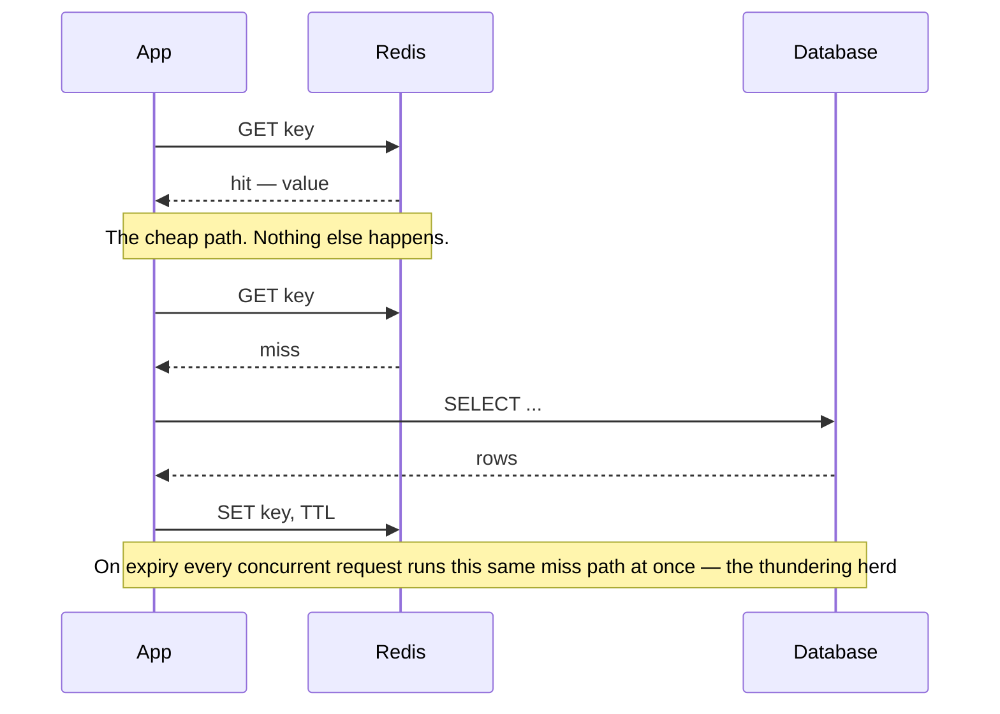

# 20. Redis Cache Strategies (Write-Through, Write-Behind, Cache-Aside)

## What It Is
Caching strategies differ in when and how the cache is populated and kept in sync with the source of truth. The choice affects your consistency guarantees, write performance, and failure behavior. Understanding the full taxonomy lets you pick the right strategy per use case rather than defaulting to cache-aside everywhere.

**Cache-aside** (lazy loading) is what you already do: the application checks the cache first; on a miss, it fetches from the DB, populates the cache, and returns the result. The application manages cache population explicitly. Cache-aside tolerates Redis failures gracefully (miss → DB fallback) and never caches data that isn't requested. The downside is the "thundering herd" problem: if the cache expires or is evicted, many concurrent requests all miss and all hit the DB simultaneously.

**Write-through** keeps the cache and DB in sync on every write: the application writes to the cache AND the DB before returning. The cache is always up to date, so reads never miss for recently written data. The cost is higher write latency (two synchronous writes per mutation). **Write-behind** (write-back) is the async variant: writes go to the cache immediately and return to the caller; a background process asynchronously flushes cache changes to the DB. This gives the lowest write latency but risks data loss if the cache crashes before flushing — only appropriate for non-critical, lossy data (metrics, view counts).

For a multi-tenant SaaS, a layered strategy makes sense: session data and tenant config use write-through (always fresh in cache, DB is backup), expensive aggregate queries use cache-aside with staggered TTLs (to avoid thundering herd), and ephemeral counters (rate limit counters, online presence) use Redis as the primary store with no DB sync needed.

## Key Concepts
- **Cache-aside (lazy loading)**: App checks cache first; populates on miss; app manages cache lifecycle
- **Write-through**: On every write, update both cache and DB synchronously; cache is always current; higher write latency
- **Write-behind (write-back)**: Write to cache immediately, flush to DB asynchronously; lowest write latency; risk of data loss
- **Cache invalidation**: Deleting or updating cache entries when source data changes — the hardest problem in caching
- **TTL (Time-To-Live)**: Maximum staleness window; balance between freshness and cache hit rate
- **Thundering herd**: Many concurrent requests all miss the cache at the same time and flood the DB; prevent with staggered TTLs, lock-based population, or probabilistic early expiration
- **Cache stampede prevention**: Use a distributed lock during cache population so only one request populates the cache while others wait
- **Cache warming**: Pre-populating the cache at startup or before a deploy to avoid cold-start misses

Cache-aside is two different stories depending on whether the key is there, and the second one is where the thundering herd lives — the bullets name it, this shows the shape that causes it:



## Example Code
```typescript
// ─── Cache-aside with thundering herd prevention ───
import { PrismaClient } from '@prisma/client';
import Redis from 'ioredis';
// What actually gets cached. Keep it small and derived: the more a cached
// object carries, the more writes have to remember to invalidate it.
type TenantConfig = {
  id: string;
  name: string;
  planId: string;
  featureFlags: Record<string, boolean>;
};

async function getTenantConfig(tenantId: string, redis: Redis, db: PrismaClient) {
  const cacheKey = `tenant:config:${tenantId}`;
  const cached = await redis.get(cacheKey);
  if (cached) return JSON.parse(cached);

  // Thundering herd prevention: only one caller populates the cache
  const lockKey = `lock:cache:${cacheKey}`;
  const lock = await redis.set(lockKey, '1', 'NX', 'PX', 5000); // 5s lock

  if (!lock) {
    // Another request is already populating — wait briefly and retry
    await new Promise((r) => setTimeout(r, 100));
    const retried = await redis.get(cacheKey);
    if (retried) return JSON.parse(retried);
  }

  try {
    const config = await db.tenantConfig.findUniqueOrThrow({ where: { tenantId } });
    // Stagger TTLs to prevent all tenants' caches expiring simultaneously
    const ttl = 300 + Math.floor(Math.random() * 60); // 300–360 seconds
    await redis.setex(cacheKey, ttl, JSON.stringify(config));
    return config;
  } finally {
    await redis.del(lockKey);
  }
}

// ─── Write-through: update cache and DB atomically ───
async function updateTenantConfig(
  tenantId: string,
  updates: Partial<TenantConfig>,
  redis: Redis,
  db: PrismaClient
) {
  // Write to DB first (source of truth)
  const updated = await db.tenantConfig.update({
    where: { tenantId },
    data: updates,
  });

  // Immediately update the cache — no stale data window
  const cacheKey = `tenant:config:${tenantId}`;
  await redis.setex(cacheKey, 300, JSON.stringify(updated));

  return updated;
}

// ─── Write-behind: async flush for non-critical counters ───
// Example: page view counter where precision doesn't matter
const VIEW_FLUSH_INTERVAL = 30_000; // flush to DB every 30 seconds

async function incrementPageView(pageId: string, redis: Redis) {
  // Write to Redis immediately — no DB round trip on every view
  await redis.hincrby('page_views_pending', pageId, 1);
  // Returns instantly; DB is updated later by the flush job
}

// BullMQ worker that runs every 30 seconds:
async function flushPageViews(redis: Redis, db: PrismaClient) {
  // Get all pending counts and clear them atomically
  const pending = await redis.hgetall('page_views_pending');
  if (!pending || Object.keys(pending).length === 0) return;

  await redis.del('page_views_pending'); // Clear before writing to DB
  // (Race: new views that come in after DEL and before DB write are lost —
  //  acceptable for view counts; use a pipeline + rename trick for higher accuracy)

  const updates = Object.entries(pending).map(([pageId, count]) =>
    db.page.update({
      where: { id: pageId },
      data: { viewCount: { increment: parseInt(count) } },
    })
  );
  await db.$transaction(updates);
}

// ─── Cache invalidation strategy: tag-based ───
// When a tenant's data changes, invalidate all cache keys tagged with that tenantId
async function invalidateTenantCache(tenantId: string, redis: Redis) {
  // Scan for all keys matching the pattern (use sparingly; SCAN not KEYS in production)
  const pattern = `tenant:*:${tenantId}`;
  let cursor = '0';
  do {
    const [nextCursor, keys] = await redis.scan(cursor, 'MATCH', pattern, 'COUNT', 100);
    cursor = nextCursor;
    if (keys.length > 0) {
      await redis.del(...keys);
    }
  } while (cursor !== '0');
}
```

## When to Use
- **Cache-aside**: Read-heavy data that can tolerate brief staleness (tenant configs, user profiles, feature flags); default choice when in doubt
- **Write-through**: Data that is written and immediately read back (user settings, session data); eliminates the cold-start problem at the cost of write latency
- **Write-behind**: High-frequency, loss-tolerant counters (view counts, online user counts, activity heatmaps); never for financial or transactional data
- **Cache warming**: On deployment or after a Redis restart, pre-populate high-traffic cache keys to avoid a cold-start flood on the DB

## Common Mistakes
- **Caching mutable objects without invalidation**: A cached tenant config that is never invalidated will serve stale data indefinitely after an admin changes a setting; every write path must also update or invalidate the relevant cache keys
- **Using a global cache key (no tenant scoping)**: `cache:users` instead of `cache:users:${tenantId}` — in a multi-tenant SaaS, cross-tenant data leakage via shared cache keys is a serious security issue
- **Not handling Redis unavailability in cache-aside**: If Redis is down and your cache-aside falls back to the DB, that's correct behavior — but make sure the fallback path exists and is tested; don't let Redis downtime cause 500s
- **Write-behind for financial data**: If Redis crashes between a write-behind and the DB flush, you've lost the data permanently; write-behind is only for ephemeral, loss-tolerant data

## Further Reading
- [**AWS documentation — "Caching strategies"](https://docs.aws.amazon.com/AmazonElastiCache)** — Clear diagrams and explanations of all four caching patterns; language-agnostic and directly applicable
- **"Redis Explained" by Thorsten Höger** — A concise e-book covering Redis data structures and caching patterns; free online edition available
- **"The Thundering Herd Problem" by Facebook Engineering blog** — Facebook's approach to preventing cache stampedes at scale; the probabilistic early expiration technique described is directly applicable to your TTL strategy
