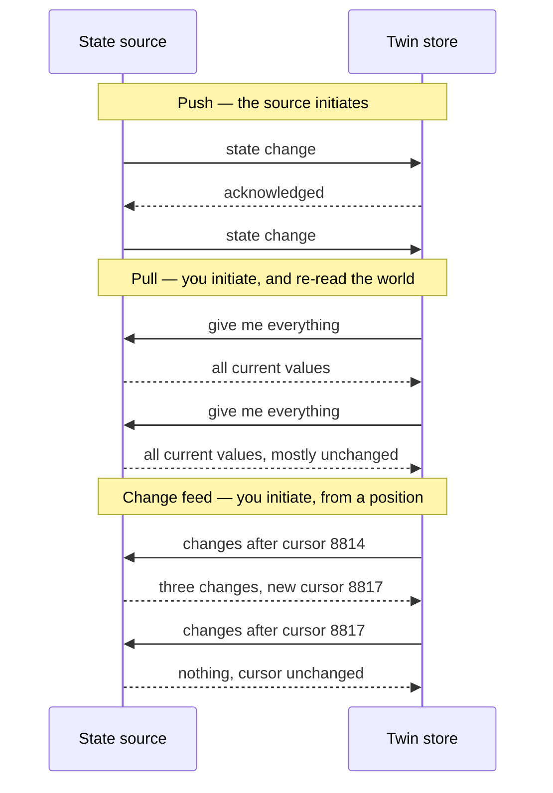

# 492. Twin Sync: Push, Pull, and Change Feeds

## What It Is
A twin's state has to get from wherever it is produced to wherever it is consumed, and there are three shapes for that. Which one you choose is decided by who is allowed to initiate a connection, which is a network and security question before it is an architectural one.

**Push** is the source calling you: a device publishes, a webhook fires, a broker delivers. It is the lowest-latency shape and it requires the source to be able to reach you, which is exactly what an operational-technology network is usually configured to prevent. It also means the source decides the rate, so a burst — Lesson 476's reconnection flush — arrives at whatever speed the source can produce it.

**Pull** is you calling the source on a schedule. It works where push cannot, because the connection is initiated from your side; it is the shape almost every building-management-system integration ends up as, for exactly that reason. What it costs is latency bounded by the poll interval, plus the problem of not knowing whether anything changed — which is why a naive pull re-reads everything every time.

**A change feed** is the middle: the source maintains an ordered log of what changed, and you pull *from a position in it*. That single addition fixes the two things wrong with pull — you read only what changed, and you know exactly where you left off — and it introduces one requirement: the source has to keep the log long enough for your worst outage. A consumer whose position falls off the end of the retained log cannot resume, and its only recovery is a full reload.

The property that decides correctness in all three is **idempotency**, and Lesson 475's argument applies unchanged: every shape can deliver the same state twice, so the consumer keys on `(asset, point, measured_at)` and a repeat is a no-op. What differs is only how often it happens.

```quiz
- q: "An operational-technology network forbids inbound connections from your side and outbound connections from its side is also restricted. Which shape is available?"
  anchor: "the connection is initiated from your side"
  options:
    - text: "Push, since the source is inside the restricted network"
      correct: false
      why: "Push requires the source to reach you, which is outbound from the restricted network — usually the thing being prevented."
    - text: "Pull, because the connection is initiated from your side"
      correct: true
      why: "Which is why almost every building-system integration is a poll."
    - text: "A change feed, since it is neither"
      correct: false
      why: "A change feed is a pull with a position. It has the same connection direction as a pull."

- q: "What does a change feed require that a plain pull does not?"
  anchor: "the source has to keep the log long enough for your worst outage"
  options:
    - text: "A higher poll frequency"
      correct: false
      why: "The opposite — a change feed lets you poll less often, because you read only what changed."
    - text: "The source must retain the log long enough to cover your worst outage"
      correct: true
      why: "A consumer whose position falls off the end can only recover with a full reload."
    - text: "Ordering guarantees across all points"
      correct: false
      why: "Per-stream ordering is enough for a consumer that keys on measurement time."
```

## Key Concepts
- **Push**: the source calls you — lowest latency, needs inbound reachability
- **Pull**: you call the source — works where push cannot, latency bounded by the interval
- **The connection direction is the deciding constraint**, not the architecture
- **A naive pull re-reads everything** because it cannot tell what changed
- **Change feed**: an ordered log the consumer reads from a position
- **It fixes both pull problems** — only changes, and a resumable position
- **And adds one requirement**: retention longer than your worst outage
- **A lost position means a full reload** — so the retention window is a design parameter
- **All three deliver duplicates**, so the consumer is idempotent regardless (Lesson 475)
- **Push bursts at the source's rate** — a reconnection flush arrives as fast as the source can send (Lesson 476)

## Example Code
The three shapes, and where the position lives in each:



```typescript
/** What a consumer has to persist for each shape. The push consumer stores
 *  nothing about its position, which is its advantage and its exposure: a
 *  message it never received is a message it will never know about. */
type SyncState =
  | { shape: 'push' }
  | { shape: 'pull'; lastPolledAt: string }
  | { shape: 'change-feed'; cursor: string; cursorSavedAt: string };

type Change = { assetId: string; point: string; measuredAt: string; value: number };

type FeedPage = { changes: Change[]; nextCursor: string };

export type SyncOutcome =
  | { ok: true; applied: number; skipped: number; cursor: string }
  /** The failure that has only one recovery, and the reason retention is a
   *  design parameter rather than an operational detail. */
  | { ok: false; reason: 'cursor-expired'; recovery: 'full-reload' };

/** `apply` is idempotent on (asset, point, measuredAt) — Lesson 475's key.
 *  It returns false when the row was already present, which is how `skipped`
 *  becomes a number worth watching: a consumer skipping everything is a
 *  consumer whose cursor is not advancing. */
export function consume(
  page: FeedPage | 'cursor-expired',
  apply: (change: Change) => boolean
): SyncOutcome {
  if (page === 'cursor-expired') return { ok: false, reason: 'cursor-expired', recovery: 'full-reload' };

  let applied = 0;
  let skipped = 0;
  for (const change of page.changes) (apply(change) ? applied++ : skipped++);

  // The cursor is saved AFTER the changes are applied. Saving it first means
  // a crash between the two loses those changes permanently; saving it after
  // means a crash re-delivers them, which idempotency already handles.
  return { ok: true, applied, skipped, cursor: page.nextCursor };
}
```

The ordering in that last comment is the whole correctness argument for a change feed: **apply, then save the cursor**. Reversing it trades a duplicate you can absorb for a loss you cannot detect.

## When to Use
- Push: when the source can reach you and latency matters — devices, brokers, webhooks (Lesson 471, and #8 for the delivery guarantees)
- Pull: when the source cannot initiate, which covers most operational-technology and building-system integrations
- Change feed: when a pull is the only option and re-reading everything is too expensive, which is most pulls at scale
- All three: alongside an idempotent write (Lesson 475), because none of them delivers exactly once

## Common Mistakes
- **Choosing the shape on architecture grounds** — the network decides it, and finding that out after the design is a rewrite
- **Saving the cursor before applying the changes** — a crash between the two loses data silently; the other order re-delivers, which idempotency absorbs
- **Not monitoring the cursor's age** — a consumer that has stopped advancing looks identical to a source with nothing to say
- **A retention window shorter than the worst outage** — the consumer's only recovery is a full reload, and it will need one at the worst time
- **Assuming push means no polling** — a missed push is invisible, so a reconciliation pass is still required (#8)
- **Re-reading everything on a schedule and calling it a feed** — that is a pull, and its cost grows with the twin rather than with the change rate

## Further Reading
- [MQTT 5.0 specification](https://docs.oasis-open.org/mqtt/mqtt/v5.0/mqtt-v5.0.html) — session state and message expiry, which are the push shape's own answer to a consumer that was away (Lesson 471)
- [NGSI-LD specifications (FIWARE)](https://github.com/FIWARE/specifications) — a subscription and notification model for the same problem, worth comparing
- [PostgreSQL `WITH` queries](https://www.postgresql.org/docs/current/queries-with.html) — for building a change feed out of a table you already have, using a monotonic column as the cursor

```recall
- q: "Name the three sync shapes and what decides between them."
  must:
    - "push — the source initiates, lowest latency, needs inbound reachability"
    - "pull — you initiate, works where push cannot, latency bounded by the interval"
    - "change feed — a pull from a position in an ordered log"
    - "the deciding constraint is which side may initiate a connection"

- q: "What does a change feed fix, and what does it require?"
  must:
    - "you read only what changed, and you know where you left off"
    - "it requires the source to retain the log longer than your worst outage"
    - "a consumer whose position expires can only recover with a full reload"

- q: "State the cursor ordering rule and why."
  must:
    - "apply the changes, then save the cursor"
    - "saving first loses data silently if there is a crash between the two"
    - "saving after re-delivers, which an idempotent write already absorbs"
```
