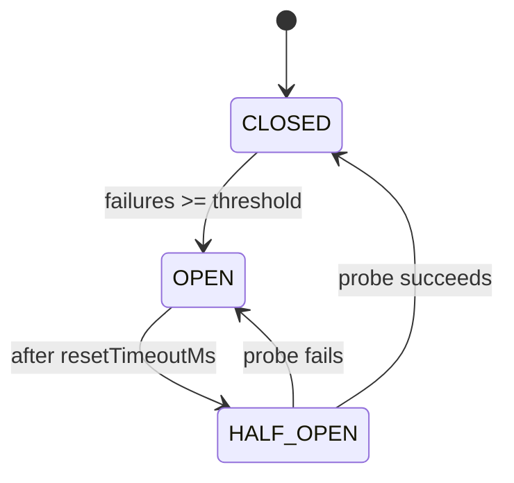

# 4. Circuit Breaker, Bulkhead, Retry

## What It Is
These three patterns form the core of resilience engineering for services that call external dependencies. Without them, a slow or failing external API can take down your entire application through timeout pile-up and resource exhaustion.

The **Retry** pattern re-executes a failed operation, ideally with exponential backoff and jitter. Naive retries (immediate, fixed-interval) can cause thundering herd — all clients hammering a recovering service simultaneously. Exponential backoff spreads retries out; jitter randomizes them so retries from thousands of users don't all fire at the same second. Retries are appropriate for transient failures (network blip, 429, 503) and must be paired with idempotency on the downstream service.

The **Circuit Breaker** prevents a cascade failure by tracking recent failure rates and "opening" the circuit when failures exceed a threshold. While open, calls fail fast (without attempting the real request), giving the downstream service time to recover. After a timeout, the circuit enters half-open state — it allows one probe request through. If it succeeds, the circuit closes; if it fails, it reopens. This pattern is what stops a Stripe outage from making every page load in your app hang for 30 seconds.

The **Bulkhead** pattern isolates failures by partitioning resources. Named after watertight compartments in a ship, it limits how many concurrent calls to a dependency are allowed, so a slow dependency can only exhaust its own thread/connection pool — not the shared pool used by healthy dependencies. In Node.js, this typically means limiting concurrency with a semaphore or a queue with a concurrency cap, per external service.

## Key Concepts
- **Exponential backoff**: Each retry waits `base * 2^attempt` ms — prevents hammering a recovering service
- **Jitter**: Random offset added to backoff — spreads retries across clients to prevent synchronized thundering herds
- **Circuit states**: `CLOSED` (normal, requests pass through), `OPEN` (failing fast, no requests attempted), `HALF-OPEN` (one probe allowed to test recovery)
- **Failure threshold**: The percentage or count of failures that triggers the circuit to open
- **Timeout**: How long the circuit stays open before transitioning to half-open
- **Bulkhead**: Resource isolation per dependency — limits concurrency so one slow service can't exhaust shared resources
- **Retry budget**: A total limit on retries per time window to prevent retry amplification in fan-out call graphs
- **Idempotency requirement**: Retries are only safe if the operation is idempotent; never retry non-idempotent mutations without an idempotency key

The three circuit states and the transitions between them — the part a bullet list can describe but not really show:



Every pattern above assumes a request eventually stops. In Node, that
assumption is not free, and the defaults that decide it are not what most
people expect:

```numbers
caption: "What an outbound HTTP call does before any retry policy is involved."
rows:
  - quantity: "`fetch()` request timeout"
    default: "— none"
    source: "https://nodejs.org/api/globals.html#fetch"
    at_scale: "There is no default timeout at all. A retry policy sitting above a call that never returns never runs: the circuit breaker sees no failures to count, the bulkhead's slot is never released, and the symptom is a queue that grows rather than an error rate that rises."
    measure: "`AbortSignal.timeout(2000)` passed as `signal`, then confirm with a request to a host that accepts the connection and never responds"
  - quantity: "Node `http.globalAgent.keepAlive`"
    default: "true"
    source: "https://nodejs.org/api/http.html#httpglobalagent"
    at_scale: "A call with no explicit agent reuses connections, which is what you want. The number matters because the moment you construct an agent — the usual reason being to cap concurrency — you get a different answer."
    measure: "`node -e \"console.log(require('http').globalAgent.keepAlive)\"`"
  - quantity: "Node `new http.Agent().keepAlive`"
    default: "false"
    source: "https://nodejs.org/api/http.html#new-agentoptions"
    at_scale: "Constructing an agent to bound sockets silently turns connection reuse off. The change meant to limit concurrency has also added a TCP and TLS handshake to every request, and the latency it introduces looks like the dependency getting slower."
    measure: "`node -e \"console.log(new (require('http').Agent)().keepAlive)\"` and compare with the line above"
  - quantity: "Node `Agent.maxSockets`"
    default: "Infinity"
    source: "https://nodejs.org/api/http.html#agentmaxsockets"
    at_scale: "Unbounded outbound concurrency is a bulkhead that does not exist. Under a slow dependency the process opens sockets until something else runs out — file descriptors, memory, or the dependency itself."
    measure: "`node -e \"console.log(require('http').globalAgent.maxSockets)\"` and count live sockets with `ss -tan state established | wc -l` under load"
```

The first two rows are the same argument the rest of this lesson makes, one
layer down: a retry, a breaker and a bulkhead all bound something that is
already bounded. When the underlying call has no timeout, none of the three
patterns can do its job, and each one will look like it is working.

## Example Code
```typescript
// Circuit breaker + retry with exponential backoff + jitter
// Drop-in wrapper for external service calls (Stripe, SendGrid, etc.)

type CircuitState = 'CLOSED' | 'OPEN' | 'HALF_OPEN';

interface CircuitBreakerOptions {
  failureThreshold: number;   // failures before opening
  resetTimeoutMs: number;     // how long to stay open
  maxRetries: number;
  baseDelayMs: number;
}

class CircuitBreaker {
  private state: CircuitState = 'CLOSED';
  private failureCount = 0;
  private lastFailureTime = 0;

  constructor(private readonly name: string, private readonly opts: CircuitBreakerOptions) {}

  async call<T>(fn: () => Promise<T>): Promise<T> {
    if (this.state === 'OPEN') {
      const elapsed = Date.now() - this.lastFailureTime;
      if (elapsed < this.opts.resetTimeoutMs) {
        throw new Error(`Circuit breaker OPEN for ${this.name} — failing fast`);
      }
      // Transition to half-open: allow one probe request
      this.state = 'HALF_OPEN';
    }

    try {
      const result = await this.withRetry(fn);
      this.onSuccess();
      return result;
    } catch (err) {
      this.onFailure();
      throw err;
    }
  }

  private async withRetry<T>(fn: () => Promise<T>): Promise<T> {
    let lastError: unknown;
    for (let attempt = 0; attempt <= this.opts.maxRetries; attempt++) {
      try {
        return await fn();
      } catch (err) {
        lastError = err;
        if (attempt === this.opts.maxRetries) break;
        // Exponential backoff with full jitter
        const cap = this.opts.baseDelayMs * Math.pow(2, attempt);
        const delay = Math.random() * cap; // jitter: random between 0 and cap
        await new Promise((res) => setTimeout(res, delay));
      }
    }
    throw lastError;
  }

  private onSuccess() {
    this.failureCount = 0;
    this.state = 'CLOSED';
  }

  private onFailure() {
    this.failureCount++;
    this.lastFailureTime = Date.now();
    if (
      this.state === 'HALF_OPEN' ||
      this.failureCount >= this.opts.failureThreshold
    ) {
      this.state = 'OPEN';
    }
  }
}

// One breaker per external service — shared across the process lifetime
export const stripeBreaker = new CircuitBreaker('stripe', {
  failureThreshold: 5,
  resetTimeoutMs: 30_000, // 30 seconds
  maxRetries: 3,
  baseDelayMs: 200,
});

// Usage: wraps any Stripe call
async function chargeCustomer(customerId: string, amountCents: number) {
  return stripeBreaker.call(() =>
    stripe.paymentIntents.create({ amount: amountCents, currency: 'usd', customer: customerId })
  );
}
```

Exponential backoff and jitter, side by side. The first block is what every
client does without jitter; the second is the same ceiling with the randomness
that breaks the herd apart.

```typescript run
const BASE_MS = 100;
const ATTEMPTS = 6;
const CLIENTS = 4;
console.log('Without jitter — every client retries at the same instant:');
for (let a = 0; a < ATTEMPTS; a++) {
  const wait = BASE_MS * 2 ** a;
  console.log(`  attempt ${a + 1}: all ${CLIENTS} clients wait ${wait}ms`);
}
console.log('');
console.log('With full jitter — the same ceiling, spread across clients:');
for (let a = 0; a < ATTEMPTS; a++) {
  const ceiling = BASE_MS * 2 ** a;
  const waits = Array.from({ length: CLIENTS }, () => Math.round(Math.random() * ceiling));
  console.log(`  attempt ${a + 1}: ceiling ${ceiling}ms -> ${waits.join('ms, ')}ms`);
}
console.log('');
console.log('Re-run this: the jittered rows change every time, which is the point.');
```

Press Run twice. The top block is identical both times and the bottom one is
not — that difference is the entire mechanism. Four clients here; picture four
thousand hitting a service that is trying to come back up.

## When to Use
- Every call to an external HTTP API (Stripe, SendGrid, Twilio, OAuth providers) — wrap these at the service boundary
- When your service calls another internal microservice or a slower downstream API
- When you have SLA requirements and cannot let a single dependency failure cascade to user-facing 500s
- In BullMQ workers that call external APIs — BullMQ's built-in retry is a partial solution, but a circuit breaker prevents endless retries against a completely dead service

## Common Mistakes
- **Retrying non-idempotent operations**: A payment charge retried three times without an idempotency key results in three charges; always pass idempotency keys to external APIs before adding retries
- **No jitter**: Exponential backoff without jitter causes synchronized retry storms — every client backs off to the same interval and fires simultaneously when it expires
- **One circuit breaker for all services**: A single global circuit breaker that trips on Stripe failures also blocks email sends; isolate by dependency
- **Catching and silencing circuit open errors**: If the circuit is open, you should either serve a degraded response (e.g., show cached data) or surface a clear error — not catch and return `null`, which hides the failure

## Further Reading
- **"Release It!" by Michael Nygard (2nd edition)** — The book that named the circuit breaker pattern; Chapter 5 is essential and very readable
- **"AWS Architecture Blog: Exponential Backoff and Jitter"** — The canonical article on jitter strategies (Full, Equal, Decorrelated); free and short
- **cockatiel (npm) or opossum (npm)** — Production-ready circuit breaker and retry libraries for Node.js; reading their source/docs shows the edge cases worth handling
