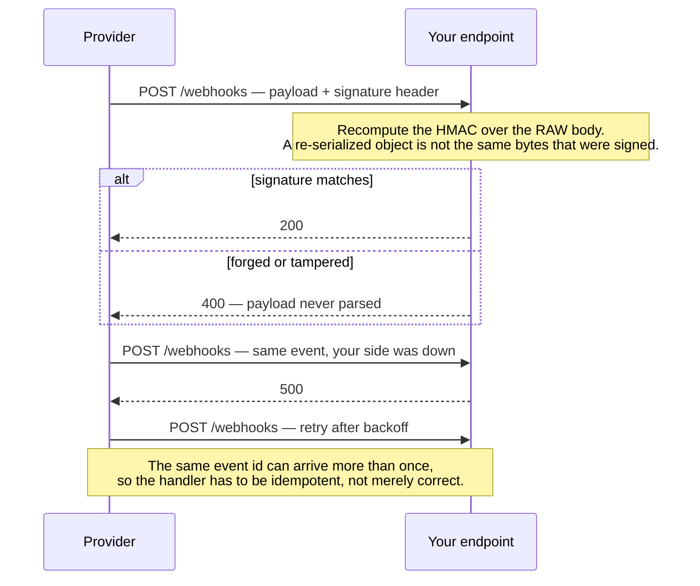

# 8. Webhook Security & Retry Mechanism

## What It Is
Webhooks are HTTP callbacks — a service calls your endpoint when an event occurs. The security problem is that any actor on the internet can POST to your webhook URL with a fabricated payload. Without signature verification, your system will process forged events: fake payment confirmations, fabricated subscription upgrades, or manufactured account events. Signature verification is non-negotiable for any production webhook endpoint.

The standard approach is HMAC-SHA256 signing. The provider (Stripe, GitHub, SendGrid) includes an `X-Signature` header containing an HMAC computed over the raw request body using a shared secret. Your handler recomputes the HMAC and compares it in constant time. The equally important detail is the timestamp: replaying a legitimate signed request from 5 hours ago is still an attack. Include a timestamp in the signature computation and reject requests where the timestamp is more than 5 minutes old.

On the outgoing side — if your SaaS sends webhooks to tenants — you need a reliable retry mechanism. Webhook delivery is at-least-once: the recipient may be down, return a 5xx, or time out. Your system must queue failed deliveries, retry with exponential backoff, and eventually mark deliveries as permanently failed after a maximum attempt count. BullMQ is a natural fit for this. You also need to expose a delivery log to tenants so they can debug failures — a good webhook system is also a good debugging interface.

```quiz
- q: "Is signature verification optional for a webhook that only carries low-value events?"
  anchor: "Signature verification is non-negotiable for any production webhook endpoint"
  options:
    - text: "Yes, if the endpoint receives nothing financial"
      correct: false
      why: "Any actor on the internet can POST a fabricated payload, and which event they fabricate is their choice, not yours."
    - text: "No — it is non-negotiable for any production webhook endpoint"
      correct: true
      why: "Without it the system processes forged events: fake payment confirmations, fabricated subscription upgrades, manufactured account events."
    - text: "Yes, as long as the webhook URL is unguessable"
      correct: false
      why: "An unguessable URL is a secret that travels with every request, not an authentication mechanism."

- q: "What is the HMAC computed over?"
  anchor: "an HMAC computed over the raw request body using a shared secret"
  options:
    - text: "The parsed JSON object, re-serialized"
      correct: false
      why: "Re-serializing changes the bytes — key order, whitespace, number formatting — and the recomputed HMAC will not match."
    - text: "The raw request body, with a shared secret"
      correct: true
      why: "The provider computes it that way and the handler recomputes exactly the same thing before comparing."
    - text: "The URL path together with the request headers"
      correct: false
      why: "The signature has to cover the payload, since the payload is what an attacker would otherwise fabricate."

- q: "Your handler verifies the HMAC correctly but ignores the timestamp. What remains possible?"
  anchor: "replaying a legitimate signed request from 5 hours ago is still an attack"
  options:
    - text: "Nothing — a valid signature proves the payload came from the provider"
      correct: false
      why: "It did come from the provider, five hours ago. Processing it a second time is the attack."
    - text: "A replay of a genuinely signed request from hours earlier"
      correct: true
      why: "The fix is to include a timestamp in the signature computation and reject anything more than 5 minutes old."
    - text: "A forged payload, if the attacker can guess the shared secret"
      correct: false
      why: "Guessing the secret defeats the signature outright. The replay gap is a separate and much cheaper attack."
```

## Key Concepts
- **HMAC-SHA256**: Hash-based Message Authentication Code using SHA-256; proves the payload was generated by the secret holder and hasn't been tampered with
- **Constant-time comparison**: Use `crypto.timingSafeEqual()` to compare HMACs; regular string comparison is vulnerable to timing attacks
- **Timestamp window**: Include a timestamp in the signed payload and reject requests where `|now - timestamp| > 5 minutes`; prevents replay attacks
- **Webhook secret rotation**: Secrets should be rotatable without downtime — support a transition window where both old and new secrets are valid
- **Delivery log**: A persistent record of every webhook attempt, its response status, and any error — essential for tenant debugging
- **Retry policy**: Exponential backoff with a cap (e.g., 1s, 5s, 30s, 5m, 30m, 2h, 12h, 24h); total max attempts ~8–10
- **Dead letter queue**: After max retries, move the event to a DLQ and alert — don't silently discard
- **Idempotency on receipt**: Tenants receiving your webhooks need idempotency keys too; send a unique event ID so they can deduplicate



## Example Code
```typescript
// 1. INCOMING: Verifying Stripe webhook signatures (applies to any HMAC-based provider)

import crypto from 'crypto';
import { NextRequest, NextResponse } from 'next/server';

function verifyStripeSignature(
  rawBody: Buffer,
  signatureHeader: string,
  secret: string,
  toleranceSeconds = 300 // 5-minute replay window
): boolean {
  // Stripe signature header format: "t=timestamp,v1=hmac,v1=hmac"
  const parts = Object.fromEntries(
    signatureHeader.split(',').map((part) => part.split('='))
  ) as Record<string, string>;

  const timestamp = parseInt(parts['t'], 10);
  const receivedSignature = parts['v1'];

  if (!timestamp || !receivedSignature) return false;

  // Reject stale requests (replay attack prevention)
  if (Math.abs(Date.now() / 1000 - timestamp) > toleranceSeconds) {
    return false;
  }

  // Recompute HMAC over "timestamp.rawBody"
  const signedPayload = `${timestamp}.${rawBody.toString('utf-8')}`;
  const expectedSignature = crypto
    .createHmac('sha256', secret)
    .update(signedPayload)
    .digest('hex');

  // Constant-time comparison — prevents timing oracle attacks
  return crypto.timingSafeEqual(
    Buffer.from(receivedSignature, 'hex'),
    Buffer.from(expectedSignature, 'hex')
  );
}

export async function POST(request: NextRequest) {
  const rawBody = Buffer.from(await request.arrayBuffer());
  const signature = request.headers.get('stripe-signature') ?? '';

  if (!verifyStripeSignature(rawBody, signature, process.env.STRIPE_WEBHOOK_SECRET!)) {
    return NextResponse.json({ error: 'Invalid signature' }, { status: 401 });
  }

  const event = JSON.parse(rawBody.toString('utf-8'));
  // Process event...
  return NextResponse.json({ received: true });
}

// 2. OUTGOING: Sending signed webhooks to tenants with retry via BullMQ

import { Queue } from 'bullmq';

const webhookQueue = new Queue('outgoing-webhooks');

export async function dispatchWebhookToTenant(
  tenantId: string,
  event: object
) {
  const eventId = crypto.randomUUID();
  await webhookQueue.add(
    'deliver',
    { tenantId, eventId, event, createdAt: Date.now() },
    {
      attempts: 8,
      backoff: { type: 'exponential', delay: 1000 }, // 1s, 2s, 4s, 8s... up to ~2min
      removeOnComplete: false, // Keep delivery logs
    }
  );
}

// Worker: sign and deliver to tenant's registered webhook URL
async function deliverWebhook(tenantId: string, eventId: string, event: object) {
  const tenant = await db.tenant.findUniqueOrThrow({
    where: { id: tenantId },
    select: { webhookUrl: true, webhookSecret: true },
  });
  if (!tenant.webhookUrl) return;

  const timestamp = Math.floor(Date.now() / 1000);
  const body = JSON.stringify({ id: eventId, timestamp, ...event });
  const signature = crypto
    .createHmac('sha256', tenant.webhookSecret)
    .update(`${timestamp}.${body}`)
    .digest('hex');

  const res = await fetch(tenant.webhookUrl, {
    method: 'POST',
    headers: {
      'Content-Type': 'application/json',
      'X-Webhook-Signature': `t=${timestamp},v1=${signature}`,
      'X-Webhook-Event-Id': eventId,
    },
    body,
    signal: AbortSignal.timeout(10_000), // 10s timeout
  });

  if (!res.ok) throw new Error(`Webhook delivery failed: ${res.status}`);
}
```

Signature verification, replay, and the re-serialization trap, run for real with node:crypto. Note the third case in particular: the object is identical and the bytes are not, which is why the signature has to cover the body a parser has not touched:

```proof sha=da82dea11240f607 at=2026-09-02 commit=cac4924
$ node webhook.js
--- the signature the provider actually sends ---
X-Signature: 7545837c568a327391719bc9ae207fad89f1af27ce5431c04da758272935e493

a genuine delivery
  signature matches, age 42s within the 300s window
  -> ACCEPTED

the same event with the amount edited
  signature does NOT match, age 42s within the 300s window
  -> REJECTED

--- re-serializing an equal object changes the bytes ---
raw  : {"id": "evt_1", "type": "payment.succeeded", "amount": 4200}
again: {"id":"evt_1","type":"payment.succeeded","amount":4200}
same object: true   same bytes: false
verified against the re-serialized body
  signature does NOT match, age 42s within the 300s window
  -> REJECTED

the same genuine delivery, replayed 5 hours later
  signature matches, age 18000s beyond the 300s window
  -> REJECTED
  the signature is still perfectly valid — only the timestamp window stops it
```

## When to Use
- Every incoming webhook endpoint — no exceptions; unverified webhooks are an unauthenticated write path into your system
- When your SaaS emits events to tenant-configured endpoints (integrations, automation triggers)
- Any time an external system calls back into your app after an async operation (payment confirmation, OAuth callback, file processing completion)

## Common Mistakes
- **Verifying the JSON-parsed body instead of the raw body**: JSON parsing is not deterministic — key ordering or whitespace differences change the hash; always verify against the raw bytes before parsing
- **Using `===` for signature comparison**: Regular string comparison leaks timing information; always use `crypto.timingSafeEqual()`
- **No timestamp window**: A valid signed request from yesterday can be replayed indefinitely without a timestamp check
- **Exposing webhook endpoints without rate limiting**: Even with signature verification, an attacker can generate valid signatures with their own test keys; rate limit webhook endpoints by IP to prevent resource exhaustion

## Further Reading
- [**Stripe Webhook documentation](https://stripe.com/docs/webhooks)** — The best-written webhook security reference in the industry; their signature verification approach is worth treating as the standard
- [**"Webhook Security" by ngrok blog](https://ngrok.com/blog)** — Covers signature verification, replay prevention, and delivery guarantees across multiple providers
- **Standard Webhooks specification (standard-webhooks.com)** — An emerging open standard for webhook signatures and payloads; worth following as an interoperability baseline for your outgoing webhooks

```recall
- q: "What is the security problem webhooks have, and what does ignoring it cost?"
  must:
    - "any actor on the internet can POST to your webhook URL with a fabricated payload"
    - "without signature verification the system processes forged events"
    - "fake payment confirmations, fabricated subscription upgrades, manufactured account events"

- q: "Describe the standard verification end to end."
  must:
    - "HMAC-SHA256 signing with a shared secret"
    - "the provider sends an X-Signature header computed over the raw request body"
    - "the handler recomputes the HMAC and compares it in constant time"

- q: "Why is a valid signature insufficient on its own, and what closes the gap?"
  must:
    - "replaying a legitimate signed request from hours ago is still an attack"
    - "include a timestamp in the signature computation"
    - "reject requests whose timestamp is more than 5 minutes old"
```
