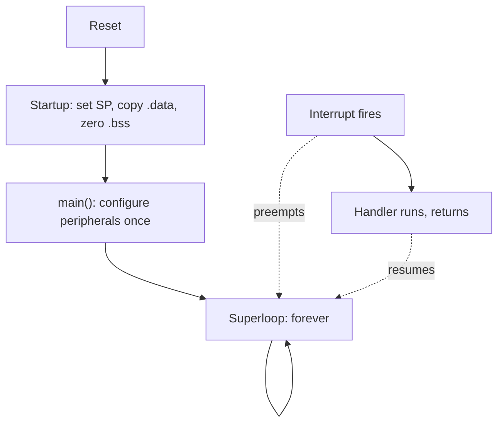

# 542. Firmware Is Not a Program: The Loop That Never Exits

## What It Is
A program on a server starts, does its work, and returns from `main` into something that outlives it — a shell, a supervisor, an orchestrator that will restart it if it dies. Firmware has nothing to return into. There is no process table, no supervisor, no allocator quietly reclaiming what the code forgot. On a microcontroller `main` is not allowed to return, and the startup code that called it usually spins or resets if it does. **The device's entire working life is one function that must not finish.**

Getting to that function takes longer than most developers expect. On reset the core loads its stack pointer and its first instruction address from a fixed location, then runs startup code that nobody writes and everybody depends on: it copies every initialized variable from flash into RAM, zeroes the rest, and only then calls `main`. Those two steps are why a global with an initializer costs both flash and RAM while an uninitialized one costs only RAM — the same distinction the linker reports as `.data` and `.bss` (Lesson 548). `main` then configures the peripherals once and enters a loop with no exit condition. That loop is the **superloop**, and it is the whole application.

The second thing that runs is not called by anyone. An **interrupt** can preempt the loop between any two instructions, run a handler, and return with the loop none the wiser — so a sensor node has two contexts sharing one memory from the first line of code, before any concurrency was chosen (Lessons 543 and 544). This is also why "it crashed" means something different here: there is no stack trace to collect and no log to read, because the thing that would have written the log is the thing that stopped. A fault handler and a reboot are the only mechanisms that survive it (Lesson 553).

Where this course sits is worth stating exactly. Lesson 524's signal chain ends at "firmware scaling", and Lesson 469's device-to-database path begins at the first published byte. This course is the software between those two points: the code that turns a converted count into a value worth sending, and keeps doing it, unattended, for years.



```quiz
- q: "Why must `main` never return in firmware?"
  anchor: "one function that must not finish"
  options:
    - text: "Returning frees the device's memory, and the peripherals stop"
      correct: false
      why: "There is no allocator or OS to free anything. Nothing reclaims memory here."
    - text: "There is nothing to return into — no shell, no supervisor — so the startup code can only spin or reset"
      correct: true
      why: "The device's whole life is that one call. Past it there is no environment left to run in."
    - text: "It is a convention inherited from C, and returning is harmless"
      correct: false
      why: "It is not a style rule. The behaviour past the return is an implementation's fallback, usually a trap or a reset."

- q: "A global variable is declared with an initializer. What does it cost?"
  anchor: "a global with an initializer costs both flash and RAM"
  options:
    - text: "RAM only — the initializer is applied by the compiler at build time"
      correct: false
      why: "The value has to survive power-off, so it lives in flash and is copied into RAM at startup."
    - text: "Flash only, because constants are not copied into RAM"
      correct: false
      why: "That is true of a `const` in flash, not of a writable initialized variable."
    - text: "Both — the initial value is stored in flash and copied into RAM by the startup code"
      correct: true
      why: "That copy is the `.data` step; an uninitialized global is merely zeroed, which is `.bss`."

- q: "What makes a sensor node concurrent before anyone chooses concurrency?"
  anchor: "two contexts sharing one memory"
  options:
    - text: "The RTOS scheduler, which is always present on a microcontroller"
      correct: false
      why: "Most firmware has no RTOS at all. The superloop is the entire scheduler."
    - text: "Interrupts — a handler can preempt the loop between any two instructions and touches the same memory"
      correct: true
      why: "That is why Lessons 543 and 544 come before any discussion of tasks."
    - text: "DMA transfers, which run on a separate core"
      correct: false
      why: "DMA is a third mover, but it is optional. An interrupt is not — the timer alone guarantees one."
```

## Key Concepts
- **`main` never returns** — there is no environment past it; the startup code can only spin or reset
- **Startup code runs before `main`**: sets the stack pointer, copies `.data` from flash to RAM, zeroes `.bss`
- **Initialized globals cost flash and RAM**; uninitialized ones cost RAM only (Lesson 548 turns this into a budget)
- **The superloop is the application** — configure once, then repeat forever with no exit condition
- **Interrupts make it concurrent immediately** — two contexts sharing one memory, before any design decision
- **A crash is a reset**, not a stack trace: the code that would log the failure is the code that failed (Lesson 553)
- **The course boundary**: from Lesson 524's converted count to Lesson 469's first published byte

## Example Code
The superloop's shape is the thing to internalize; the model below is TypeScript, but the structure is exactly what runs on the device. Note what is missing: no `await`, no callback into an event loop, no way out.

```typescript run
/** A model of the superloop, in TypeScript, so it can actually be run here.
 *  On the device this function never returns; the model stops after a fixed
 *  number of iterations so it terminates. Everything else is structural. */
type Peripherals = { adcReady: boolean; count: number };

const hw: Peripherals = { adcReady: false, count: 0 };

// --- interrupt context: called by hardware, not by the loop ---
function onAdcComplete(sample: number): void {
  hw.count = sample;
  hw.adcReady = true; // the ONLY thing the handler does (Lesson 543)
}

// --- init: runs once, before the loop ---
let published = 0;
let lastPublishTick = 0;
const PUBLISH_INTERVAL = 3;

// --- the superloop ---
for (let tick = 0; tick < 10; tick++) {
  // hardware would raise this; the model calls it directly on even ticks
  if (tick % 2 === 0) onAdcComplete(1000 + tick);

  if (hw.adcReady) {
    hw.adcReady = false;
    const degrees = hw.count / 100; // scaling: the end of Lesson 524's chain
    if (tick - lastPublishTick >= PUBLISH_INTERVAL) {
      lastPublishTick = tick;
      published++;
      console.log(`tick ${tick}: published ${degrees.toFixed(2)} degrees`);
    } else {
      console.log(`tick ${tick}: sample ${degrees.toFixed(2)} degrees (not due)`);
    }
  } else {
    console.log(`tick ${tick}: nothing ready`);
  }
}

console.log('');
console.log(`${published} values published in 10 iterations.`);
console.log('On the device the `for` is a `while (1)` and this function never returns.');
console.log('Everything the product will ever do has to fit inside it -- which is why');
console.log('a blocking call is not a convenience here, it is a stall (Lesson 546).');
```

## When to Use
- When reading device firmware for the first time — find `main`, then find the loop; everything else is called from one of the two contexts
- When estimating what a feature costs on a device, since it has to fit inside an iteration without stalling the rest
- When a device "sometimes stops responding" and the loop is the first suspect: something in it is blocking (Lesson 546)
- When deciding whether a device needs an RTOS at all — the superloop answers most sensor-node problems (Lesson 547)
- When specifying what a device does on failure, because a reset is the recovery mechanism, not an exception handler

## Common Mistakes
- **Reasoning about firmware as a request handler** — nothing calls the device; the device calls everything, forever, on its own schedule
- **Assuming a supervisor will restart it** — there is no process to restart; only a watchdog and a reset exist (Lesson 551)
- **Putting work in the interrupt handler because "it is where the data arrives"** — the handler preempts everything and must return immediately (Lesson 543)
- **Treating global initialization as free** — every initialized global is copied from flash to RAM on every boot, and both budgets are finite
- **Expecting a crash to leave evidence** — the reset wipes RAM and the log was never written; the evidence has to be designed in beforehand (Lesson 553)
- **Adding a feature that "only takes 200 ms"** — an iteration that long is 200 ms of everything else not happening

## Further Reading
- [ARM Cortex-M4 Devices Generic User Guide (ARM DUI 0553)](https://developer.arm.com/documentation/dui0553/latest/) — the reset behaviour, the vector table, and the exception model the two contexts come from
- [GCC: Developer options, including `-fstack-usage`](https://gcc.gnu.org/onlinedocs/gcc/Developer-Options.html) — how the toolchain reports what the startup code and each function actually cost
- [Lesson 524](/courses/iot-hardware-basics/the-signal-chain) — the signal chain this course picks up at its last link, "firmware scaling"
- [Lesson 469](/courses/iot-telemetry-edge/the-device-to-database-path) — the transport path that begins where this course ends, at the first published byte
- [Lesson 548](/courses/embedded-firmware/memory-you-cannot-ask-for) — the `.data`/`.bss` split the startup code creates, turned into a RAM budget

```recall
- q: "What happens if `main` returns on a microcontroller?"
  must:
    - "there is no shell, supervisor or OS to return into"
    - "the startup code that called main can only spin forever or reset the device"
    - "the device's whole life is that single call, which is why the superloop has no exit condition"

- q: "What does the startup code do before `main` runs?"
  must:
    - "sets the stack pointer from the vector table"
    - "copies initialized variables from flash into RAM (.data)"
    - "zeroes the uninitialized ones (.bss), which is why an initialized global costs both flash and RAM"

- q: "Why is a superloop device concurrent even with no RTOS?"
  must:
    - "an interrupt can preempt the loop between any two instructions"
    - "the handler and the loop share the same memory"
    - "so shared state needs care from the first line, before any concurrency was chosen"
```
