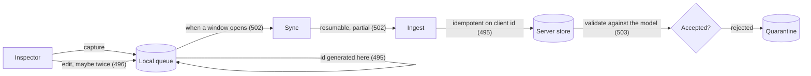

# 494. Offline-First Capture: The Queue Is the Product

## What It Is
A field application runs under a constraint nothing else in this corpus has: **there is no network, and nobody knows when there will be.** Not slow, not flaky — absent, in a basement or a plant room or a site with no coverage, for a shift or for three days.

The mistake is treating that as a feature to add. "We should support offline" produces an application that works online and degrades, which means the offline path is the least-tested path in the product and it is the path the inspector actually uses. The alternative is to invert it: **the queue is the product**, the application writes to local storage and only to local storage, and synchronisation is a background process that the user never waits for and never has to think about.

That inversion changes four things, and each one is a lesson in this course. Records need **ids the device can generate itself**, because at capture time there is nothing to ask (Lesson 495). Two people editing the same record while both offline produces a **conflict that has to be resolved rather than avoided** (Lesson 496). The **schema has to survive a version change** while a device is out of contact with a queue full of the old shape (Lesson 501). And the sync itself has to be **resumable**, because the window closes mid-upload (Lesson 502).

What makes it worth the work is that the alternative is not a slower application — it is an application that loses data. An inspector who cannot save a finding writes it on paper, and the paper is the record that does not reach the system.

The one thing to decide early, because it is hard to change later, is **how much the device holds**. A queue is finite, and the overflow policy is a product decision exactly as it was for a device in Lesson 476: drop the oldest, drop the newest, or refuse new captures. For field data the third is usually correct and the least popular — telling an inspector the queue is full is better than deciding for them which finding to discard.

```quiz
- q: "Why is 'add offline support' the wrong framing?"
  anchor: "the offline path is the least-tested path in the product and it is the path the inspector actually uses"
  options:
    - text: "Because it is more work than building offline-first"
      correct: false
      why: "It is usually less work up front. The cost arrives later, in the path nobody exercised."
    - text: "Because it makes the offline path a degraded fallback, which is both the least-tested path and the one actually used"
      correct: true
      why: "Inverting it — writing only to local storage — makes the tested path and the used path the same path."
    - text: "Because offline support requires a different database"
      correct: false
      why: "It requires local storage, which any platform provides. The problem is architectural rather than technical."

- q: "A field app's queue is full. What is usually the right behaviour?"
  anchor: "telling an inspector the queue is full is better than deciding for them which finding to discard"
  options:
    - text: "Drop the oldest entries, since the newest matter most"
      correct: false
      why: "That silently discards a finding somebody recorded, and they will not know which."
    - text: "Refuse new captures and say so, because the alternative is deciding for the inspector which finding to lose"
      correct: true
      why: "Unpopular and correct: an explicit refusal is recoverable, a silent drop is not."
    - text: "Compress the queue and continue"
      correct: false
      why: "Worth doing and it postpones the question rather than answering it."
```

## Key Concepts
- **The constraint is absence, not latency** — no network, for an unknown duration
- **The queue is the product**: write locally, sync in the background, never make the user wait
- **Offline-as-a-feature makes the used path the untested path**
- **Device-generated ids** are required, because capture has nothing to ask (Lesson 495)
- **Concurrent offline edits produce real conflicts** (Lesson 496)
- **The schema must survive a version change** with an old-shaped queue on the device (Lesson 501)
- **Sync must be resumable** — the window closes mid-upload (Lesson 502)
- **The alternative to offline-first is lost data**, on paper, outside the system
- **Queue capacity and overflow are product decisions**, as in Lesson 476
- **Refusing a capture beats silently dropping one** — explicit is recoverable

## Example Code
The path, and where each of this course's lessons sits on it:



```typescript
/** The queue entry. Note what is decided at capture time and can never be
 *  decided later: the id, and the fact that this record exists at all. */
type QueueEntry = {
  /** Generated on the device (Lesson 495). Never changes. */
  clientId: string;
  /** Which schema version the device captured against (Lesson 501). */
  schemaVersion: number;
  /** The device's own clock. Unsynchronised, and Lesson 474's caveats apply. */
  capturedAt: string;
  /** Incremented per local edit. Lesson 496's version vector is built on it. */
  localVersion: number;
  payload: Record<string, unknown>;
  /** Bytes still to upload for any attachment (Lesson 502). */
  pendingBytes: number;
};

export type QueuePolicy = {
  /** Entries, not bytes — the app knows its own record size. */
  maxEntries: number;
  /** There is no fourth option, and the third is usually right for field data. */
  onFull: 'drop-oldest' | 'drop-newest' | 'refuse-capture';
};

export type CaptureResult =
  | { accepted: true; clientId: string }
  /** An explicit refusal the user can act on — they can sync, delete, or
   *  write it down knowing the app did not take it. A silent drop offers
   *  none of those. */
  | { accepted: false; reason: 'queue-full'; queued: number; capacity: number };

export function capture(
  queue: QueueEntry[],
  policy: QueuePolicy,
  entry: QueueEntry
): CaptureResult {
  if (queue.length < policy.maxEntries) {
    queue.push(entry);
    return { accepted: true, clientId: entry.clientId };
  }
  if (policy.onFull === 'refuse-capture') {
    return { accepted: false, reason: 'queue-full', queued: queue.length, capacity: policy.maxEntries };
  }
  if (policy.onFull === 'drop-oldest') queue.shift();
  else queue.pop();
  queue.push(entry);
  return { accepted: true, clientId: entry.clientId };
}
```

## When to Use
- Any application used away from reliable connectivity — inspection, maintenance, survey, delivery
- When the cost of a lost record is high, which in a compliance or safety context it usually is
- When designing the data model, since the id scheme and the conflict strategy both follow from this decision
- When estimating, because offline-first is a larger up-front cost and a much smaller total one

## Common Mistakes
- **Building online-first and adding offline** — the offline path is then the least-exercised code in a product whose users are mostly offline
- **Blocking the user on a sync** — a spinner in a basement is an application that has stopped working
- **Server-generated ids** — they cannot exist at capture time, which is when the record needs an identity (Lesson 495)
- **No overflow policy** — the queue has one whether or not anyone chose it, and it will be whatever the storage layer happened to do
- **Silently dropping queue entries** — the inspector never learns which finding is gone
- **Assuming the sync completes** — it closes mid-upload, so partial state is the normal case (Lesson 502)
- **Ignoring the schema-version problem** — a device out of contact for a month has a queue full of the old shape (Lesson 501)

## Further Reading
- [Geolocation API specification](https://w3c.github.io/geolocation-api/) — the browser-side position source these apps read, and its accuracy field (Lesson 497)
- [MDN: GeolocationCoordinates.accuracy](https://developer.mozilla.org/en-US/docs/Web/API/GeolocationCoordinates/accuracy) — the definition to read before interpreting the number
- [RFC 7231 — HTTP/1.1 Semantics and Content](https://datatracker.ietf.org/doc/html/rfc7231) — the method semantics an idempotent submission relies on (Lesson 495)

```recall
- q: "State the constraint a field app runs under, and how it changes the architecture."
  must:
    - "no network, for an unknown duration — absence rather than latency"
    - "the queue is the product: write to local storage only, sync in the background"
    - "the user never waits for a sync"

- q: "Why does offline-as-a-feature fail?"
  must:
    - "it makes the offline path a degraded fallback"
    - "which is the least-tested path in the product"
    - "and the one the user is actually on most of the time"

- q: "Name the three overflow policies and which is usually right for field data."
  must:
    - "drop oldest, drop newest, or refuse the capture"
    - "refusing is usually right, and least popular"
    - "because an explicit refusal is recoverable and a silent drop is not"
```
