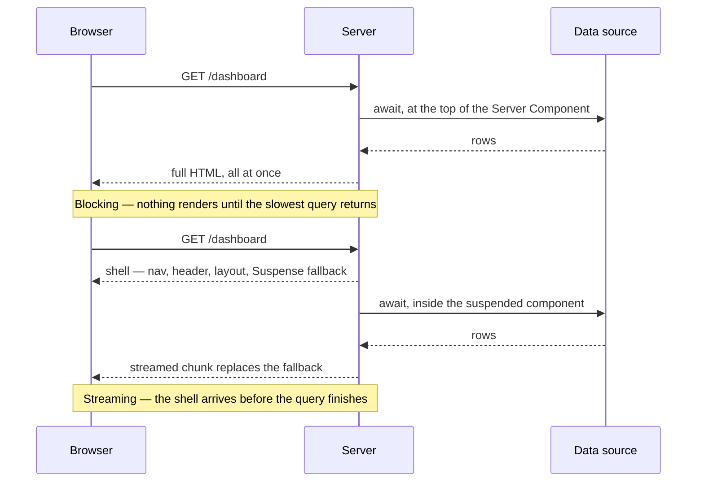

# 26. Streaming SSR and Suspense Boundaries

## What It Is
Streaming SSR is the ability to send HTML to the browser in chunks rather than waiting for the entire page to be ready. Instead of your server building a complete HTML document and flushing it all at once, it opens a persistent HTTP connection and pushes chunks down as they become ready. React 18 introduced first-class support for this through `Suspense` boundaries: any component tree wrapped in `<Suspense>` can be "deferred" — the rest of the page streams immediately, and the deferred chunk streams in when its data resolves.

In the Next.js App Router this is the default behavior the framework was designed around. When you `await` at the top of a Server Component, you block streaming for everything in that subtree. Moving that `await` inside a nested component and wrapping it with `<Suspense fallback={<Skeleton />}>` means the shell — nav, header, layout chrome — reaches the browser nearly instantly, and the data-dependent content streams in as it resolves. For a multi-tenant SaaS where different panels (billing, team members, analytics) hit different database sources, this is a meaningful UX and performance win.

The mechanism under the hood is HTTP chunked transfer encoding combined with React's selective hydration. The server sends the fallback HTML first, then later sends a `<script>` tag containing the resolved chunk, which React inserts into the right DOM position. The client does not do a round-trip; it receives everything over the same initial connection.

## Key Concepts
- **Suspense boundary** — A `<Suspense fallback={...}>` wrapper that tells React "this subtree can be deferred; show the fallback until it resolves"
- **Streaming vs blocking** — Blocking: entire route waits for the slowest `await`. Streaming: each boundary resolves independently
- **`loading.tsx`** — Next.js file convention; automatically wraps the page in a Suspense boundary with whatever you export as the fallback
- **Parallel data fetching** — Using `Promise.all` or independent async components to ensure multiple fetches run concurrently rather than sequentially
- **`use` hook** — React 19 / Next.js experimental: lets you unwrap a Promise inside a Client Component and suspend on it
- **Selective hydration** — React hydrates the streamed chunks independently, so interactivity arrives for visible parts before hidden parts resolve
- **`generateStaticParams` + streaming** — Static-shell pages that still stream dynamic sections; the best of both worlds
- **Time-to-first-byte (TTFB) vs largest contentful paint (LCP)** — Streaming improves TTFB dramatically; LCP depends on what you stream first

Where the `await` sits decides which of these two shapes the browser gets. Both fetch the same data and take the same total time; only one of them shows the reader anything while it waits:



## Example Code
```tsx
// app/dashboard/[tenantId]/page.tsx
// Shell renders immediately; data panels stream in independently

import { Suspense } from 'react';
import { BillingSkeleton, TeamSkeleton, AnalyticsSkeleton } from '@/modules/ui/skeletons';

// Each panel is its own async Server Component — they fetch in parallel
async function BillingPanel({ tenantId }: { tenantId: string }) {
  // This fetch does NOT block the rest of the page
  const billing = await getBillingData(tenantId); // hits Stripe API ~200ms
  return <BillingCard data={billing} />;
}

async function TeamPanel({ tenantId }: { tenantId: string }) {
  const members = await getTenantMembers(tenantId); // hits tenant DB ~50ms
  return <TeamTable members={members} />;
}

async function AnalyticsPanel({ tenantId }: { tenantId: string }) {
  const stats = await getAnalytics(tenantId); // expensive query ~800ms
  return <AnalyticsChart stats={stats} />;
}

export default function DashboardPage({
  params,
}: {
  params: { tenantId: string };
}) {
  const { tenantId } = params;

  // The layout shell (nav, header) renders and streams immediately.
  // Each Suspense boundary resolves independently — the team panel
  // (fast) appears well before analytics (slow).
  return (
    <main>
      <h1>Dashboard</h1>

      <Suspense fallback={<BillingSkeleton />}>
        {/* @ts-expect-error async RSC */}
        <BillingPanel tenantId={tenantId} />
      </Suspense>

      <Suspense fallback={<TeamSkeleton />}>
        {/* @ts-expect-error async RSC */}
        <TeamPanel tenantId={tenantId} />
      </Suspense>

      {/* Slowest panel — streams last, others don't wait */}
      <Suspense fallback={<AnalyticsSkeleton />}>
        {/* @ts-expect-error async RSC */}
        <AnalyticsPanel tenantId={tenantId} />
      </Suspense>
    </main>
  );
}

// app/dashboard/[tenantId]/loading.tsx
// Automatic top-level Suspense for route navigation transitions
export default function Loading() {
  return <div>Loading dashboard...</div>;
}
```

## When to Use
- Any page with multiple independent data sources (billing + members + analytics) where you don't want the slowest query to block the fastest one
- Pages that call external APIs (Stripe, third-party SaaS) where latency is unpredictable — stream the local data first
- Long-running report or aggregation queries that should not block the page shell
- Your tenant dashboard where different panels come from different per-tenant databases
- Any route where TTFB matters for perceived performance — even if LCP is unchanged, users feel the page is faster

## Common Mistakes
- **Awaiting at the page level** — `const data = await Promise.all([...])` at the top of a page component defeats streaming; move awaits inside child components
- **Waterfall inside a single component** — `const a = await fetchA(); const b = await fetchB(b.id)` is a sequential chain; only use this when `b` genuinely depends on `a`
- **Missing error boundaries** — A streaming component that throws after the shell has been sent cannot be caught with an HTTP status code; you must use `error.tsx` alongside `loading.tsx`
- **Over-granular Suspense** — Wrapping every single leaf in Suspense creates layout shift; group logically related content that should appear together

## Further Reading
- [Next.js Streaming and Suspense docs](https://nextjs.org/docs/app/building-your-application/routing/loading-ui-and-streaming)
- [React 18 Suspense and Streaming (RFC)](https://github.com/reactjs/rfcs/blob/main/text/0213-suspense-in-react-18.md)
- [Vercel: How Streaming Works](https://vercel.com/blog/understanding-react-server-components)
