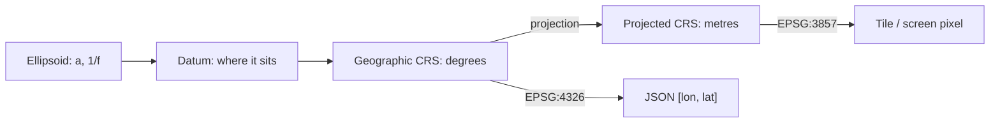

# 441. Coordinates Are Not Numbers: Geographic vs Projected

## What It Is
A latitude and a longitude look like two numbers, and every type system you will use agrees: `{ lat: number, lon: number }`, `double precision`, `float64`. That agreement is the problem. **A coordinate is only meaningful with the reference system it was measured in**, and that system is almost never carried alongside the numbers.

There are two families. A **geographic** coordinate is an angle: latitude and longitude are directions from the centre of an ellipsoid that models the Earth, measured in degrees. A **projected** coordinate is a position on a flat plane, in metres or feet, produced by squashing that ellipsoid onto paper. `51.5, -0.1` and `-11131, 6710219` can name the same place, and only the first looks like something you would put in a `lat` column.

The distinction decides what arithmetic is legal. Subtracting two projected coordinates gives a distance, because the plane has metres on it. Subtracting two geographic coordinates gives a difference of angles, and a degree of longitude is 111 km at the equator and 19 km at 80 degrees north — so the same subtraction means different things depending on where you did it. Almost every spatial bug that survives code review is this substitution: treating angles as if they were a flat grid.

A reference system is not one choice but several stacked: an ellipsoid (the shape), a datum (where that shape sits relative to the actual Earth), a coordinate system (angles or metres, and in what order), and for projected systems a projection with its own parameters. Lessons 443 and 444 take the two that break things most often.

```quiz
- q: "Why is subtracting two latitudes a different operation from subtracting two projected northings?"
  anchor: "a degree of longitude is 111 km at the equator and 19 km at 80 degrees north"
  options:
    - text: "It is not — both give a distance, just in different units"
      correct: false
      why: "A difference of angles is not a distance. What that angle is worth on the ground depends on where you are."
    - text: "A projected difference is metres on a plane; an angular difference is worth a different distance at every latitude"
      correct: true
      why: "That is the whole reason the two families are kept apart."
    - text: "Latitudes cannot be subtracted because they are not linear"
      correct: false
      why: "They can be subtracted. The result is an angle, which is a perfectly good answer to a different question."

- q: "What does a `lat double precision` column tell you about the value in it?"
  anchor: "A coordinate is only meaningful with the reference system it was measured in"
  options:
    - text: "That it is a latitude in WGS 84, since that is the default"
      correct: false
      why: "There is no default. WGS 84 is the most common answer and still a guess until something records it."
    - text: "That it is a number between -90 and 90 — the reference system is not in the column"
      correct: true
      why: "The type carries the range and nothing else, which is exactly why the system has to be recorded beside it."
    - text: "That it is an angle, which is enough to compute distances from"
      correct: false
      why: "Knowing it is an angle is necessary and not sufficient: which ellipsoid the angle is measured against still changes where the point is."
```

## Key Concepts
- **Geographic coordinates**: angles — latitude and longitude on an ellipsoid, in degrees
- **Projected coordinates**: positions on a plane, in linear units, produced by a projection
- **Ellipsoid**: the mathematical shape standing in for the Earth, defined by a semi-major axis and a flattening
- **Datum**: where that ellipsoid is anchored relative to the real Earth — the part lesson 443 is about
- **Coordinate reference system (CRS)**: the whole stack, named as one thing and usually identified by an EPSG code
- **Units are not the same as system**: two projected systems both in metres can still be tens of metres apart
- **Angles do not subtract into distances**: the value of a degree changes with latitude, which is why the same code is right near the equator and wrong at 60 north
- **The system is metadata, and metadata is what gets lost**: a JSON array, a CSV column and a float pair all carry the numbers and drop the system

## Example Code
Where the reference system actually lives, in the three places a coordinate usually travels:



```typescript
/** Two families, kept apart in the type system rather than in a comment.
 *  A function that wants metres cannot be handed degrees by accident. */
type Geographic = { kind: 'geographic'; epsg: number; lat: number; lon: number };
type Projected = { kind: 'projected'; epsg: number; easting: number; northing: number };

export type Coordinate = Geographic | Projected;

/** Legal only on a projected pair, and only when both are in the same system.
 *  On a geographic pair this would be a difference of angles wearing the word
 *  "metres", which is the bug this whole course is about. */
export function planarDistanceMetres(a: Projected, b: Projected): number {
  if (a.epsg !== b.epsg) {
    throw new Error(`cannot subtract EPSG:${a.epsg} from EPSG:${b.epsg} — reproject one of them first`);
  }
  return Math.hypot(a.easting - b.easting, a.northing - b.northing);
}
```

## When to Use
- Any time coordinates cross a system boundary — an API, a file, a database column, a message queue
- When designing a schema that will hold positions, where the CRS is a column decision and not a comment
- When a distance or an area comes out plausible but wrong, and the cause is an angular difference treated as a linear one
- When integrating two datasets that both claim to be "lat/lon" and do not line up

## Common Mistakes
- **Storing coordinates without their reference system** — the numbers survive every hop and the system does not, so the receiver guesses, and the guess is usually WGS 84 and occasionally wrong by tens of metres
- **Computing distance from a difference of degrees** — that is a difference of angles; it is right at the equator and increasingly wrong towards the poles, which is why it passes local testing
- **Assuming two systems in metres are interchangeable** — the unit says nothing about the origin, the projection or the datum, and two metre-based systems can put the same place tens of metres apart
- **Treating "WGS 84" as a complete answer** — it names a datum, and lesson 443 is about what that still leaves open
- **Reprojecting for display and then measuring on the result** — the projection that makes a map look right is the one that makes a distance wrong, which lesson 444 makes concrete

## Further Reading
- [EPSG:4326](https://epsg.io/4326) — the geographic system nearly everything defaults to, with its ellipsoid, datum and axis order
- [EPSG registry](https://epsg.org/home.html) — the authority the codes come from, and the place to check a system's definition and version
- [PROJ documentation](https://proj.org/en/9.4/operations/conversions/index.html) — the library almost every tool uses underneath, and a readable catalogue of what a conversion actually is

```recall
- q: "Distinguish geographic from projected coordinates, and say what each one supports."
  must:
    - "geographic coordinates are angles on an ellipsoid, in degrees"
    - "projected coordinates are positions on a plane, in linear units"
    - "subtracting projected coordinates gives a distance; subtracting angles gives an angle"

- q: "Name the layers a coordinate reference system is stacked out of."
  must:
    - "an ellipsoid — the shape, its semi-major axis and flattening"
    - "a datum — where that ellipsoid sits relative to the real Earth"
    - "a coordinate system — angles or linear units, and their order"
    - "for a projected system, a projection with its own parameters"

- q: "Why does a `lat double precision` column not settle what a value means?"
  must:
    - "the type carries a range, not a reference system"
    - "the reference system is metadata and metadata is what gets dropped between hops"
    - "the receiver guesses, usually WGS 84, and the guess is sometimes wrong by tens of metres"
```
