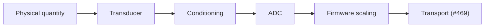

# 524. The Signal Chain: Everything That Happens Before the First Byte

## What It Is
Lesson #469 traces a reading from a device to a database, and its first box is labelled "device". This lesson opens that box. Everything here happens before the first byte exists, which is also why none of it appears in a log.

A sensor node is a chain of conversions, and **each link converts one representation into another while losing something**. A physical quantity — a temperature, a pressure, a position — acts on a transducer, which turns it into an electrical quantity. Signal conditioning scales that electrical quantity into a range the next stage can accept. An analog-to-digital converter turns it into an integer. Firmware turns that integer into a number with a unit. Only then does the transport you already know pick it up.

The chain matters because of how it fails. **A software failure usually announces itself; a signal-chain failure usually produces a plausible number instead.** A disconnected sensor does not raise an exception — it reads whatever the input floats to, which may sit comfortably inside your valid range. A sensor powered from a rail that sags during radio transmission returns a reading that is wrong only while transmitting, which is exactly when you record it. A miswired divider returns a number that tracks the real quantity perfectly and is scaled wrong by a constant, which looks like a calibration problem for months.

This is the single habit the course is built to install: **when a number is wrong, ask which conversion produced it before asking which line of code did.** The conversions are ordered, so they can be bisected, and Lesson #540 turns that into a procedure.

There is a second reason to see the chain whole. Decisions made at one link constrain every link after it. The transducer's output range decides the conditioning; the conditioning decides how much of the converter's range you actually use; that decides your resolution; and resolution decides whether the payload design in #473 is spending bytes on precision the sensor never had. **A byte of precision that the front end did not deliver is a byte of noise you are paying to transmit.**

```quiz
- q: "A field temperature reading is wrong. Which question comes first?"
  anchor: "ask which conversion produced it before asking which line of code did"
  options:
    - text: "Which line of the parsing code mis-scaled it"
      correct: false
      why: "Possible, but it is the last link in the chain and the cheapest to inspect later. Starting there means re-reading correct code while a physical fault stays in place."
    - text: "Which conversion in the chain produced it — transducer, conditioning, converter, or firmware scaling"
      correct: true
      why: "The chain is ordered, so it can be bisected. Naming the link first turns a vague fault into a measurement."
    - text: "Whether the transport dropped or duplicated the reading"
      correct: false
      why: "Transport corrupts delivery, not value. A reading that arrives intact and wrong was already wrong when it was created."

- q: "Why is a disconnected sensor more dangerous than a crashed one?"
  anchor: "it reads whatever the input floats to"
  options:
    - text: "Because it draws more current and flattens the battery"
      correct: false
      why: "A disconnected input generally draws less, not more. The danger is in the data, not the power."
    - text: "Because it produces a plausible number instead of an error, so nothing downstream rejects it"
      correct: true
      why: "Every validator, alert and dashboard downstream is built to catch missing data. None of them is built to catch data that is present and invented."
    - text: "Because the gateway retries it and creates duplicates"
      correct: false
      why: "That is a transport concern (#475). This reading is singular, delivered once, and wrong."
```

## Key Concepts
- **Transducer**: converts a physical quantity into an electrical one; the first and least reversible link
- **Signal conditioning**: scales, filters or buffers the electrical signal into the range the converter needs
- **ADC**: converts a voltage into an integer count; the point where the analog world ends
- **Firmware scaling**: converts counts into a number with a unit — the first place the value is human-readable
- **Every link is lossy**: precision removed at one stage cannot be recovered at a later one
- **Hardware fails plausibly**: the common failure is a believable wrong number, not an exception
- **The chain is ordered**, which is what makes bisection possible (#540)
- **Downstream precision is capped upstream** — payload bytes beyond the front end's resolution carry noise (#473)

## Example Code
The chain as a picture, because the order is the part worth memorising:



Read it as a fault tree rather than a data flow. A wrong number at the transport was produced at exactly one of the earlier links, and each has a different symptom: a constant offset points at conditioning or scaling, a value that ignores the world points at the transducer, a value that steps coarsely points at the converter, and a value that changes when the radio transmits points at the power feeding all of them.

## When to Use
- When a reading is wrong and you need somewhere to start that is not the parsing code
- When specifying a sensor, where the transducer's range decides everything downstream of it
- When choosing a payload encoding, because the front end sets the ceiling on useful precision (#473)
- When writing validation rules, which must assume plausible wrong values rather than absent ones
- When reading someone else's device firmware, where the scaling step is usually the only link written down

## Common Mistakes
- **Debugging the software first** — it is the most visible link and the least likely to have changed, so it costs the most time per unit of information
- **Assuming a failed sensor reports nothing** — the ordinary failure is a value inside the valid range, which every downstream check passes
- **Transmitting more precision than the front end produced** — the extra digits are noise, and they cost payload budget that #472 has already made scarce
- **Treating calibration as a fix for a wiring error** — a constant scale error can be calibrated away, which hides the wiring fault until the wiring is touched again
- **Validating only for missing data** — range and rate-of-change checks catch invented values, absence checks do not (#519)

## Further Reading
- [Analog Devices MT-001: Taking the Mystery out of the Infamous Formula](https://www.analog.com/media/en/training-seminars/tutorials/MT-001.pdf) — where converter resolution actually comes from, before you spend bytes on it
- [Bosch BME280 humidity sensor product page](https://www.bosch-sensortec.com/products/environmental-sensors/humidity-sensors-bme280/) — a widely used sensor whose datasheet shows the whole chain in one document
- [SparkFun: How to Read a Schematic](https://learn.sparkfun.com/tutorials/how-to-read-a-schematic) — the notation the rest of this course assumes

```recall
- q: "Name the links of the signal chain in order, from the world to the transport."
  must:
    - "physical quantity acts on a transducer"
    - "conditioning scales it into the converter's range"
    - "the ADC turns volts into counts"
    - "firmware turns counts into a number with a unit"
    - "and only then does transport carry it"

- q: "Explain why hardware faults are harder to detect than software faults."
  must:
    - "software failures usually announce themselves with an error"
    - "a signal-chain fault usually produces a plausible number instead"
    - "so downstream validation, which is built to catch missing data, passes it"

- q: "Why does the front end cap how much precision is worth transmitting?"
  must:
    - "precision lost at one link cannot be recovered later"
    - "so payload bytes beyond the front end's resolution carry noise"
    - "and payload budget is already scarce on constrained radios"
```
