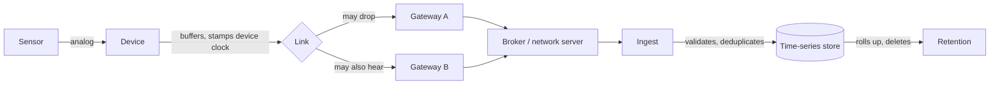

# 469. The Device-to-Database Path: Where Readings Actually Get Lost

## What It Is
A sensor reading has a longer journey than most data in a system, and almost every production bug in a telemetry stack is located somewhere on it. Naming the hops is the first useful thing to do, because "the data is wrong" is not a diagnosis and "the reading was written at the wrong timestamp between the gateway and the ingest" is.

The path is: a **sensor** produces a measurement; the **device** samples it, stamps it with its own clock and buffers it; a **radio or network link** carries it, sometimes; a **gateway** receives it and forwards it, possibly alongside another gateway that heard the same transmission; a **broker or network server** routes it; an **ingest** validates and writes it; and a **database** stores it under a schema with its own retention rules. Seven hops, and a reading can be lost, duplicated or mis-timestamped at nearly all of them.

What makes this course necessary rather than a rewrite of the distributed-systems lessons is where the constraints differ. A client retrying an HTTP request and a device retrying an uplink are solving the same problem under different physics: the device may have been offline for three days, may have four thousand buffered readings to flush, may be legally forbidden from transmitting again for two minutes (Lesson 472), and cannot be asked anything because it is asleep. The patterns from (#7) and (#4) still apply; their parameters do not.

The other structural difference is that **a reading has three timestamps and none of them is authoritative** (Lesson 474), and that **duplication here is normal rather than exceptional** — two gateways in range of one transmitter is a correctly working network, not a fault.

```quiz
- q: "A reading appears twice in the database. Which hop is the likeliest cause?"
  anchor: "two gateways in range of one transmitter is a correctly working network"
  options:
    - text: "The device sampled twice"
      correct: false
      why: "Possible, and the least likely: the device's own loop is the one part of the path with no network in it."
    - text: "Several hops can cause it, and more than one of them is the network working correctly"
      correct: true
      why: "Two gateways hearing one transmission, an acknowledgement that did not get back, and a store-and-forward flush all produce duplicates without anything failing."
    - text: "The database's unique constraint was missing"
      correct: false
      why: "That is what let the duplicate be STORED. It is not what produced it, and knowing the difference is what fixes the right hop."

- q: "Why does this course exist alongside the corpus's existing retry and idempotency lessons?"
  anchor: "The patterns from (#7) and (#4) still apply; their parameters do not"
  options:
    - text: "Because devices use different protocols, so the patterns do not transfer"
      correct: false
      why: "The patterns transfer directly. What changes is the scale of the constraints they run under."
    - text: "Because the same patterns run under different physics — days offline, thousands of buffered readings, a legally enforced silence between transmissions"
      correct: true
      why: "A retry policy written for HTTP is not merely suboptimal here; at the slowest data rates it is not legal."
    - text: "Because telemetry does not need idempotency"
      correct: false
      why: "It needs it more, because duplication is routine rather than exceptional."
```

## Key Concepts
- **Seven hops**: sensor, device, link, gateway, broker or network server, ingest, database
- **Loss, duplication and mis-timestamping** are each possible at several of them
- **Duplication is normal**: two gateways hearing one uplink is a healthy network
- **Three timestamps** per reading, none authoritative on its own (Lesson 474)
- **The device may be asleep**: nothing upstream can ask it anything
- **Buffered backlogs** arrive in bulk and out of order after an outage (Lesson 476)
- **Transmission may be rate-limited by law**, not by policy (Lesson 472)
- **Existing patterns, different parameters**: (#7) and (#4) apply, with numbers from this domain

## Example Code
The path, and what each hop can do to a reading:



```typescript
/** What a reading has to carry to survive the path above. The three times are
 *  separate fields on purpose: collapsing them is the mistake Lesson 474 is
 *  about, and it cannot be undone once the row is written. */
export type Reading = {
  deviceId: string;
  /** The device's own clock at sampling. What the reading is ABOUT. */
  measuredAt: string;
  /** The gateway's clock when it forwarded. */
  forwardedAt: string;
  /** Our clock when the row was written. */
  ingestedAt: string;
  metric: string;
  value: number;
  /** Which gateway delivered this copy. Two gateways hearing one uplink is
   *  not an error, and knowing which one arrived is how you tell that apart
   *  from a device that transmitted twice. */
  viaGateway: string;
};

/** The identity of a reading, and therefore the only correct deduplication
 *  key: what was measured, by which device, at which instant. Not the
 *  arrival time, which differs between two copies of the same reading. */
export function readingKey(r: Reading): string {
  return `${r.deviceId}|${r.metric}|${r.measuredAt}`;
}
```

## When to Use
- Before designing a telemetry stack, where naming the hops decides where validation and deduplication live
- When diagnosing a data problem, where the useful first question is which hop could have produced this symptom
- When writing an ingest contract, since what a reading must carry is determined by what the path can do to it
- When estimating cost, because the transport hops are usually the expensive ones and Lesson 481 is about moving work off them

## Common Mistakes
- **Treating duplication as a fault** — several hops produce duplicates while working correctly, so the ingest deduplicates rather than the network being fixed
- **Storing one timestamp** — the three cannot be recovered from each other, and the choice of which to keep is made once, permanently, at write time
- **Assuming the device can be asked** — it may be asleep, out of range, or legally unable to transmit; anything requiring a round trip has to survive not getting one
- **Applying HTTP retry parameters unchanged** — the pattern is right and the intervals are not, which Lesson 472 makes concrete
- **Validating only at the ingest** — a reading that was already wrong at the device is validated into the database, correctly formatted and false
- **Designing for the healthy path** — the interesting cases are all outages, backlogs and duplicates, and they are the normal operating conditions rather than the exceptions

## Further Reading
- [MQTT 5.0 specification](https://docs.oasis-open.org/mqtt/mqtt/v5.0/mqtt-v5.0.html) — the broker hop, defined; Lesson 470 and Lesson 471 work through it
- [LoRa Alliance technical specifications](https://resources.lora-alliance.org/technical-specifications/ts001-1-0-4-lorawan-l2-1-0-4-specification) — the link and gateway hops for a LPWAN, version-stamped
- [PostgreSQL table partitioning](https://www.postgresql.org/docs/current/ddl-partitioning.html) — the storage hop, and what makes retention possible

```recall
- q: "Name the hops between a sensor and a stored row."
  must:
    - "sensor, device, link, gateway, broker or network server, ingest, database"
    - "a reading can be lost, duplicated or mis-timestamped at nearly all of them"

- q: "Give two ways a duplicate arrives without anything having failed."
  must:
    - "two gateways in range both hear and forward the same transmission"
    - "an acknowledgement is lost, so the sender retries a delivery that succeeded"
    - "a store-and-forward flush re-sends something already delivered"

- q: "Why is this not a rewrite of the corpus's retry and idempotency lessons?"
  must:
    - "the patterns transfer; the constraints they run under do not"
    - "a device may be offline for days, buffer thousands of readings, and be legally barred from transmitting again for minutes"
    - "and it may be asleep, so nothing upstream can ask it anything"
```
