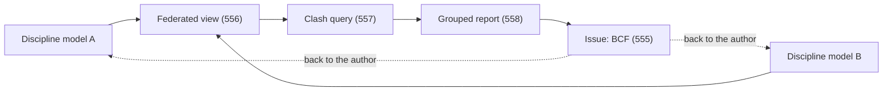

# 554. Coordination Is a Data Problem: Geometry, Properties, and the Issue

## What It Is
Every project with more than one discipline has the same shape: several teams author several models, and something has to happen at the seams. That something is usually described as a meeting, and underneath it is three separate data flows that behave nothing like each other.

**Geometry** moves as whole files. A discipline exports its model, the file lands somewhere, and everyone downstream works from a copy that was true at the moment of export. **Properties** move inside those files, and they move badly — a value that was structured in the authoring tool arrives as a string in a property set, or does not arrive at all, because the export mapping decided so (Lesson 561). Both of these are covered by the branch already: Lesson 431 onward reads what arrived, and Lesson 440 works out what changed between two arrivals.

The third flow is the one with no home in the corpus so far. When a coordinator finds that a duct passes through a beam, the thing that has to travel is **not geometry and not a property — it is an issue**: a statement about a place in a model, addressed to a discipline, with a status that changes over time. It is the only one of the three that moves *backwards*, from the coordinated model toward the authoring tool, and the only one whose value is destroyed by being flattened into a screenshot in an email. It has a format designed for exactly this, and that format is Lesson 555's subject.

This course is the branch's write half. Nine lessons: combining models so they share one coordinate system, finding what collides and reporting it in a form somebody can act on, producing a file another tool will accept, and stating an exchange requirement precisely enough that a machine can check it. **Reading a model is a solved problem in this corpus; producing and reconciling one is not**, and everything here is on the producing side.



```quiz
- q: "Three things move between disciplines on a project. Which one has a format of its own designed to carry it?"
  anchor: "it is an issue"
  options:
    - text: "Geometry — the exported model file"
      correct: false
      why: "Geometry moves as whole files in a general-purpose format; nothing about it is coordination-specific."
    - text: "The issue — a statement about a place in a model, addressed to a discipline, with a status"
      correct: true
      why: "It is also the only one that travels backwards, toward the authoring tool."
    - text: "Properties — the values attached to elements"
      correct: false
      why: "Properties move inside the model file and are shaped by the export mapping, not by a coordination format."

- q: "Why is emailing a screenshot of a clash a lossy way to raise it?"
  anchor: "destroyed by being flattened into a screenshot"
  options:
    - text: "Because image files are large and get stripped by mail servers"
      correct: false
      why: "Size is incidental. What is lost is the link to the elements."
    - text: "Because it drops the identity of the elements involved, so nothing downstream can find them again"
      correct: true
      why: "An issue anchored to element identity can be reopened, tracked and resolved in the authoring tool."
    - text: "Because screenshots cannot show three dimensions"
      correct: false
      why: "A viewpoint is a camera position and can be captured; the loss is in the data, not the picture."

- q: "What does this course add to the branch?"
  anchor: "Reading a model is a solved problem in this corpus; producing and reconciling one is not"
  options:
    - text: "A deeper treatment of the IFC schema than Lesson 431 gives"
      correct: false
      why: "The schema is covered. What is missing is everything on the producing side."
    - text: "The write half — federating, finding collisions, moving issues, and producing a file others accept"
      correct: true
      why: "Nine courses read, query, store and hand over models; none of them makes one."
    - text: "The rendering and visualisation layer"
      correct: false
      why: "Nothing in this branch draws geometry, and this course does not either."
```

## Key Concepts
- **Three flows, not one**: geometry as whole files, properties inside them, and issues about them
- **Geometry is a snapshot** — everyone downstream works from a copy true at export time (Lesson 440)
- **Properties are shaped by the export mapping**, which decides what survives the trip (Lesson 561)
- **An issue is the only flow with a purpose-built format**, and the only one that travels backwards
- **A screenshot destroys the anchor** — element identity is what makes an issue actionable (Lesson 433)
- **This course is the branch's write half** — federate, query, report, produce, and specify
- **Nothing here renders anything**; every problem is posed as data or as a query

## Example Code
The distinction is easiest to see when the three flows are given the same shape and compared:

```typescript run
/** What each of the three flows actually carries, and what survives a
 *  round trip back to the authoring tool. */
type Flow = {
  name: string;
  carries: string;
  direction: 'forward' | 'backward';
  survivesRoundTrip: boolean;
  anchoredTo: string;
};

const flows: Flow[] = [
  { name: 'geometry', carries: 'whole model file', direction: 'forward', survivesRoundTrip: false, anchoredTo: 'the file, at export time' },
  { name: 'properties', carries: 'values on elements', direction: 'forward', survivesRoundTrip: false, anchoredTo: 'the export mapping' },
  { name: 'issue', carries: 'a topic, a viewpoint, a status', direction: 'backward', survivesRoundTrip: true, anchoredTo: 'element identity (GlobalId)' },
];

console.log('flow        direction   round-trips   anchored to');
for (const f of flows) {
  console.log(
    `${f.name.padEnd(11)} ${f.direction.padEnd(10)}  ${String(f.survivesRoundTrip).padEnd(12)}  ${f.anchoredTo}`
  );
}

console.log('');
// The coordination loop only closes if something can travel backwards.
const closesTheLoop = flows.filter((f) => f.direction === 'backward' && f.survivesRoundTrip);
console.log(`flows that can close the coordination loop: ${closesTheLoop.length} of ${flows.length}`);
console.log(`  -> ${closesTheLoop.map((f) => f.name).join(', ')}`);
console.log('');
console.log('This is the whole argument for a coordination format. Two of the three flows');
console.log('run one way and are re-created from scratch on the next export. The third has');
console.log('to survive the trip back, be found again in a tool that has since changed the');
console.log('model, and still point at the right element -- which is why it is anchored to');
console.log('identity rather than to a position or a picture (Lesson 555).');
```

## When to Use
- At the start of a coordination process, to separate what is a file problem from what is an issue-tracking problem
- When a team proposes "we will just share screenshots", where the cost is the anchor rather than the resolution
- When deciding what a federated environment must do — combine, query, and carry issues back are three separate requirements
- When scoping integration work on a project, because the three flows have different tools, formats and failure modes
- When a model arrives and something is missing, to work out whether it was never authored or was dropped by the export (Lesson 561)

## Common Mistakes
- **Treating coordination as a meeting rather than a data flow** — the meeting is where the data is discussed, not where it lives
- **Assuming the federated model is the deliverable** — it is a view; the deliverables are the discipline models and the resolved issues
- **Raising issues in email or a chat thread** — nothing there can be reopened against an element three exports later
- **Confusing "what changed" with "what is wrong"** — the first is Lesson 440's diff, the second is a clash query (Lesson 557)
- **Expecting properties to survive because they were authored** — the export mapping decides, and it is a file you can read (Lesson 561)
- **Planning for one flow and being surprised by the other two** — they need different formats, different tools and different owners

## Further Reading
- [buildingSMART: openBIM and the exchange formats](https://www.buildingsmart.org/standards/bsi-standards/) — the standards family this course draws on: IFC for the model, BCF for the issue
- [Lesson 431](/courses/bim-ifc-data-models/ifc-as-a-file-format) — the read side this course is the counterpart of
- [Lesson 440](/courses/bim-ifc-data-models/model-diffing) — deciding what changed between two exports, which is the geometry flow's own problem
- [Lesson 511](/courses/asset-management-systems/handover-data) — where the three flows end up: an operations team receiving a model and a data set

```recall
- q: "Name the three flows between disciplines and how each behaves."
  must:
    - "geometry moves forward as whole exported files, true at the moment of export"
    - "properties move inside those files and are shaped by the export mapping"
    - "issues move backwards toward the authoring tool and are the only flow with a purpose-built format"

- q: "Why must an issue be anchored to element identity?"
  must:
    - "so it can be found again after the model has been re-exported and changed"
    - "a screenshot or a coordinate drops the link to the element"
    - "identity is what lets an issue be reopened, tracked and resolved where the model is authored"

- q: "What does this course add to the branch, and what does it deliberately not do?"
  must:
    - "the write half: federating, clash querying, issue transport, file production and checkable requirements"
    - "reading, querying, storing and handing over models are already covered by nine courses"
    - "nothing here renders or draws anything -- every problem is posed as data or as a query"
```
