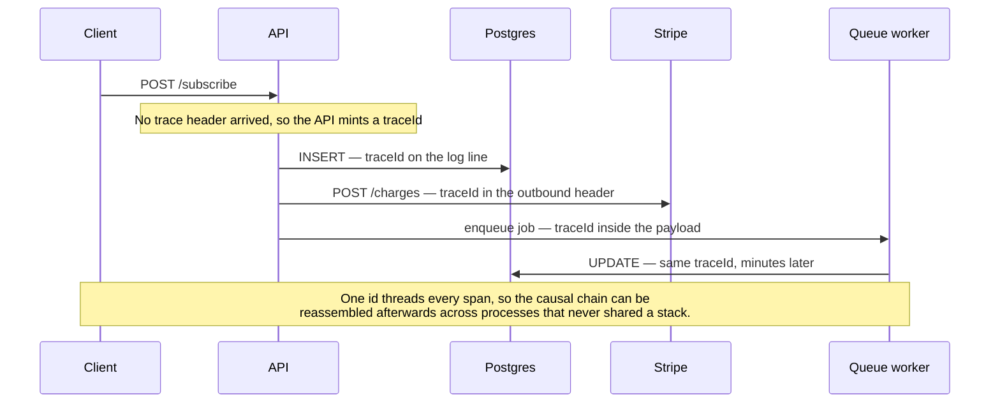

# 54. Distributed Tracing — Following a Request Across Services

## What It Is
Distributed tracing is the practice of attaching a unique `traceId` to every incoming request and propagating that ID through every system the request touches — your database, Redis, an outbound HTTP call to Stripe, a BullMQ job — so you can reconstruct the complete causal chain of events later.

Even in a "monolith," distributed tracing pays off. Your Next.js app already crosses several process boundaries on each request: it queries PostgreSQL (a separate process), hits Redis (another process), and often queues a BullMQ job (asynchronous, different execution context). Without a shared `traceId`, these are three isolated log streams. With tracing, they become one unified timeline.

The W3C `traceparent` header is the standard carrier. When your API handler receives an inbound request, the SDK either reads an existing `traceparent` header (from a load balancer, upstream service, or Stripe webhook) or mints a new one. Every outbound HTTP call your code makes should include that header so the receiver can join the same trace. This is what "context propagation" means.

For a multi-tenant SaaS, tracing gives you something logging alone cannot: you can see that a specific tenant's checkout request took 3.2 seconds because Stripe's API was slow (450 ms span) and your own DB query was fine (12 ms), which means the SLA breach is on Stripe's side, not yours.

## Key Concepts
- **TraceId** — a single 128-bit ID shared by all spans in one end-to-end request
- **SpanId** — a 64-bit ID unique to one unit of work within a trace; each span knows its parent SpanId
- **W3C traceparent** — the standard HTTP header format: `00-{traceId}-{spanId}-{flags}` (e.g., `00-4bf92f3577b34da6a3ce929d0e0e4736-00f067aa0ba902b7-01`)
- **Context propagation** — the mechanism that carries the active span context into async callbacks, Promise chains, and across HTTP boundaries via `AsyncLocalStorage`
- **Span context** — the minimal data needed to create a child span: traceId, spanId, trace flags
- **Root span** — the first span in a trace; created by the service that receives the original request
- **Child span** — a span whose parent is another span in the same trace; represents a sub-operation
- **Baggage** — key-value metadata attached to a trace and propagated alongside the trace context (e.g., `tenantId`, `userId` for every span downstream)



## Example Code
```typescript
// middleware/tracing.ts — inject traceId into every Next.js request
import { NextRequest, NextResponse } from 'next/server';
import { trace, context, propagation } from '@opentelemetry/api';

export function tracingMiddleware(req: NextRequest): NextResponse {
  // Extract trace context from incoming headers (e.g., from a load balancer or upstream caller)
  const carrier: Record<string, string> = {};
  req.headers.forEach((value, key) => { carrier[key] = value; });

  const ctx = propagation.extract(context.active(), carrier);

  return context.with(ctx, () => {
    const span = trace.getActiveSpan();
    const traceId = span?.spanContext().traceId ?? 'none';

    const response = NextResponse.next();
    // Expose traceId in response headers so the client can include it in bug reports
    response.headers.set('x-trace-id', traceId);
    return response;
  });
}

// libs/http-client.ts — outbound HTTP client that propagates trace context
import axios from 'axios';
import { context, propagation } from '@opentelemetry/api';

export function createTracedAxios() {
  const instance = axios.create();

  instance.interceptors.request.use((config) => {
    // Inject the current trace context into outbound request headers
    const carrier: Record<string, string> = {};
    propagation.inject(context.active(), carrier);

    // carrier now contains 'traceparent' and optionally 'tracestate'
    Object.assign(config.headers, carrier);
    return config;
  });

  return instance;
}

// When you call Stripe, PayPal, or Iyzico through this client,
// those requests will carry your traceId. If they expose their own tracing,
// you can even link cross-vendor traces.

// libs/bullmq-tracing.ts — propagate trace context into BullMQ jobs
import { Queue, Worker, Job } from 'bullmq';
import { context, propagation, trace } from '@opentelemetry/api';

// Producer: serialize active trace context into job data
export async function enqueueWithTrace(
  queue: Queue,
  name: string,
  data: Record<string, unknown>,
): Promise<void> {
  const carrier: Record<string, string> = {};
  propagation.inject(context.active(), carrier);  // adds 'traceparent'
  await queue.add(name, { ...data, __traceContext: carrier });
}

// Consumer: restore trace context from job data
export function createTracedWorker(
  queueName: string,
  processor: (job: Job, ctx: typeof context) => Promise<void>,
): Worker {
  return new Worker(queueName, async (job) => {
    const carrier = job.data.__traceContext ?? {};
    const parentCtx = propagation.extract(context.active(), carrier);

    // All spans created inside processor() will be children of the original request's span
    await context.with(parentCtx, () =>
      trace.getTracer('bullmq').startActiveSpan(`job.${job.name}`, async (span) => {
        try {
          await processor(job, context);
        } finally {
          span.end();
        }
      }),
    );
  });
}
```

## When to Use
1. **Debugging slow requests in production** — without tracing, "the checkout was slow" sends you hunting through three separate log files. With tracing, you see a waterfall of spans in 5 seconds.
2. **Async job attribution** — a BullMQ job fails 30 seconds after the HTTP request that triggered it. Trace propagation links the job failure back to the original request and the user who triggered it.
3. **External API latency attribution** — when Stripe, S3, or an email provider is slow, trace spans prove it was their latency, not yours, which matters for SLA discussions.
4. **Multi-tenant debugging** — attach `tenantId` as baggage so every span in a trace carries tenant context; filter your trace UI by `tenant.id = "acme-corp"` to see only their requests.
5. **Performance regression detection** — compare trace waterfall before and after a deploy to see which spans got slower.

## Common Mistakes
- **Not propagating context through `Promise.all`** — OpenTelemetry uses `AsyncLocalStorage` to track context; if you spawn fire-and-forget Promises without capturing context first, those spans become orphans. Always capture context before async boundaries.
- **Logging traceId but not linking logs to traces** — adding `traceId` to log lines is only half the job. Configure your log aggregation backend (Loki, Elasticsearch) to hyperlink `traceId` values to your trace UI (Grafana Tempo).
- **Sampling too aggressively early** — at low traffic, sample 100%. At scale, use tail-based sampling (keep 100% of error traces, 10% of success traces) rather than dropping traces uniformly.
- **Creating too many spans** — instrumenting every function call adds overhead and noise. Reserve manual spans for I/O operations and meaningful business operations; let auto-instrumentation handle the rest.

## Further Reading
- W3C Trace Context specification: https://www.w3.org/TR/trace-context/
- OpenTelemetry context propagation docs: https://opentelemetry.io/docs/concepts/context-propagation/
- Honeycomb blog — "Distributed Tracing in Practice": https://www.honeycomb.io/distributed-tracing
