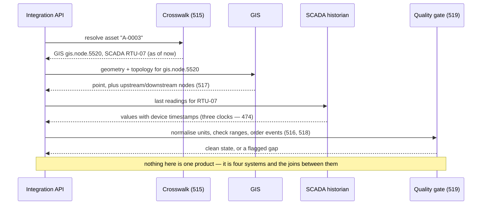

# 513. Smart Infrastructure as an Integration Problem, Not a Product

## What It Is
"Smart infrastructure" sounds like something you buy. It is not — it is what you are left with after a water utility, a building portfolio or a city has bought a BIM authoring tool, a GIS, a CMMS, a SCADA historian and a public open-data portal over fifteen years, and now someone wants a single answer to "what is the state of asset X". The smart part is the integration, and the integration is the hard part.

The difficulty is structural and this course is about four instances of it. **One asset has a different identity in every system** (Lesson 515) — a GlobalId in the model, a feature id in the GIS, a functional-location tag in the CMMS, an RTU address in SCADA. **The systems do not share a clock** (Lesson 518), so "which happened first" is not answerable from timestamps. **Units, scales and time zones differ at every boundary** (Lesson 516), and the mismatches pass every schema check. And **the slice of data that goes public carries a different duty** (Lessons 519, 521) — a licence, a redaction obligation, a rate limit — than the same data does internally.

This course sits last in the built-environment sequence because every lesson leans on one of the earlier four: coordinates from the GIS course (Lesson 443), telemetry from the IoT course (Lesson 469), twin state from the twin course (Lesson 483), and asset identity from the asset-management course (Lesson 506). Written first, it would have nothing to point at.

The framing to take from this lesson: **you are not building a smart-infrastructure platform.** You are building a small number of well-defined joins between systems that will outlive your integration, plus the contract that governs them (Lesson 522). The systems keep their own models. Your job is the crosswalk, the clock discipline, the unit normalisation and the quality gate — and to write down what each of those promises before the first sensor is installed.

```quiz
- q: "Why is 'smart infrastructure' described as an integration problem rather than a product?"
  anchor: "the integration is the hard part"
  options:
    - text: "Because the products involved are immature and will improve"
      correct: false
      why: "The products are mature. What is missing is the connective layer between them, and that is not something a vendor ships."
    - text: "Because it is what remains after an organisation has bought many single-purpose systems and needs one coherent answer across them"
      correct: true
      why: "The systems keep their own models; the work is the joins, the clock discipline, the unit normalisation and the quality gate."
    - text: "Because sensors are the expensive part"
      correct: false
      why: "Sensors are a cost, but the recurring difficulty is reconciling systems that were never designed to be reconciled."

- q: "Why does this course sit last in the built-environment sequence?"
  anchor: "every lesson leans on one of the earlier four"
  options:
    - text: "Because it is the least important and can be skipped"
      correct: false
      why: "It is the synthesis of the domain. It is last because it depends on the others, not because it matters less."
    - text: "Because each lesson depends on coordinates, telemetry, twin state or asset identity taught in the earlier courses"
      correct: true
      why: "Written first, it would have nothing concrete to point at — the dependency is real, not organisational."
    - text: "Because it introduces no new runtime"
      correct: false
      why: "It has SQL, TypeScript and a proof. The ordering is about conceptual dependency."
```

## Key Concepts
- **The smart part is the integration** — the systems already exist and keep their own models
- **One asset, many identities** — a different id in the model, the GIS, the CMMS, SCADA, the portal (Lesson 515)
- **No shared clock** — timestamp order is not causal order across systems (Lesson 518)
- **Boundary mismatches in units, scales and time zones** pass every schema check (Lesson 516)
- **Public data carries a different duty** — licence, redaction, rate limit (Lessons 519, 521)
- **You build a few well-defined joins, not a platform** — the crosswalk, clock discipline, unit normalisation, quality gate
- **The contract comes before the sensors** (Lesson 522) — what each join promises, written down
- **This course is a synthesis** — coordinates (Lesson 443), telemetry (Lesson 469), twin state (Lesson 483), identity (Lesson 506)

## Example Code
The flow a single "what is the state of asset X" query actually takes across four systems, and where each of this course's lessons sits on it:



## When to Use
- At the start of any project described as "smart city", "smart building" or "digital twin at portfolio scale" — to reframe it as a set of integrations with owners
- When scoping, to replace "build the platform" with a list of named joins, each with a contract
- When an organisation has more than two systems of record for the same assets and no agreed canonical identity
- Before procuring sensors or a new system, so the integration contract (Lesson 522) shapes the purchase

## Common Mistakes
- **Treating it as a product to buy or build** — the deliverable is the connective layer, and no single system owns it
- **Picking one system as "the truth" and forcing the others to match** — each system is authoritative for something; the crosswalk records which
- **Starting integration before agreeing a canonical identity** — every later join inherits the ambiguity (Lesson 515)
- **Assuming timestamps give event order** — across systems they do not, and control decisions depend on order (Lesson 518)
- **Publishing internal data straight to a public feed** — the public slice has a licence, a redaction duty and a rate limit the internal one does not (Lessons 519, 521)
- **Leaving the integration contract implicit** — "we'll figure out the interface later" means every consumer discovers the quirks the hard way (Lesson 522)

## Further Reading
- [OGC API family](https://ogcapi.ogc.org/) — the open, versioned web APIs for features, tiles, coverages and processes that a public infrastructure feed is usually expected to speak
- [NGSI-LD (ETSI CIM) specification](https://www.etsi.org/deliver/etsi_gs/CIM/001_099/009/) — one standard context-information model for smart-infrastructure integration, with its own identity and linked-data conventions
- [CityGML 3.0](https://www.ogc.org/standard/citygml/) — the OGC model for city-scale objects, for comparison with a per-system integration approach

```recall
- q: "State the reframing this lesson asks for and the four recurring difficulties."
  must:
    - "smart infrastructure is an integration problem, not a product — the systems already exist"
    - "one asset has a different identity in every system"
    - "the systems do not share a clock; units/scales/time zones differ at every boundary"
    - "the public slice carries a different duty — licence, redaction, rate limit"

- q: "What is the actual deliverable of a smart-infrastructure project?"
  must:
    - "a small number of well-defined joins between systems that keep their own models"
    - "the crosswalk, clock discipline, unit normalisation, quality gate"
    - "and the integration contract that says what each join promises, written before the sensors arrive"

- q: "Why is this course last in the sequence?"
  must:
    - "each lesson depends on an earlier course — coordinates, telemetry, twin state, asset identity"
    - "it is a synthesis of the domain, not a lower priority"
    - "written first it would have nothing concrete to point at"
```
