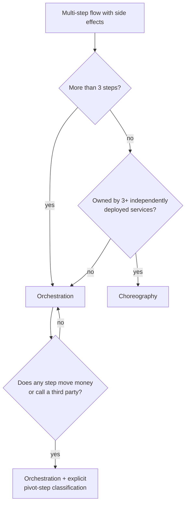

# Proposals 02 — Content depth

> Verbatim output of the `ideate:content-depth` agent. It received all six audit reports as input.

## Lens

content-depth — what has to change in the lesson text itself, and in the section contract that constrains it, so a senior engineer reading one of these pages says "this person has actually run this" instead of "this is a well-written glossary."

Reading the corpus, the ceiling is not authoring quality. It is a *contract problem*: six sections, one code fence, ~1030 words, applied identically to `121_sql_fundamentals.md` (552 words for joins + 1NF–3NF + NULL logic + transactions) and `34_timing_attack_constant_time_comparison.md` (1043 words for one Node API the lesson itself calls "largely theoretical"). Every section is in the *assertive* mood — "MVCC uses xmin and xmax", "conflicts are rare and retries are cheap", "if a milestone payment is more than [X] days overdue" — and none is in the *evidential* mood: no measured number, no observed output, no error code, no cited statute, no incident. Depth in this corpus is not more words. It is a change of mood, from claim to evidence, plus permission for a hard topic to take four times the space of an easy one.

So my eight proposals are one structural unlock (depth tiers, so length can finally vary) plus seven new or restructured sections that are each *a different kind of evidence* — mechanism observed in real telemetry, a table of measured constants with their publisher, a broken→fixed→proven code triple, a falsifiable decision table, an annotated public postmortem, a senior's follow-up question, and a statute with its Resmî Gazete / EUR-Lex citation — including one locale layer for the 73 business lessons that are currently UK-defaulted for a Turkish audience.

The plumbing is cheap and shared: `LessonSections` in `course_content.types.ts` is a fixed 6-key record, `HEADING_RULES` in `course_content.parser.ts` maps six prefixes, and `LessonPage.tsx` hardcodes six `<LessonSectionCard>` calls — but `LessonSectionCard` already does `if (!html) return null`, so every new section is optional-by-construction with zero conditional logic. Three files change once, and then all eight proposals are pure markdown authoring. That is what makes this scale to 412 lessons under AI-assisted authoring with human review: the reviewer is checking a *verifiable artifact* (does this command print this output? does this URL resolve? does TCMB publish this?) rather than judging prose, which is the only review that stays honest at 412x.

I deliberately did not propose "add more prose", "add a summary", or "add key takeaways" — the corpus's failure mode is already too much confident undifferentiated prose, and more of it is exactly what reads as AI filler.

## Proposals (8)

### 02.1 Depth Tiers · effort L

**Add a `depth` key to the manifest that unlocks different section contracts and word budgets, so a hard topic can take 3,000 words and an easy one can take 500 — the structural precondition for every other proposal here.**

**What changes**

`ManifestItem` in modules/course_content/course_content.types.ts gains `depth: 'primer' | 'working' | 'deep'`. All 23 `manifest.json` files gain the key per item (412 edits, scriptable with a first-pass heuristic then human adjudication). `LessonSections` becomes a partial record so optional sections are legal. `HEADING_RULES` in course_content.parser.ts gains the new prefixes (the flush loop already handles arbitrary fields — no logic change). `LessonPage.tsx` renders the new cards in a fixed order; `LessonSectionCard` already returns null on empty html, so nothing needs a conditional. `CourseOverviewPage.tsx` and the course card in app/(frontend)/page.tsx show the depth as a second badge next to the bracket, so a reader can see before clicking whether this is a 6-minute orientation or a 25-minute deep dive. A new `docs/content-contract.md` states the tier rubric and the per-tier required sections; it is the authoring brief every AI pass is given.

**Example snippet**

````
```jsonc
// content/courses/database-advanced/manifest.json
{ "id": 41, "file": "41_postgresql_mvcc_vacuum_bloat_isolation.md",
  "title": "PostgreSQL MVCC, VACUUM, Bloat & Isolation Levels",
  "bracket": "7-10", "category": "PostgreSQL",
  "depth": "deep" }          // 1075 words today for xmin/xmax + dead tuples +
                             // autovacuum tuning + XID wraparound + 4 isolation
                             // levels. Five topics on a one-topic budget.

// content/courses/security/manifest.json
{ "id": 34, "file": "34_timing_attack_constant_time_comparison.md",
  "bracket": "3-7", "depth": "primer" }
                             // 1043 words today for one function and one Node
                             // API, in a lesson that concedes the risk is
                             // "largely theoretical". Should be ~550.

// content/courses/fundamentals-tools/manifest.json
{ "id": 121, "file": "121_sql_fundamentals.md",
  "bracket": "0-1", "depth": "deep" }
                             // 552 words for joins + 1NF-3NF + NULL three-valued
                             // logic + transactions. bracket 0-1 does NOT mean
                             // shallow — it means no assumed vocabulary.
```

**The contract (docs/content-contract.md):**

| depth | words | required sections | typical count |
|---|---|---|---|
| `primer` | 450–700 | the existing 6 | ~90 |
| `working` | 900–1,400 | the 6 + **How It Breaks** | ~220 |
| `deep` | 2,000–3,500 | the 6 + **How It Breaks** + **Numbers That Matter** + **Prove It**, and at least one of **Decide** / **Field Notes**, and one diagram | ~100 |

**Assignment rubric — three questions, not vibes:**
1. *Surface area*: how many independently-testable ideas does the title name? (`121` names four → deep. `34` names one → primer.)
2. *Consequence of being wrong*: silent data loss / money moved / credential exposure → at least `working`, usually `deep`. Cosmetic → `primer`.
3. *Is the hard part the vocabulary or the mechanism?* If a competent reader could get to "correct" from the Key Concepts bullets alone, it is a `primer`. If they would ship a plausible-looking bug (the saga, the idempotency key, the `FOR UPDATE` around a Stripe call), it is `deep`.

Bracket is orthogonal and stays orthogonal: it says *who this is for*, `depth` says *how far this goes*. The measured medians today (0-1 = 606, 1-3 = 1020, 3-7 = 1039, 7-10 = 1025 words) show bracket currently has no effect on treatment at all above the first tier — which is the bug.
````

**Why it makes them feel knowledgeable**

Uniform length is a tell. When every topic takes the same page, the reader correctly infers that no topic was actually investigated — the format did the thinking. Variable depth is the first honest signal in the corpus: it tells the reader that someone decided MVCC is harder than constant-time comparison and paid for that in words. Mechanically, it also removes the ceiling: today there is nowhere to put a query plan, a postmortem, or a decision table, so authors don't write them. Nothing else in this list is buildable until length can vary.

**Risk**

Retagging 412 manifest entries is cheap; rewriting 100 lessons to a 3,000-word budget is the real cost and it is the whole program, not a task. Mitigate by shipping the tier key + contract doc first with every lesson tagged at its current de-facto tier, so the site is correct on day one and the rewrite is incremental per course. Second risk: `depth: 'deep'` becomes an excuse to pad. The contract must state that a deep lesson earns its length only through the evidential sections below — never through more exposition. Enforce with a CI check: a `deep` lesson whose 'What It Is' exceeds 400 words fails.

### 02.2 How It Breaks · effort XL

**A new `## How It Breaks` section that shows the failure as telemetry — the symptom a user reports, the exact query or log line that identifies it, the error code, and the one knob that bounds it — replacing prose warnings with 3am-recognizable evidence.**

**What changes**

New markdown section `## How It Breaks`, placed after `## Common Mistakes` in the file and rendered as a card between Common Mistakes and Further Reading in LessonPage.tsx. New `howItBreaks` field in `LessonSections`, new `{ prefix: 'How It Breaks', field: 'howItBreaks' }` in `HEADING_RULES`. Required for `working` and `deep` tiers (~320 technical lessons). Internal shape, enforced by the authoring brief and checkable in review: each entry is **Symptom** (what a human reports, with a number) → **What you see** (a real diagnostic command and its real output, in a fenced block) → **Why** (one paragraph, using this lesson's own vocabulary) → **The knob** (the config, timeout, or code change that bounds it). Two to three entries per lesson. This is also the only place in the corpus where `## Common Mistakes` prose gets promoted to something a reader can pattern-match against a real console.

**Example snippet**

`````
For `content/courses/database-advanced/42_optimistic_vs_pessimistic_locking.md`, whose Example Code currently ships `addSeatPessimistic` doing a `FOR UPDATE` inside a transaction and whose Common Mistakes says only "do external calls outside the transaction":

````markdown
## How It Breaks

### Symptom — p99 on `POST /members` goes 40ms → 9s, error rate unchanged
Users say "adding a teammate hangs." Nothing is throwing, so no alert fires.
`addSeatPessimistic` holds the `FOR UPDATE` row lock for the whole transaction.
If anything slow runs inside it — a Stripe call, a retry, a cold index scan —
every other writer for that tenant queues behind the lock holder.

**What you see:**

```sql
SELECT pid, state, wait_event_type, wait_event,
       now() - xact_start AS xact_age, left(query, 50) AS q
FROM pg_stat_activity
WHERE datname = current_database() AND state <> 'idle'
ORDER BY xact_age DESC;
```

```
  pid  | state  | wait_event_type |  wait_event   |   xact_age    |         q
-------+--------+-----------------+---------------+---------------+------------------
 41822 | active | Client          | ClientRead    | 00:00:08.914  | BEGIN
 41890 | active | Lock            | transactionid | 00:00:08.402  | SELECT ... FOR UP
 41903 | active | Lock            | transactionid | 00:00:07.155  | SELECT ... FOR UP
```

The signature is the pair: several pids with `wait_event_type = Lock` /
`wait_event = transactionid`, and one holder in `Client` / `ClientRead` — an
open transaction blocked on a network read. That holder is your Stripe call.
`transactionid` (not `tuple`, not `relation`) means they are waiting for a
row lock to be released by transaction commit.

**The knob:** move the external call outside the transaction. Then bound the
lock anyway, because the next slow thing inside it will not be a Stripe call:

```typescript
await dataSource.transaction(async (manager) => {
  await manager.query(`SET LOCAL lock_timeout = '3s'`);
  // ...
});
```

That converts an invisible pile-up into a fast, retryable failure:
`55P03 lock_not_available` — an error you can count, alert on, and back off from.

### Symptom — `OptimisticLockVersionMismatchError` rate climbs with traffic, then 500s
`addSeatOptimistic` retries 3 times with 50/100/200ms backoff. Under contention
the retries themselves are the contention: every retry re-reads and re-writes the
same row. Past roughly 20 concurrent writers on one subscription row, the third
retry fails more often than the first, and the user gets a 500.

**What you see:** conflict rate is not in your metrics today, so add it before
you need it — count the mismatch on catch, labelled by attempt number, and
alert on `attempt=2` failures rather than on the 500.

**The knob:** below ~1% conflict rate, optimistic wins on latency. Above ~5%,
switch that row to pessimistic. Between the two, add jitter
(`50 * 2**attempt * (0.5 + Math.random())`) — the shown fixed backoff
re-synchronizes the losers into the same retry window.

### Trap — `pessimistic_write` under `REPEATABLE READ` does not queue, it aborts
The lesson's TypeORM example runs at the connection default (`READ COMMITTED`),
where the blocked transaction waits and then re-reads. If you raise the isolation
level — as `41_postgresql_mvcc_vacuum_bloat_isolation.md` recommends — the blocked
transaction instead raises `40001 could not serialize access due to concurrent
update` the moment the holder commits. `addSeatPessimistic` has no retry, so it
500s. **Pessimistic locking above READ COMMITTED still needs the retry loop.**
````
`````

**Why it makes them feel knowledgeable**

Recognition-under-pressure is the difference between knowing a pattern and owning it. A reader who has seen `wait_event = transactionid` next to a holder in `ClientRead` will identify that incident in ten seconds three years later, because it is stored as a visual pattern, not a proposition. Prose warnings ('do external calls outside the transaction') are stored as propositions and are unavailable under stress. This section also converts the corpus's single largest asset — its 1,771 correctly-identified failure modes — from assertions into things the reader can go verify on their own database tonight, which is what makes the knowledge feel earned rather than received.

**Risk**

This is the most expensive proposal per lesson and the one an AI pass is most likely to fake: hallucinated `psql` output looks exactly like real `psql` output. Non-negotiable mitigation — every fenced output block in this section must be pasted from an actual run, and the authoring brief must require the author to attach the reproduction (a docker-compose one-liner or a script under `content/repro/<lesson-id>/`). If it wasn't run, the section is omitted rather than invented; a `deep` lesson with two How It Breaks entries beats one with five where two are fabricated. Second risk: scope creep into a Postgres operations manual — cap at three entries and keep every entry anchored to a symptom the lesson's own Example Code would produce.

### 02.3 Numbers That Matter · effort L

**A small table of the constants that actually govern the topic — each with its default, its publisher or source, and the command that measures your own — so trade-offs stop being adjectives.**

**What changes**

New `## Numbers That Matter` section, rendered as a card immediately after `## Key Concepts` (it is a reference the reader returns to, not a conclusion). New `numbers` field in `LessonSections` + a `HEADING_RULES` prefix. Required for `deep`, encouraged for `working` in the ~150 performance/scale/database/distributed lessons. Fixed four-column shape so it is scannable and reviewable: **Quantity | Default or typical | Why the default is wrong at scale | Measure yours**. Hard rule in the authoring brief, and the thing human review checks: every row either cites the documentation that publishes the number (inline link, not a Further Reading bullet) or gives the command that produces it. A number with neither is deleted. This also seeds the corpus's first inline citations — currently 6 exist across 412 lessons. Renders with zero UI work: `LessonSectionCard` already styles `[&_table]` with borders.

**Example snippet**

`````
For `content/courses/database-advanced/41_postgresql_mvcc_vacuum_bloat_isolation.md`, which today asserts SERIALIZABLE has "significant performance cost" with no number and teaches bloat diagnosis without ever mentioning the xmin horizon:

````markdown
## Numbers That Matter

| Quantity | PostgreSQL 16 default | Why the default is wrong at scale | Measure yours |
|---|---|---|---|
| `autovacuum_vacuum_scale_factor` | `0.2` | 20% of the table must be dead before autovacuum runs. On a 100M-row `events` table that is **20 million dead tuples**, and the vacuum that finally runs is enormous. | `SHOW autovacuum_vacuum_scale_factor;` |
| `autovacuum_vacuum_threshold` | `50` | Added to the scale factor, so it only matters on tiny tables. | — |
| `autovacuum_naptime` | `1min` | The *launcher* interval, not a per-table guarantee. With `autovacuum_max_workers = 3` and 400 tables, a hot table can wait far longer than a minute. | `SHOW autovacuum_max_workers;` |
| `autovacuum_freeze_max_age` | `200000000` | The anti-wraparound vacuum becomes non-cancellable at this XID age. The 2-billion-XID cliff is far away; **this** is the number that wakes you up. | `SELECT max(age(datfrozenxid)) FROM pg_database;` |
| Bloat that justifies action | — | Under ~20% dead space, `VACUUM FULL` costs more (ACCESS EXCLUSIVE) than it returns. | `CREATE EXTENSION pgstattuple;`<br>`SELECT dead_tuple_percent, free_percent FROM pgstattuple('members');` |

**Per-table override for a hot table** — the single highest-value line in this lesson:

```sql
ALTER TABLE events SET (autovacuum_vacuum_scale_factor = 0.01,
                        autovacuum_vacuum_threshold  = 1000);
-- 1% + 1000 rows instead of 20%: many small vacuums instead of one catastrophic one.
```

### The number this lesson was missing: the xmin horizon
Autovacuum cannot reclaim a dead tuple that is still visible to *some* open
snapshot. If your bloat grows while `last_autovacuum` keeps updating, tuning
scale factors will never help — something is holding the horizon back. Three
suspects, three queries:

```sql
-- 1. A long-running transaction (the usual culprit: an idle-in-transaction app)
SELECT pid, state, age(backend_xmin) AS xmin_age, now() - xact_start AS xact_age
FROM pg_stat_activity WHERE backend_xmin IS NOT NULL ORDER BY xmin_age DESC LIMIT 5;

-- 2. An abandoned replication slot (a dead replica pins the horizon forever)
SELECT slot_name, active, age(xmin) AS xmin_age, age(catalog_xmin) FROM pg_replication_slots;

-- 3. An orphaned prepared transaction
SELECT gid, prepared, age(transaction) AS xmin_age FROM pg_prepared_xacts;
```

Any `xmin_age` in the tens of millions while `n_dead_tup` climbs is your answer.
Defaults and semantics: [Automatic Vacuuming](https://www.postgresql.org/docs/current/routine-vacuuming.html#AUTOVACUUM).
````
`````

**Why it makes them feel knowledgeable**

You cannot defend a trade-off you cannot quantify, and the corpus currently teaches trade-offs entirely in adjectives ('significant cost', 'conflicts are rare', 'fast approximation') — which is exactly why a reader finishes able to name the pattern and unable to argue for it. Giving the reader the governing constants plus the command that measures their own instance converts the lesson from a claim into an instrument: they can run it against their real database in five minutes and come back with a number nobody on their team has. That single experience — 'I measured our xmin horizon and found the dead replication slot' — produces more felt competence than fifty accurate paragraphs, and it is the moment the platform stops being reading and starts being capability.

**Risk**

Numbers rot. PostgreSQL defaults change between majors (`autovacuum_vacuum_cost_delay` went 20ms → 2ms in 12; insert-triggered autovacuum arrived in 13), and vendor pricing/limits rot faster. Mitigate by (a) stamping the version in the column header — 'PostgreSQL 16 default', not 'default'; (b) preferring the *measurement command* over the *stated value* wherever both exist, since the command never goes stale; (c) banning derived performance claims ('SERIALIZABLE costs 15%') unless the lesson ships the benchmark that produced them — an unsourced benchmark number is worse than the adjective it replaced. Keep tables to ~6 rows; a 20-row table is a config dump, not a lesson.

### 02.4 Broken → Fixed → Proof · effort XL

**Restructure `## Example Code` from one decorative fence into three: the wrong version a competent developer would actually write with its symptom shown, the fix, and a copy-pasteable verification whose real output proves it.**

**What changes**

No parser or type change — this restructures the *inside* of the existing `exampleCode` section, so it can ship independently and incrementally across all 412 lessons. Three required beats, each with a bold lead-in (the parser treats an unrecognized `##` as content of the open section, so use bold text or `###` for internal structure, never `##`). Beat 1 **The version that ships the bug** — short, compiling, with the symptom shown as output/log/query plan. Beat 2 **The fix** — self-contained; every identifier defined or imported from a real published package, never `@/libs/*` (46 TS lessons currently import the first owner's private boilerplate). Beat 3 **Prove it** — a run command with its actual output, or 6–10 lines of a test that fails before and passes after. Also fixes the mechanical defects the code-quality audit found: `tsx` for JSX fences (19 lessons mis-tagged `typescript`), and `LessonPage.tsx`'s hardcoded card title `"Example Code"` becomes `"Example"` for the 230 business lessons whose fence contains no code and the 9 files using `## Example / Template`.

**Example snippet**

`````
For `content/courses/distributed-systems-api-design/07_idempotency_key_pattern.md`, whose entire Example Code section is today one 85-line `typescript` block with no prose, and whose Prisma model is `key String @unique` — globally unique, not scoped to the caller:

````markdown
## Example Code

**1. The version that ships the bug.** This is the model almost everyone writes first:

```prisma
model IdempotencyKey {
  key          String   @unique   // <- globally unique across all tenants
  statusCode   Int
  responseBody Json
}
```
```typescript
const existing = await prisma.idempotencyKey.findUnique({ where: { key } });
if (existing) return res.status(existing.statusCode).json(existing.responseBody);
```

The key is the caller's, but the lookup is global. Any client that guesses or
replays another tenant's key is handed that tenant's cached response body:

```bash
$ curl -s -X POST localhost:3000/v1/charges \
    -H 'X-Tenant: acme' -H 'Idempotency-Key: 8f3c-checkout-1' \
    -d '{"amount":1000}'
{"chargeId":"ch_9Qk2","tenant":"acme","amount":1000}

$ curl -s -X POST localhost:3000/v1/charges \
    -H 'X-Tenant: globex' -H 'Idempotency-Key: 8f3c-checkout-1' \
    -d '{"amount":50}'
{"chargeId":"ch_9Qk2","tenant":"acme","amount":1000}   # <- globex reads acme's data
```

The second failure is quieter: the same key with a *different body* returns the
first body. A client that retries a $10 charge after editing it to $20 is told
the $20 charge succeeded. It did not.

**2. The fix.** Scope the key to the caller, fingerprint the request, and claim
the key with an insert rather than a read:

```prisma
model IdempotencyKey {
  tenantId     String
  key          String
  fingerprint  String    // sha256(method + path + canonical JSON body)
  statusCode   Int?
  responseBody Json?
  createdAt    DateTime  @default(now())
  expiresAt    DateTime
  @@unique([tenantId, key])
}
```
```typescript
import { createHash } from 'node:crypto';
import { Prisma } from '@prisma/client';

const fp = createHash('sha256')
  .update(`${req.method}\n${req.path}\n${JSON.stringify(req.body)}`)
  .digest('hex');

// Claim-by-insert: the unique index, not a read, decides who wins the race.
try {
  await prisma.idempotencyKey.create({
    data: { tenantId, key, fingerprint: fp,
            expiresAt: new Date(Date.now() + 24 * 3600_000) },
  });
} catch (e) {
  if (!(e instanceof Prisma.PrismaClientKnownRequestError) || e.code !== 'P2002') throw e;

  const prior = await prisma.idempotencyKey.findUnique({
    where: { tenantId_key: { tenantId, key } },
  });
  if (prior!.fingerprint !== fp)
    return res.status(422).json({ error: 'idempotency_key_reused_with_different_body' });
  if (prior!.statusCode === null)
    return res.status(409).set('Retry-After', '1').json({ error: 'request_in_flight' });

  return res.status(prior!.statusCode).json(prior!.responseBody);
}
```

Two simultaneous requests with the same key: one wins the insert, the other gets
`P2002` and sees `statusCode === null` — the marker that the winner is still
working. That is the losing race the Common Mistakes section names, handled.

**3. Prove it.** Four calls, four different outcomes — run them in order:

```bash
$ K='Idempotency-Key: 8f3c-checkout-1'
$ post() { curl -s -o /dev/null -w '%{http_code}\n' -X POST localhost:3000/v1/charges \
           -H "X-Tenant: $1" -H "$K" -d "$2"; }

$ post acme   '{"amount":1000}'   # first call, real work
201
$ post acme   '{"amount":1000}'   # replay, cached — no second charge
201
$ post globex '{"amount":50}'     # same key, different tenant — its own charge
201
$ post acme   '{"amount":2000}'   # same key, changed body — refused
422
```

Check it charged once, not twice:

```sql
SELECT tenant_id, count(*) FROM charges WHERE tenant_id = 'acme' GROUP BY 1;
-- acme | 1
```
````
`````

**Why it makes them feel knowledgeable**

The corpus names 1,771 failure modes and *shows* none of them — every code fence in all 412 files is a finished, correct solution, and the Common Mistakes section contains no code at all. A correct solution shown alone teaches recognition: the reader nods, and cannot reproduce it. Showing the broken version first gives the reader something to be wrong about — they recognize their own instinct in beat 1 — and beat 3 closes the loop with an observable, falsifiable result they can run tonight. That is the difference between 'I read about idempotency keys' and 'I have watched a 422 come back when the body changed', and it is the single largest gap between this corpus and a product someone would pay for.

**Risk**

Highest cost per lesson: 412 sections, and beats 1 and 3 require actually running the code — which is precisely why it is also the highest value, since 126 of 158 TypeScript fences currently fail a standalone typecheck and nothing shows evidence of ever having been executed. Mitigate by ordering the work: the ~100 `deep` lessons first, then `working`. Add a CI gate that extracts every `typescript`/`tsx` fence and runs `tsc --noEmit --skipLibCheck`, allowing only TS2307 (uninstalled module) — that alone catches the 85 lessons with undefined identifiers and makes regression impossible. For the 230 business lessons whose Example contains no code, the analogue is a filled-in worked instance beside the blank form with the arithmetic reconciling, not a compiler.

### 02.5 Decide · effort M

**A `## Decide` section for every lesson that is secretly a choice between two options: a decision table with falsifiable thresholds, a Mermaid flow, and the classification scheme the primary source actually uses.**

**What changes**

New `## Decide` section rendered after `## When to Use` (which stays — it lists applicability; Decide adjudicates between alternatives). New `decide` field + `HEADING_RULES` prefix. Applies to the ~70 lessons whose title or body poses an either/or: saga orchestration vs choreography, optimistic vs pessimistic locking, RS256 vs HS256, monolith vs services, REST vs RPC. Shape: (a) a table whose left column is a **measurable signal**, not a feeling — count of steps, count of deploy units, conflict rate, teams touching the code; (b) a Mermaid decision flowchart; (c) where the cited primary source has a formal taxonomy, apply it to this lesson's own example rather than name-dropping the book. Mermaid needs one build-time addition to modules/course_content/course_content.markdown.ts — `rehype-mermaid` with `strategy: 'inline-svg'` renders to SVG at build, ships no client JS, and survives the static export.

**Example snippet**

`````
For `content/courses/distributed-systems-api-design/03_saga_pattern.md`, which today says "for a solo developer on a SaaS, orchestration is almost always the right choice" and cites Richardson chapter 4 in Further Reading without using his taxonomy:

````markdown
## Decide

### Orchestration or choreography — on signals you can count

| Signal | How to measure it | → Choreography | → Orchestration |
|---|---|---|---|
| Steps in the flow | count them | ≤ 3 | ≥ 4 |
| Independently deployed services owning a step | count deploy units | ≥ 3 | 1–2 |
| Compensation paths that branch (step 4 failing ≠ step 2 failing) | count distinct undo sequences | 0 | ≥ 1 |
| "Where is tenant X's signup stuck right now?" | can one query answer it? | no — join logs across services | yes — one row |
| Cost of adding step 5 | files touched | 1 new subscriber | orchestrator + new worker |

The tenant-onboarding saga in this lesson: 4 steps, 1 deploy unit, 2 branching
compensation paths, and support asks the "where is it stuck" question weekly.
Every row points the same way. That is why it is orchestrated — not because it
is a solo project.



### Classify every step before you write the switch

Richardson's taxonomy is the part of chapter 4 that changes your code, so apply
it to the four steps above:

| Step | Class | Rule it imposes |
|---|---|---|
| `CREATE_TENANT` | **compensatable** | must have a working undo (`deleteTenant`) |
| `CHARGE_CARD` | **pivot** | the point of no return — once it commits, the saga goes *forward* |
| `ALLOCATE_SEATS` | **retriable** | after the pivot: retry until it succeeds; never compensate back through it |
| `SEND_WELCOME_EMAIL` | **retriable** | same — and note it has no `case` in the orchestrator switch above |

Read the Example Code against this table and the bug is structural, not a typo:
on `ALLOCATE_SEATS` failure it enqueues `COMPENSATE_CHARGE`, i.e. it refunds the
customer's card because a seat row would not insert. Seat allocation is a
retriable step *after* the pivot. The correct behaviour is retry-with-backoff,
then dead-letter and page a human — the tenant is paid for and must end up
provisioned. **Compensation never crosses the pivot.**

The classification also tells you where idempotency keys are mandatory rather
than nice: every step at or after the pivot, because every one of them will be
retried. See [Idempotency Key Pattern (#07)](/courses/distributed-systems-api-design/idempotency-key-pattern).
````
`````

**Why it makes them feel knowledgeable**

The corpus reliably teaches what each option *is* and never how to choose, so a reader leaves able to define choreography and unable to defend picking it — which is exactly the moment a design review exposes them. A decision table built on countable signals gives them a defensible position ('four steps, one deploy unit, two branching compensation paths, so orchestration') instead of an aesthetic one. And applying the cited source's own taxonomy to the lesson's own code turns Further Reading from a reading list into something already metabolized — plus, in this case, it surfaces a real bug in the shipped example, which is the most credible thing a lesson can do: demonstrate that the rule catches errors the author himself made.

**Risk**

Thresholds stated with false precision are worse than none — '≥4 steps' must read as a default to argue with, not a law, and each row needs a one-line reason. The Mermaid addition is the only real plumbing here: `rehype-mermaid`'s inline-svg strategy needs Playwright available at build time, which is fine on Vercel but adds build minutes and a dependency; the fallback is a small client-side `<Mermaid>` component, which costs ~40KB of JS on lesson pages. Decide that before authoring 70 diagrams. Also: only apply this section where a genuine either/or exists — bolting it onto single-option lessons produces exactly the AI-filler texture to avoid.

### 02.6 Field Notes · effort L

**One annotated public postmortem per deep lesson: the real incident's causal chain retold in that lesson's own vocabulary, ending with an honest audit of which controls in this very lesson would and would not have stopped it.**

**What changes**

New `## Field Notes` section, rendered as the last card before `## Further Reading`. New `fieldNotes` field + `HEADING_RULES` prefix. One per `deep` lesson (~100 lessons), drawn only from *publicly documented* incidents — vendor postmortems (Cloudflare, GitLab, GitHub, AWS), regulator filings, court documents, CVE writeups — never invented and never anonymized-client anecdotes, which is what would read as fabrication. Fixed shape: **What happened** (5–8 lines, dated, with an inline link to the primary document) → **The causal chain**, written using the lesson's own defined terms → **Which controls from this lesson would have stopped it** — including, honestly, the ones that would not. That last beat is what makes it teaching rather than storytelling, and it doubles as the corpus's inline-citation beachhead: 279 of 412 lessons currently have no followable source at all.

**Example snippet**

`````
For `content/courses/security/33_ssrf_server_side_request_forgery.md`, which today asserts "this has been the root cause of several major cloud data breaches including the Capital One breach in 2019" with no citation, and whose own `safeFetch` uses the regex `/^fc|fd/`:

````markdown
## Field Notes — Capital One, July 2019

**What happened.** A misconfigured web application firewall running on EC2 could
be induced to make an HTTP request to an attacker-chosen URL. The attacker
pointed it at the EC2 Instance Metadata Service — `169.254.169.254`, a link-local
address reachable only from inside the instance — and retrieved the temporary IAM
credentials issued to the WAF's instance role. Those credentials carried S3 list
and read permissions. Roughly 100 million US and 6 million Canadian applicants'
records were copied. The DOJ complaint records the sequence plainly: a request to
the metadata endpoint, then `aws s3 sync`.

**The causal chain, in this lesson's terms:**

1. **Unvalidated outbound URL** — the SSRF precondition from *What It Is*.
2. **Server-side privilege** — the request came from inside the trust boundary,
   so the metadata service answered it. SSRF is dangerous not because of the
   request but because of *who is making it*.
3. **Ambient credentials** — IMDSv1 handed a role's temporary keys to any process
   that could issue a plain GET. No signature, no token, no proof of intent.
4. **Over-broad role** — the WAF's role could read the data buckets. The blast
   radius was an IAM decision made long before the SSRF existed.

**Which controls in this lesson would have stopped it — and which would not:**

| Control | Would it have helped? |
|---|---|
| Denylisting `169.254.0.0/16` | **Yes** — this specific attack. |
| The `BLOCKED_CIDR_PATTERNS` regex as written above | **No.** `/^fc\|fd/` parses as `(^fc)\|(fd)` — the anchor binds to the first branch only. And no denylist here catches `http://2130706433/` (decimal-encoded `127.0.0.1`) or an IPv4-mapped IPv6 form. **Denylists lose; resolve the hostname, then check the resolved IP against an allowlist.** |
| Allowlisting outbound destinations | **Yes**, and it is the only control on this list that generalizes. |
| Re-resolving after redirects (`maxRedirects: 0`) | **Yes** — DNS rebinding and 302-to-metadata are the standard bypasses of a check performed only on the input string. |
| **IMDSv2 — not covered anywhere above** | **Yes, decisively.** It requires a `PUT` to obtain a session token and sets a default response hop limit of 1, so a proxied or forwarded request cannot reach it at all. AWS shipped it in November 2019 in direct response. If you run on EC2, `HttpTokens=required` is a one-line change worth more than the entire `safeFetch` above. |

The honest lesson: the application-layer fix in *Example Code* narrows the window;
the infrastructure-layer fix closes it. Ship both, and know which is which when
someone asks in a review.

Primary sources: [DOJ criminal complaint, *US v. Thompson* (W.D. Wash., 2019)](https://www.justice.gov/usao-wdwa/press-release/file/1188626/download) ·
[AWS — Instance Metadata Service Version 2](https://docs.aws.amazon.com/AWSEC2/latest/UserGuide/configuring-instance-metadata-service.html)
````
`````

**Why it makes them feel knowledgeable**

An abstraction with one real referent attached is remembered; the same abstraction alone is not. 'SSRF plus ambient cloud credentials' becomes durable the moment it is fused to a dated event with a named mechanism and a number of records. The second effect matters more for a paid product: the honest audit column — 'this lesson's own regex would not have stopped it' — is a credibility move nothing else in the corpus makes. It proves the author is grading his own work rather than selling it, which is precisely the posture that makes a senior reader trust the other 411 lessons. And every entry ends at a primary document the reader can go read, which is the route to depth the current bibliography-style Further Reading never provides.

**Risk**

Fabrication risk is the highest of any proposal — an AI pass will confidently produce a plausible incident that never happened, and one caught fabrication in a security lesson destroys the corpus (the sourcing audit already found ~7 invented citations). Hard rule: every Field Note must link a primary document, and human review must open the link. If no public incident exists for a topic, omit the section — 100 sourced entries beat 200 with five inventions. Secondary risk: retelling a famous incident inaccurately is nearly as damaging as inventing one, so prefer the vendor's own postmortem or a court filing over journalism, and take dates and figures only from that document.

### 02.7 Prove It · effort M

**Three questions a senior would actually ask in a review, each answered as a triple — the shallow answer most people give, exactly what it misses, and the answer that ends the conversation.**

**What changes**

New `## Prove It` section rendered after `## Common Mistakes` and before `## How It Breaks`. New `proveIt` field + `HEADING_RULES` prefix. Required for `deep`, optional for `working`. Fixed triple per question — **Q** / **The usual answer** / **What it misses** / **The answer that lands** — which is what keeps this from degenerating into a quiz: the depth lives in the *gap* between answers two and three, and that gap is content that exists nowhere else in the lesson. Questions must be derived from the lesson's own Example Code (so they cannot be generic) and must be things that actually get asked: startup failures, version-specific behaviour, what an annotation really does. Naturally becomes the corpus's cross-link layer, since the strongest answers reach into adjacent lessons — the first `<a>` tags between lessons anywhere in the corpus.

**Example snippet**

`````
For `content/courses/framework-deep-dives/410_springboot_jpa_entities_and_n_plus_one.md`, whose repository interface currently declares `findByUserStatus` twice and queries a `userStatus` field the shown entity does not have:

````markdown
## Prove It

### 1. You added `JOIN FETCH` and the endpoint still returns a `Page<UserEntity>`. What breaks?

**The usual answer:** "Nothing — `JOIN FETCH` fixes N+1, and `DISTINCT` handles the duplicate rows."

**What it misses:** a collection fetch join multiplies parent rows by child rows,
so `LIMIT`/`OFFSET` in SQL would paginate *rows*, not *users*. Hibernate refuses
to get that wrong, and instead silently loads **the entire result set into JVM
memory** and paginates there. It tells you once, in a log line most people scroll
past:

```
WARN  o.h.hql.internal.ast.QueryTranslatorImpl : HHH000104:
  firstResult/maxResults specified with collection fetch; applying in memory!
```

On 40 users this is invisible. On 400,000 it is an OOM in production and a
perfectly green staging environment.

**The answer that lands:** split it in two — page the IDs with no fetch join,
then fetch the collections for that page:

```java
@Query("SELECT u.userId FROM UserEntity u WHERE u.userRole = :role")
Page<UUID> findIdPage(@Param("role") String role, Pageable pageable);

@Query("SELECT DISTINCT u FROM UserEntity u LEFT JOIN FETCH u.sessions WHERE u.userId IN :ids")
List<UserEntity> findWithSessions(@Param("ids") List<UUID> ids);
```

Or set `hibernate.default_batch_fetch_size: 100` and keep the lazy access — that
turns N+1 into N/100+1 queries with no query rewriting at all, and it is the
higher-leverage change across a whole codebase.

### 2. This repository does not start. Why — and at which stage does it fail?

**The usual answer:** "Duplicate method name — rename one."

**What it misses:** there are two independent failures at two different stages,
and naming only the first means you fix it and the app still will not boot.

1. `List<UserSummary> findByUserStatus(String)` and
   `List<UserEntity> findByUserStatus(String)` erase to the same signature.
   **javac** rejects the interface — Spring never sees it. Return type is not
   part of the erased signature.
2. Even with that fixed, `findByUserStatus` derives a property named
   `userStatus`, and `UserEntity` has no such field (its only status-like column
   is `userRole`). Spring fails at **context startup** with
   `PropertyReferenceException: No property 'userStatus' found for type 'UserEntity'`.
   The `@Query` JPQL referencing `u.userStatus` fails at the same stage.

**The answer that lands:** derived query names and JPQL are a compile-and-startup
contract with the entity, not strings. Name the projection method for what it
returns (`findSummariesByUserRole`) and keep the failure at startup, where it is
free — which is also the real argument for `ddl-auto: validate`.

### 3. What does `@Transactional(readOnly = true)` actually do?

**The usual answer:** "Makes it read-only — it's faster and safer."

**What it misses:** it does not prevent writes. It sets Hibernate's flush mode to
`MANUAL`, so the persistence context stops dirty-checking (the real speed-up on
large result sets), and it marks the JDBC `Connection` read-only. A native
`UPDATE` on the same connection still executes.

**The answer that lands:** that `Connection.setReadOnly(true)` flag is exactly the
hook a replica-routing `DataSource` reads to send the query to a read replica —
so the annotation is load-bearing infrastructure, not a hint. Which is also why a
`readOnly = true` method that reads immediately after a write can read stale data.
See [Read Replica Routing (#11)](/courses/distributed-systems-api-design/read-replica-routing).
````
`````

**Why it makes them feel knowledgeable**

The owner's goal is that a reader *feels* genuinely knowledgeable — and the honest way to produce that feeling is to give them something specific to say that most people in the room cannot say. The shallow/strong split does that directly: it names the answer the reader already had, shows precisely where it fails, and hands them the next layer. That structure also inoculates against the illusion of fluency, because the reader meets their own current answer as the *inadequate* one. Unlike a quiz, the depth is in the text itself — `HHH000104`, erasure-identical signatures, `Connection.setReadOnly` as the replica-routing hook — none of which exists anywhere in the current lesson, so this section carries real content, not just retrieval scaffolding.

**Risk**

Easy to write badly: generic questions ('what is the N+1 problem?') produce filler, and a 'usual answer' that is a strawman insults the reader. The authoring rule that prevents both — every question must be answerable only by someone who read *this* lesson's Example Code, and the usual answer must be one a competent mid-level engineer would genuinely give. Also a version-drift risk on framework specifics (Hibernate 6 changed DISTINCT handling and some log message ids); state the version being described. Keep to three questions; five reads as an exam.

### 02.8 Jurisdiction Notes · effort M

**A `### Türkiye` / `### EU` / `### US` block that fills in the bracketed blanks in the 73 finance and contracts lessons with the actual statute, the actual publisher of the rate, and the actual filing obligation.**

**What changes**

New `## Jurisdiction Notes` section for the ~73 lessons in business-finance-solo-ops and contracts-pricing-legal, plus the ~13 privacy/compliance lessons. New `jurisdiction` field + `HEADING_RULES` prefix; rendered after `## Example` so the reader hits the template first and the local rules second. Internal `###` subheads per jurisdiction, each capped at ~120 words and each carrying an inline primary-source link (mevzuat.gov.tr, resmigazete.gov.tr, gib.gov.tr, tcmb.gov.tr, eur-lex.europa.eu). Two hard authoring rules: (1) never state a rate that is revised annually — name the publisher, the instrument, and the month it is published, so the sentence stays true; (2) the disclaimer moves here, once, out of `## Further Reading`, where it currently consumes a reference slot in 40 lessons that have zero real links. Also requires editing one line: app/(frontend)/page.tsx and app/layout.tsx say "A course platform for interns and employees" while 186 lessons address a solo operator.

**Example snippet**

`````
For `content/courses/contracts-pricing-legal/216_payment_gates_and_milestone_enforcement.md`, whose template says "If a milestone payment is more than **[X] days** overdue" and whose body admits "none of the specific numbers, interest rates, or 'days to pay' figures below are legal advice" — while containing no interest rate and no days figure at all:

````markdown
## Jurisdiction Notes

### Türkiye — commercial (tacir-to-tacir) engagements
For commercial transactions in the supply of goods and services, **TTK m.1530**
sets a statutory default: where no payment date is agreed, payment falls due
within 30 days of invoice or delivery, and interest accrues without any reminder
being required. Terms that stretch that period or waive interest can be struck as
*ağır derecede haksız* against an SME counterparty. The applicable default
interest rate and the **minimum collection-cost compensation** are not fixed in
the code — the TCMB publishes both each January in the *Resmî Gazete* under
TTK 1530/7. Cite the current year's announcement in the contract rather than
hard-coding a number; a rate written into a 2024 agreement is wrong by 2026.

So `[X] days` is not a blank to fill with a preference — **30** is your statutory
floor if you write nothing, and anything shorter must be agreed expressly and in
writing.

**Invoicing:** an invoice here is not optional structure, it is a filing. If the
client is e-Fatura registered you must issue e-Fatura; otherwise e-Arşiv. The
registration thresholds are revised by GİB — check [gib.gov.tr](https://www.gib.gov.tr)
before assuming you are out of scope. Services exported to a foreign client are
generally KDV-exempt (0%) under the *hizmet ihracı* conditions, and you still
issue the invoice and document the export nature — see
[Financial Literacy (#117)](/courses/career-entrepreneurship/financial-literacy).

**The clause this course is missing entirely:** a 12-month fixed-TL retainer
(taught in #333/#334) with no indexation is a structurally guaranteed real-terms
loss. Add an annual or semi-annual adjustment tied to a published index
(TÜİK TÜFE/ÜFE), or invoice in EUR/USD with a stated conversion date and source.

### EU — cross-border B2B
[Directive 2011/7/EU](https://eur-lex.europa.eu/legal-content/EN/TXT/?uri=celex%3A32011L0007)
on late payment gives you, automatically and without a reminder: a 30-day default
payment period (60 only where expressly agreed and not grossly unfair), statutory
interest of at least the ECB reference rate **+ 8 percentage points**, and a
**minimum €40** fixed compensation for recovery costs per invoice, on top of
reasonable further recovery costs. Member states transpose it individually, so
the instrument to cite is the national implementing act, not the directive.

A client asking you to waive interest is asking you to waive a statutory
entitlement. You can — but price it.

### US
No federal late-payment statute for private commercial contracts; enforcement is
whatever your contract says, constrained by state law on penalty clauses (a late
fee must be a reasonable estimate of loss, not a punishment, or a court will not
enforce it). If you are a non-US person receiving US-source payments, expect a
request for **W-8BEN** (individual) or **W-8BEN-E** (entity) before they pay;
the Türkiye–US double taxation treaty is what stands between you and 30%
withholding.

> This is general education, not legal or tax advice. Every rate and threshold
> named here is revised periodically by the body cited — verify the current
> instrument before relying on it, and have your standard payment terms reviewed
> once by a lawyer in your jurisdiction. That review is a fixed cost you pay once
> and amortize across every contract you will ever sign.
````
`````

**Why it makes them feel knowledgeable**

These 73 lessons currently teach the *shape* of a payment clause and withhold every number, statute and rate that makes it operative — 27 of 33 contracts lessons contain no currency amount or percentage anywhere, and the one lesson about rates ships `$[X]/hour`. A reader who learns that TTK 1530 already gives them a 30-day term and TCMB-published statutory interest they have never once invoiced for has gained something with immediate cash value, and gained it by being handed the instrument rather than a summary of the instrument. That is the sharpest possible version of 'feeling genuinely knowledgeable': walking into a negotiation knowing a rule the other side does not. It also repairs the corpus's worst defect — a Turkish audience being taught IR35 and W-8BEN as though those were their exposure.

**Risk**

The only proposal here carrying real-world liability, and the only one no AI pass should ship unreviewed: it needs one pass by a Turkish mali müşavir and one by a lawyer across the ~73 lessons — expensive, but far cheaper than the current state, where a reader following contracts-pricing-legal literally invoices without e-Fatura and hires against the wrong classification test. Mitigate staleness by the rule above (name the publisher and the month, never the rate) — that is what lets these blocks survive annual revisions without an annual rewrite. Keep US and EU deliberately thin: the audience is Türkiye-first, and a shallow-but-correct US block ('ask for the W-8BEN, check state law on penalty clauses') beats a detailed one that goes stale. Finally, settle the audience line first — the 'interns and employees' homepage claim and the solo-operator framing of 186 lessons cannot both stand, and this section makes that contradiction impossible to ignore.
